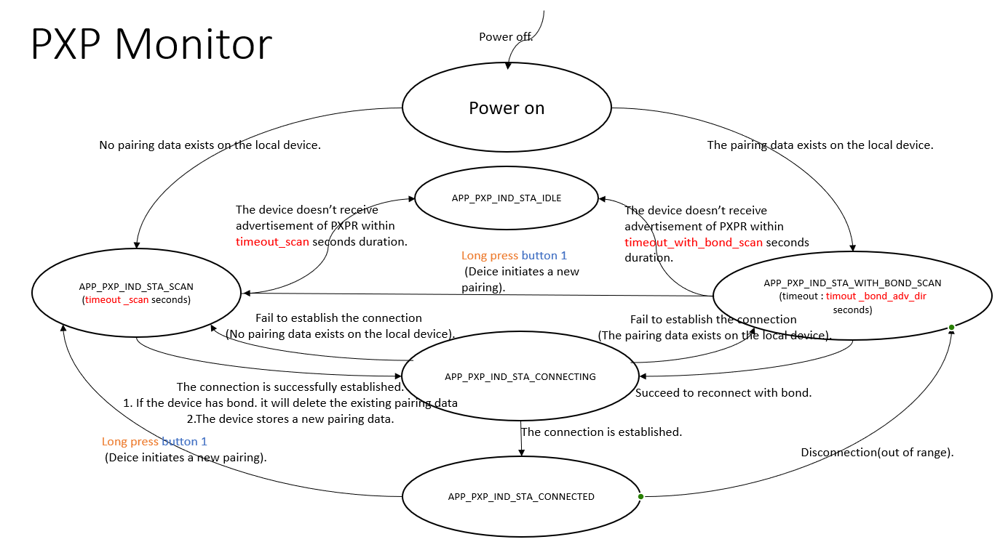

# PXPM Principal Application

## Table of Contents
- 1. Introduction
- 2. Contents
  - 2.1 Working Flow
  - 2.2 Testing
    - 2.2.1 Environment Setup
    - 2.2.2 Test Introduction
    - 2.2.3 Test Cases

## 1. Introduction
 This application which implements the profile Proximity Monitor , functions in the central role. The document consists of two parts. The first part, **2.1 Working Flow**, describes the operational flow of this application. The second part, **2.2 Testing**, introduces the test environment and presents test cases. In this document, the term "curiosity board" refers to the WBZ series curiosity board.

## 2. Contents
### 2.1 Working Flow
State machine:

This application demonstrates how to simulate an PXPM device on the curiosity board. There are the following states and their introductions behind in state machine:

| Description                           | Variable               | Value      | 
| ----------------------------------    | ---------------        | ---------- | 
| The timeout for scanning without bond | timeout_scan           | 60 seconds | 
| The timeout for scanning with bond    | timeout_with_bond_scan | 30 seconds | 

State machine:
- **APP_PXP_IND_STA_IDLE**:          The application remains in idle mode.
- **APP_PXP_IND_STA_CONNECTED**:     The application is prepared to transmit commands to the Proximity Reporter role.
- **APP_PXP_IND_STA_WITH_BOND_SCAN**:     The application is prepared to reconnect with bond within timeout_with_bond_scan seconds duration.
- **APP_PXP_IND_STA_SCAN**:  The application is prepared to initiate the connection within timeout_scan seconds duration.

This application relies on Button 1 as the input and LEDs as the output to have interactions with users.
- Button 1:
  - Type of Pressing:
    - Press: Press the button for less than 500 ms.
    - Long press: Press the button for more than 500 ms.
  - Functions:

| State                               | Action              | Behavior           |
| :-----------------------------------| :------------------ | :----------        |
| **APP_PXP_IND_STA_IDLE**            | Long press Button 1| Connect to a new device.|
| **APP_PXP_IND_STA_CONNECTED**       | Long press Button 1| Disconnect the existing connection and connect to a new device.|
| **APP_PXP_IND_STA_WITH_BOND_SCAN**  | Long press Button 1| Start a new pairing|

- LEDs indicate the current state according to the following table:

| APP Connection State           | LED behavior                                                           |
| ------------------------------ | ---------------------------------------------------------------------- |
| APP_PXPM_STATE_IDLE            | All LEDs are turned off.                                               |
| APP_PXP_IND_STA_CONNECTING     | All LEDs are turned off.                                               |
| APP_PXP_IND_STA_CONNECTED      | Green light or Red light keep lighting                                 |
| APP_PXP_IND_STA_WITH_BOND_SCAN | All LEDs are turned off.                                               |
| APP_PXPM_STATE_SCAN            | All LEDs are turned off.                                               |

- RGB LEDs indicate the alert state according to the following table:

| APP Alert Level             | RGB LED behavior         | PXPR LED behavior                           |
| :-------------------------- | :------------------------| :------------------------------------------ |
| BLE_PXPR_ALERT_LEVEL_NO     | Green light              | All LED keep lighting                       |
| BLE_PXPR_ALERT_LEVEL_MILD   | Red light                | User LED blinks one time every second.      |
| BLE_PXPR_ALERT_LEVEL_HIGH   | Red light                | User LED blinks five times every second.    |

- Immediate Alert level will be issued according to the follow table. 

| Distance                    |      10cm       |       3m        |      30m         |
| :---------------------------| :---------------| :---------------| :--------------- |
| Path loss                   |       51        |       65        |        85        | 
| Zone                        |    LOW_ZONE     |  MIDDLE_ZONE    |    HIGH_ZONE     | 

### 2.2 Testing
#### 2.2.1 Environment Setup
- In the following section, PXPM device represents WBZ series curiosity board with proximity monitor role application (ble_pxpm_app).
- In the following section, PXPR device represents WBZ series curiosity board with proximity reporter role application (ble_pxpr_app).
#### 2.2.2 Test Introduction
A test which is described below, please do them in order.

**Test 1**: Basically, the idea is to demonstrate:
- How to establish the connection and pair with the PXPR curiosity board.
- How to issue the Immediate alert service and perform the actions after establishing the connection.
- How to observe the LLS alert performance while link loss occured.
- How to reconnect to the curiosity board after disconnecting from it.

**Test 2**: Basically, the idea is to demonstrate:
- How to allow a new device to be bonded with the curiosity board

The LEDs behavior according to the "APP Connection State."
#### 2.2.3 Test Cases
**Test 1**:

1. On the computer, compile and program the PXPM application on the curiosity board A “PXPM” is used instead in the following section..
2. On the computer, compile the PXPR application with BLE_PXPR_IAS_AUTH_ENABLE and BLE_PXPR_LLS_AUTH_ENABLE compile option which are defined seperatly in the ble_lls.c and ble_ias.c and program the PXPR application on the curiosity board B and C “PXPR B” and “PXPR C” is used instead in the following section.
	- The curiosity board A will enter **APP_PXPR_STATE_SCAN** and establish a connection with PXPR B after receiving the advertising.
3. For the PXPM will enter **APP_PXP_IND_STA_CONNECTED** when the connection is established. 
4. On the PXPM , the Link loss service will issued with **BLE_PXPR_ALERT_LEVEL_HIGH** and trigger the pairing flow.
5. When the PXPR B is within 10cm of the PXPM, the **BLE_PXPR_ALERT_LEVEL_NO** alert level can be observed through RGB led and PXPR User LED.
6. PXPR B moves away from PXPM over 3m, the **BLE_PXPR_ALERT_LEVEL_MILD** alert level can be observed through PXPM RGB led and PXPR User LED.
7. PXPR B keep moves away from PXPM over 30m, the **BLE_PXPR_ALERT_LEVEL_HIGH** alert level can be observed through the PXPM RGB led and PXPR B User LED .
8. Disconnect the PXPR B. The PXPM will enter **APP_PXP_IND_STA_WITH_BOND_SCAN**. The alert level set in step 4 of the link loss service will be displayed as **BLE_PXPR_ALERT_LEVEL_HIGH** and can be observed through the PXPR B User LED.
	- Power off the PXPM by "unplug USB cable".
	- keep away from the PXPR until disconnected.
9. Once the PXPR B is reconnected, it will enter **APP_PXP_IND_STA_CONNECTED** and the RGB LED alert situation will be re-indicated as the corresponding alert level specified by the path loss table.

**Test 2**:

10. For the PXPR B, move it far away from the PXPM curiosity board to disconnect.
    - The PXPM will enter **APP_PXP_IND_STA_WITH_BOND_SCAN** and scan for rebonding  .
11. For the PXPR B, move it close back to the PXPM .
12. For the PXPR curiosity board B that have pairing data will automatically reconnect to the PXPM.
    - The PXPM, it will enter **APP_PXP_IND_STA_CONNECTED** when reconnection is successful.
13. Unplug USB cable to power off the PXPR B to establish a disconnection condition with PXPM.

14. Long press the button 1 to start a new pairing with PXPR C and it will enter **APP_PXPM_STATE_SCAN**.
	- PXPM establish a connection with PXPR C after receiving the advertising.
	

