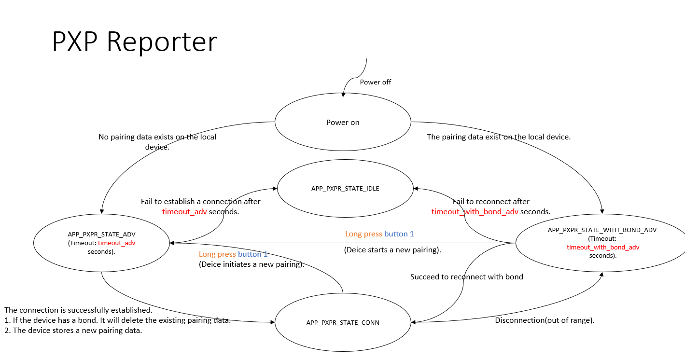

# PXPR Principal Application

## Table of Contents
- 1. Introduction
- 2. Contents
  - 2.1 Working Flow
  - 2.2 Testing
    - 2.2.1 Environment Setup
    - 2.2.2 Test Introduction
    - 2.2.3 Test Cases

## 1. Introduction
 This application which implements the profile Proximity Reporter , functions in the peripheral role. he document consists of two parts. The first part, **2.1 Working Flow**, describes the operational flow of this application. The second part, **2.2 Testing**, introduces the test environment and presents test cases.

## 2. Contents
### 2.1 Working Flow
State machine:

| Description                                | Variable              | Value      | 
| ----------------------------------         | ---------------       | ---------- | 
| The timeout for advertisement without bond | timeout_adv           | 60 seconds | 
| The timeout for advertisement with bond    | timeout_with_bond_adv | 30 seconds | 

This application demonstrates how to simulate an PXPR device on the curiosity board which is **Device** in the state machine. There are the following states and their introductions behind in state machines:

State machine:
- **APP_PXPR_STATE_IDLE**: The application remains in idle mode.
- **APP_PXPR_STATE_ADV**: The application is waiting for a connection without bond within timeout_adv seconds duration.
- **APP_PXPR_STATE_BOND_ADV**: The application is waiting for a reconnection with bond within timeout_with_bond_adv seconds duration.
- **APP_PXPR_STATE_CONN**: The application is prepared to respond to proximity monitor role.

This application relies on Button 1 as the input and LEDs as the output to have interactions with users.
- Button 1:
  - Type of Pressing:
    - Press: Press the button for less than 500 ms.
    - Long press: Press the button for more than 500 ms.
  - Functions:

| State                         | Action              | Behavior    |
| :---------------------------- | :------------------ | :---------- |
| **APP_PXPR_STATE_CONN**       | Long press Button 1 | Disconnect the exiting connection, enable advertisement and allow new device to be bonded. |
| **APP_PXPR_STATE_BOND_ADV**   | Long press Button 1 | Enable advertisement and allow new device to be bonded. |

- LEDs indicate the current state according to the following table:

| APP Connection State        | LED behavior                                                           |
| --------------------------- | ---------------------------------------------------------------------- |
| APP_PXPR_STATE_IDLE         | All LEDs are turned off.                                               |
| APP_PXPR_STATE_ADV          | Blue LED flashes onec every 3 seconds. (On: 50 ms, Off: 2950 ms)       |
| APP_PXPR_STATE_BOND_ADV     | Blue LED flashes twice every 3 seconds. (On: 50 ms, Off: 50 ms)        |
| APP_PXPR_STATE_CONN         | Blue LED flashes twice every 1.5 seconds. (On: 50 ms, Off: 150 ms)     |

- User LED indicate the alert state according to the following table:

| APP Alert Level             | LED behavior                                                           |
| :---------------------------| ---------------------------------------------------------------------  |
| BLE_PXPR_ALERT_LEVEL_NO     | User LED keep lighting                                                 |
| BLE_PXPR_ALERT_LEVEL_MILD   | User LED blinks one time every second.                                 |
| BLE_PXPR_ALERT_LEVEL_HIGH   | User LED blinks five times every second.                               |

- immediate Alert level will be issued according to the follow table. 

| Distance                      | 10cm             | 3m                  | 30m         |
| :---------------------------- | :--------------- | :------------------ | :---------- |
| Path loss                     |        51        |          65         |      85     |
| Zone                          |       low        |        middle       |     high    |

### 2.2 Testing
#### 2.2.1 Environment Setup
- An Android Phone that has installed the MBD(Microchip Bluetooth Data) application.
- An iPhone that has installed the MBD(Microchip Bluetooth Data) application.
- At least 2 WBZ series curiosity boards, “the curiosity board” is used instead in the following section.
- A Microsoft Window 10 computer, “the computer” is used instead in the following section.

The curiosity board is connected to the computer with the USB cable.

#### 2.2.2 Test Introduction
The default configuration, which is described below, has to be tested with the following Test case 1 using the default configuration.

|                             |   MBD(Central)  | PXPR(Peripheral)|
| :---------------------------| :-------------  | :---------------|
| Authentication              |    supported    |    disabled     |
| Power Control               |    supported    |    disabled     |

**Test 1**: Basically, the idea is to demonstrate:
- How to use the iphone/Android MBD application to establish the connection with PXPR curiosity board.
- How to receive the immediate alert service and perform the actions after establishing the connection from Iphone MBD application.
- How to observe the LLS alert performance while link loss occurred with the MBD application on your Android device .

**Test cases 2 correspond to PXPM test cases 1 and 2. Please use the Encrypted settings and Encrypted setting with Power control below to test PXPM test cases 1 and 2 separately.**

**Encrypted settings**
- Uncomment the compile option BLE_PXPR_LLS_AUTH_ENABLE in ble_lls.c 
- Uncomment the compile option BLE_PXPR_IAS_AUTH_ENABLE in ble_ias.c

|                             |   PXPM curiosity board | PXPR curiosity board|
| :-------------------------- | :----------------------|:--------------------|
| Authentication              |        supported       |        enabled      |
| Power Control               |        supported       |        disabled     |

**Encrypted settings with Power control**
- Uncomment the compile option BLE_PXPR_LLS_AUTH_ENABLE in ble_lls.c 
- Uncomment the compile option BLE_PXPR_IAS_AUTH_ENABLE in ble_ias.c
- Uncomment the compile option POWER_CTRL_ENABLE in initialization.c

|                             |   PXPM curiosity board | PXPR curiosity board|
| :-------------------------- | :----------------------|:--------------------|
| Authentication              |        supported       |        enabled      |
| Power Control               |        supported       |        enabled     |

**Test 2**: Basically, the idea is to demonstrate:
- How to establish the connection and pair with the PXPM curiosity board.
- How to receive the immediate alert service and perform the actions after establishing the connection.
- How to reconnect to the curiosity board after disconnecting from it.
- How to observe the LLS alert performance while link loss occured.

The LEDs behave according to “APP Connection State”.

#### 2.2.3 Test Cases
**Test 1**:

1. On the computer, compile and program the PXPR application on the curiosity board A.
    - The curiosity board A will enter **APP_PXPR_STATE_ADV** and wait for the pairing for timeout_adv seconds.
2. On the Iphone , excute the MBD application and press the "BLE Connect" icon .
3. Press "START SCAN" icon to establish connection with "PXPR" device.
4. For the PXPR curiosity board will enter **APP_PXPR_STATE_CONN** when the connection is established. 
5. On the Iphone ,press the "Immidediate Alert Service" icon.
6. When the PXPR is within 10cm of the Iphone, the **BLE_PXPR_ALERT_LEVEL_NO** can be observed through User LED .
7. PXPR moves away from Iphone over 3m, the **BLE_PXPR_ALERT_LEVEL_MILD** can be observed through PXPR User LED.
8. PXPR keep moves away from Iphone over 30m, the **BLE_PXPR_ALERT_LEVEL_HIGH** could be observed through the PXPR User LED.
9. Disconnect the PXPR with Iphone . It will enter **APP_PXPR_STATE_BOND_ADV**. 

10. On the Android phone ,position the PXPR curiosity board as close as possible until the connection could be re-established and excute the MBD application and press "START SCAN" icon to establish connection with "PXPR" device again.
11. Press the "START SCAN" icon to establish connection with PXPR.
12. For the PXPR curiosity board will enter **APP_PXPR_STATE_CONN** when the connection is established. 
13. On the Android phone ,press the "Link Loss Service" icon and indicate the alert level as **BLE_PXPR_ALERT_LEVEL_HIGH**.
14. Press the "←" icon on the top left corner of the screen to disconnect the PXPR”. It will enter APP_PXPR_STATE_BOND_ADV. The link loss service alert level will be shown as **BLE_PXPR_ALERT_LEVEL_HIGH** and can be observed through the PXPR User LED.
15. Re-Connect the PXPR it will enter **APP_PXPR_STATE_CONN** and the User LED alert situation will be indicated as coresponding alert level specified by path loss table .

**Test 2**:

16. On the computer, compile and program the PXPR application using the **Encrypted settings**  on the curiosity board.
    - Co-test with The PXPM test case 1 and test case 2.
    - validate the test case 1 with Android MBD application . 
	
17. On the computer, compile and program the PXPR application using the **Encrypted settings with Power control** on the curiosity board .
    - Co-test with The PXPM test case 1 and test case 2.

