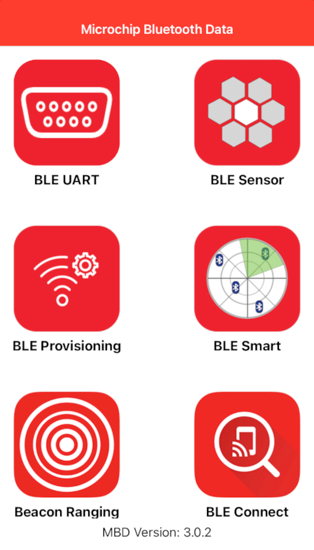

# BLE Throughput

This document is to illustrate the example of PIC32CXBZ2 BLE throughput evaluation using Microchip MBD APP. At the same time, the factors affecting the BLE throughput are also discussed.

**1. Introduction**

The purpose of this document is to illustrate the user-guide of the BLE\_THROUGHPUT Application for PIC32CXBZ2. The BLE\_THROUGHPUT Application is designed to demonstrate several functionalities including:

1.  Connection with mobile phone via BLE.

2.  Data transmission between PIC32CXBZ2 and mobile phone via BLE and throughput evaluation.

3.  Data transmission from PIC32CXBZ2 to mobile phone via BLE and throughput evaluation.

4.  Data transmission from mobile phone to PIC32CXBZ2 via BLE and throughput evaluation.

**1.1. Data Format for Advertising**

**- Advertising Data**

The Service Data type is used in advertising data. The data format is shown as below:

\*Note: 0xFEDA is a 16-bit Service UUID which is purchased by Microchip from Bluetooth SIG.

**- Scan Response Data**

The device name is put in the scan response. And the device name is set as "BLE\_UART\_XXXX". \(XXXX are the last two bytes of the device address.\)

**1.2. Supported Services and Profiles**

The supported service and profile are listed in the below section.

**- Services**

1.  Transparent Service

    MCHP proprietary service, see Reference \[1\] for the detail.

2.  Device Information Service

    Bluetooth SIG standard service, see Reference \[3\] for the detail.

**- Profiles**

-   Transparent Profile \(TRP\)

    MCHP proprietary profile, see Reference \[4\] for the detail.

**1.3 LED Indication**

The LED indication is defined as below based on the different role and state:

1.  Advertising State \(No LE link existed\)

    Green LED flashes one time every 500 ms.

2.  Connected with peer device

    Green LED is solid on.

**2. Interaction with MBD App**

**2.1. Work with iOS MBD App**

**- How to Scan and Connect to the Device**

The steps to scan and connect to the device via MBD app are described as below:

-   Tap "BLE UART" in MBD App

-   Tap "PIC32CXBZ"

-   Tap "START"

-   Tap "BLE\_UART\_XXXX" \(XXXX are the last two bytes of the device address\)

**- Firmware Version**

After LE is connected, tap the setting button:

The firmware version is shown as the below screenshot:

**- Select Transparent Profile**

There are two profiles supported by the MBD "BLE UART" APP but "BLE\_THROUGHPUT" firmware supports TRP only.

1.  Legacy Transparent Profile \(TRP\)

    This is supported by "BLE\_THROUGHPUT" firmware.

2.  Transparent Credit Based Profile \(TRCBP\)

    This is NOT supported by "BLE\_THROUGHPUT" firmware.

**- Select GATT WriteType**

TRP profile supports both "Write with Response" and "Write without Response", which is much higher than the former.

**- Demo Modes**

There are two demo modes: Burst Mode and Text Mode. Burst Mode is designed for the throughput evaluation via massive data transmission. Text Mode is designed for the simple text typing.

**A. Burst Mode**

There are four data transfer modes supported in Burst Mode:

1.  Checksum mode

    MBD App to the device \(Uni-direction\).

2.  Fixed pattern mode

    Device to MBD App \(Uni-direction\).

3.  Loopback mode

    MBD App → Device → MBD App \(Bi-direction\).

4.  UART mode

    MBD App → Device → UART output to PC ; UART input from PC → Device → MBD App \(Bi-direction\). This mode is NOT supported by "BLE THROUGHPUT" firmware.

**B. Text Mode**

There are two data transfer modes supported in Text Mode:

1.  Loopback mode

    MBD App → Device → MBD App \(Bi-direction\).

2.  UART mode

    MBD App → Device → UART output. This mode is NOT supported by "BLE THROUGHPUT" firmware.

**2.2. Work with Android MBD App**

The operation of Android MBD App is quite the same as the iOS version MBD App.

**3. Throughput Evaluation**

In this section, we will describe the throughput evaluation steps and a list of throughput figures tested with a list of phone models for reference only. Finally, we also discuss the factors affecting the throughput.

**3.1 Throughput Evaluation Steps**

1.  Connect a USB cable to a WBZ451 CURIOSITY board

2.  Download the BLE\_THROUGHPUT firmware

3.  Run a terminal tool like "Tera Term"

    Open the serial port connecting to WBZ451 CURIOSITY and configure the setting as below:

    

4.  Press the reset button on the WBZ451 CURIOSITY board and the initialization string will be shown as below

    

5.  Connect the "BLE UART" of MBD APP to WBZ451 CURIOSITY board

6.  Select "Burst mode"

7.  Select "Demo Mode" in setting page

    Except UART mode, all the other modes are supported by "BLE\_THROUGHPUT"

8.  Select Text file size in setting page

9.  The TRP profile is automatically selected

10. Select "GATT WriteType"

    "Write without Response" will achieve much higher throughput.

11. Tap "Done" and back to the previous page

12. Tap "START"

    After sending the file, the throughput is evaluated and shown as below:

    

**3.2 Throughput Test Report**

The below tables show the throughput test result with iOS and Android devices with the configuration as

-   Profile

    TRP

-   GATT Write Type

    Write without Response

-   Downlink

    Tested with "Checksum" data transfer mode

-   Uplink

    Tested "Fixed pattern" data transfer mode

1.  iOS Devices

    

2.  Android Devices

    

**3.3 Factors affecting Throughput**

In BLE\_THROUGHPUT example, the WBZ451 is the GATT server while the MBD App is the GATT client. There are 7 main factors affecting the throughput. Some factors are negotiated and determined by the BLE stack of the GATT client and server. And some factors can be modified or requested by the user level application code using the APIs exposed by underneath BLE stack.

1.  **ATT MTU size**

    Larger MTU size achieves higher throughput. Assuming the MTU size is x, then the Max application data payload in one operation is of x minus 3\( excluding 1byte of GATT operation code and 2 bytes of the attribute handle \).

    In PIC32CX1012BZ20548 BLE stack, the Max MTU is set to 247 bytes. The final MTU used by the GATT client and server will depends on the negotiation initiated by the GATT client. For iOS, the MTU size is determined by the underneath BLE stack while the user level application can use API to learn the determined MTU. For Android, the MTU size can be requested by the user level application code using API of "**requestMtu \(int mtu\)**" and the user application code should observe the result from "**onMtuChanged** " callback.

2.  **Operation Type**

    For downlink operation, the "Write without Response"\(Write Command\) is always faster than the "Write with Response"\(Write Request\).

    For uplink operation, the Notify operation is always faster than the Indication operation which requires a confirm from peer device.

    It's the responsibility of BLE\_THROUGHPUT firmware to define the property of the GATT characteristics. The property in turn defines the permitted operation type.

3.  **Data Length Extension\(DLE\)**

    Link layer data packet length by default is 27 bytes. From BLE 4.2 onward, the link layer data packet length can be extended to as long as 251bytes. This feature is called Data Length Extension\(DLE\). Note that some phone models might not support DLE while PIC32CX1012BZ20548 BLE stack supports it. DLE negotiation is conducted by underneath BLE stack of both the client and the server. User level application code has no API to modify the link layer data packet length.

4.  **Connection Interval\(CI\)**

    The CI defines the frequency of the Connection Event. Shorter CI causes higher frequency of the Connection Event. Certain number of data packets can be sent during one connection event. It is obvious that the shorter CI the lesser number of data packets can be sent in one Connection Event. In contrast, the longer CI the higher opportunity to send larger number of data packets in one Connection Event. The iOS device might limit the CI parameter according to the peripheral type. See reference\[6\] for more details.

    PIC32CX1012BZ20548 BLE stack provides API of "**BLE\_DM\_ConnectionParameterUpdate**" to update the connection parameter. The final connection parameter is decided by negotiation of both the client and the server stack.

    On Android the equivalent API is "**requestConnectionPriority**" while there is no such similar API available on iOS.

5.  **Number of Data Packets per Connection Event**

    The number varies from iOS to Android and from revision to revision. There is no direct API available on either iOS or Android to define this number. User can fine tune the CI to get ideal value and verify the result in the air log.

6.  **PHY Selection**

    From BLE 5.0 onward, LE 2M PHY is introduced. It is 2x faster than the former LE 1M PHY. Gradually the phone models in the market will embrace this new feature. Either the GATT client or server might request to update the PHY to LE 2M according to PHY Update Procedure defined by SIG, see reference \[7\] for details. WBZ451 is born to support this feature and the API of "**BLE\_GAP\_SetPhy**" is available to user level application code to change the PHY selected.

    -   **PHY Update Procedure**

    In BLE\_THROUGHPUT example, the API "**BLE\_GAP\_SetPhy**" is called on writing the handle of TRP TX characteristic CCCD\(Client Characteristic Configuration Descriptor\) operated by peer device illustrated as below image. For more details on TRP, see reference\[1\].

    

    A event of **BLE\_GAP\_EVT\_PHY\_UPDATE** will be generated on the completion of this procedure then the user can check the result in this event. This event is handled by **APP\_BleGapEvtHandler\( \)** of GAP handler in this example.

7.  **The RF Factor**

    The noisy RF environment can decrease the throughput. The well designed RF circuit can achieve higher throughput. Finally, the casing condition of the end product containing the BLE device can also affect the throughput.

**4. The BLE\_THROUGHPUT Example Firmware Diagram**

The BLE\_THROUGHPUT firmware is designed for WBZ451 CURIOSITY board. The firmware is based on TRP service. There are 3 data transfer modes supported by the BLE\_THROUGHPUT firmware, including Checksum mode, Fixed pattern mode and Loopback mode. To simplify, the UART mode is not implemented in this example. The firmware diagram below illustrates the main part of the firmware.

**References**

\[1\] [Microchip Transparent Service\_v1.1](https://onlinedocs.microchip.com/pr/GUID-C5EAF60E-9124-427C-A0F1-F2DBE662EA92-en-US-1/index.html?GUID-3343772E-C6A4-4195-B8E7-42568CBBDE6F)

\[2\] [Microchip Transparent Credit Based Service v1.0](https://onlinedocs.microchip.com/pr/GUID-C5EAF60E-9124-427C-A0F1-F2DBE662EA92-en-US-1/index.html?GUID-C14BCBFE-5169-4BDB-A2F9-7B09FB4DB3F7)

\[3\] https://www.bluetooth.com/specifications/gatt/

\[4\] [Microchip Transparent Profile\_v1.1](https://onlinedocs.microchip.com/pr/GUID-C5EAF60E-9124-427C-A0F1-F2DBE662EA92-en-US-1/index.html?GUID-DBD3AFD8-6BFB-4B13-A3C0-C05ADCE92BA6)

\[5\] [Microchip Transparent Credit Based Profile\_v1.0](https://onlinedocs.microchip.com/pr/GUID-C5EAF60E-9124-427C-A0F1-F2DBE662EA92-en-US-1/index.html?GUID-A1595ACB-6522-44A3-8CF5-5C6F04A32490)

\[6\] https://developer.apple.com/accessories/Accessory-Design-Guidelines.pdf

\[7\] https://www.bluetooth.com/specifications/specs/core-specification-5-3/

**Parent topic:**[Advanced Applications](https://onlinedocs.microchip.com/pr/GUID-A5330D3A-9F51-4A26-B71D-8503A493DF9C-en-US-1/index.html?GUID-92137358-930E-4654-9431-E8BA0E260468)

