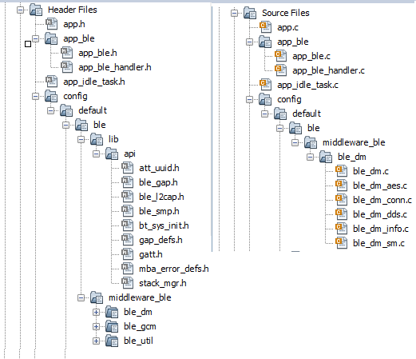
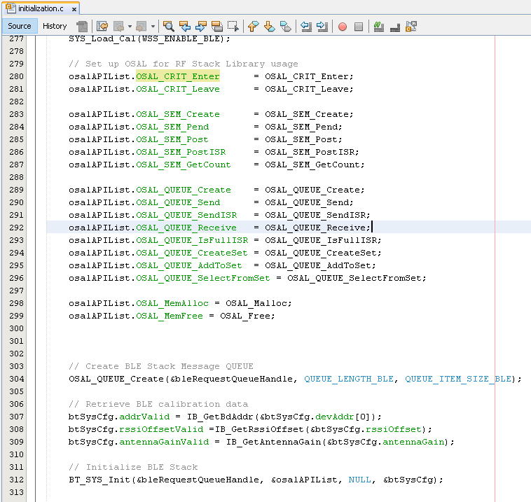
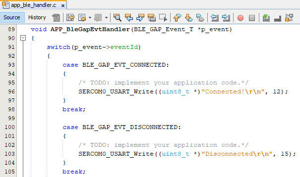
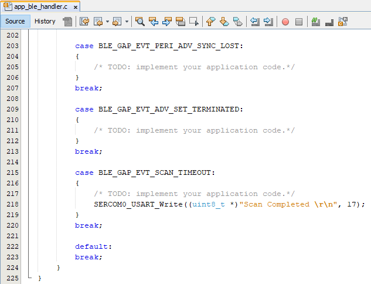

# BLE Connection

[Getting Started](https://onlinedocs.microchip.com/pr/GUID-A5330D3A-9F51-4A26-B71D-8503A493DF9C-en-US-1/index.html?GUID-17DABF04-E5D8-4201-A746-2FC244450A19)

[Getting Started with Central Building Blocks](https://onlinedocs.microchip.com/pr/GUID-A5330D3A-9F51-4A26-B71D-8503A493DF9C-en-US-1/index.html?GUID-E8C0DDA5-3AD0-42A4-B4EF-BCB02811BF8C)

[Legacy Scan](https://onlinedocs.microchip.com/pr/GUID-A5330D3A-9F51-4A26-B71D-8503A493DF9C-en-US-1/index.html?GUID-950762E2-DD5E-41CD-AAB4-895439CCFBC4) **--\>** [BLE Connection](#GUID-7C948236-7D8E-45CA-9511-AB244B44BE64) **--\>** [BLE Transparent UART](https://onlinedocs.microchip.com/pr/GUID-A5330D3A-9F51-4A26-B71D-8503A493DF9C-en-US-1/index.html?GUID-7A350957-2010-468F-AF8D-0635373EF79D)

## Introduction {#INTRODUCTION .section}

This document will help users to enable scan and connect functionality on the BLE Central Device \(WBZ451\). For a successful BLE connection, ADVERTISER must start sending advertisement packets on the three primary advertisement channels \(or a subset of these channels\). This allows the devices scanning for advertisers to find then and read their advertisement data, the scanner can initiate a connection if advertiser allows it. To demonstrate a BLE Connection on WBZ451 we need 2 device types

1.  Advertiser \(Transmitting Connectable Adv\)

2.  Scanner


Users of this document can choose to just run the precompiled Application Example hex file on the WBZ451 Curiosity Board and experience the demo or can go through the steps involved in developing this Application from scratch

These examples each build on top on one and other. We strongly recommend that you follow the examples in order, to learn the basics concepts before progressing to the more advanced topics.

## Recommended Reads {#RECOMMENDED-READS .section}

1.  [BLE Software Specification](https://onlinedocs.microchip.com/pr/GUID-C5EAF60E-9124-427C-A0F1-F2DBE662EA92-en-US-1/index.html?GUID-222749FE-01C5-43B6-A5C7-CD82B3FC7F5F)

2.  [FreeRtos BLE App Initialize](https://onlinedocs.microchip.com/pr/GUID-A5330D3A-9F51-4A26-B71D-8503A493DF9C-en-US-1/index.html?GUID-897B75C0-387F-4AF8-B353-1F97A3B0BEC8)

3.  [BLE Legacy Scan](https://onlinedocs.microchip.com/pr/GUID-A5330D3A-9F51-4A26-B71D-8503A493DF9C-en-US-1/index.html?GUID-950762E2-DD5E-41CD-AAB4-895439CCFBC4)


## Hardware Required {#HARDWARE-REQUIRED .section}

|**Tool**|**Qty**|
|--------|-------|
|WBZ451 Curiosity Board|2|
|Micro USB cable|2|

## SDK Setup {#SDK-SETUP .section}

1.  [Getting Started with Software Development](https://onlinedocs.microchip.com/pr/GUID-A5330D3A-9F51-4A26-B71D-8503A493DF9C-en-US-1/index.html?GUID-2AD37FE2-1915-4E34-9A05-79E3810726D7)


## Software {#SOFTWARE .section}

1.  [TeraTerm](https://ttssh2.osdn.jp/index.html.en)


## Smartphone App {#SMARTPHONE-APP .section}

None

## Programming the precompiled hex file or Application Example {#PROGRAMMING-THE-PRECOMPILED-HEX-FILE-OR-APPLICATION-EXAMPLE .section}

**Programming the hex file using MPLABX IPE**

1.  Precompiled Hex file is located in "<Harmony Content Path\>/wireless\_apps\_pic32cxbz2\_wbz45\\apps\\ble\\building\_blocks\\central\\central\_conn\\hex" folder

2.  Follow the steps mentioned [here](https://microchipdeveloper.com/ipe:programming-device)


**Caution:** Users should choose the correct Device and Tool information

**Programming the Application using MPLABX IDE**

1.  Follow steps mentioned in of [Running a Precompiled Example](https://onlinedocs.microchip.com/pr/GUID-A5330D3A-9F51-4A26-B71D-8503A493DF9C-en-US-1/index.html?GUID-EA74172C-595E-4A34-B359-D42EE443F0EC) document

2.  Open and program the Application Example "central\_conn.x" located in "<Harmony Content Path\>/wireless\_apps\_pic32cxbz2\_wbz45\\apps\\ble\\building\_blocks\\central\\central\_conn\\firmware" using MPLABX IDE


<Harmony Content Path\> [how to find what is my Harmony Content Path](https://onlinedocs.microchip.com/pr/GUID-A5330D3A-9F51-4A26-B71D-8503A493DF9C-en-US-1/index.html?GUID-A55E9342-CE44-4A91-86BB-FEC6706FCD1C)

## Demo Description {#DEMO-DESCRIPTION .section}

To experience this demo users are required to use central\_connection and peripheral\_connection application examples. The 2 Application Example mentioned above will demonstrate a BLE Connection Establishment Process. An advertiser \(Peripheral\) will start connectable, scannable, undirected BLE advertisement and the scanner \(Central\) will receive the advertisements and initiate a BLE connection. enables users to transmit Connectable and Scannable Undirected BLE Advertisements. Demo will print start of the scanning "Scanning", connected "Connected!" and disconnected "Disconnected" "Disconnected" state on a terminal emulator like TeraTerm@ \(Speed: 115200, Data: 8-bit, Parity: none, stop bits: 1 bit, Flow control: none\)

## Testing {#TESTING .section}

Users should use another WBZ451 Curiosity Board configured as [peripheral connection](https://onlinedocs.microchip.com/pr/GUID-A5330D3A-9F51-4A26-B71D-8503A493DF9C-en-US-1/index.html?GUID-F9A0C390-C124-49A7-9F22-157D20BFBE5D)

This section assumes that a user has already programmed the peripheral\_conn and central\_conn application on 2 WBZ451 Curiosity Boards.

Board1 = WBZ451 Curiosity Board with peripheral\_conn application Programmed Board2 = WBZ451 Curiosity Board with central\_conn applicaton Programmed

Board1: Open TeraTerm @ \(Speed: 115200, Data: 8-bit, Parity: none, stop bits: 1 bit, Flow control: none\). Reset the board. Upon reset, "Advertising" message is displayed on the TeraTerm.

Board2: Open TeraTerm @ \(Speed: 115200, Data: 8-bit, Parity: none, stop bits: 1 bit, Flow control: none\). Reset the board. Upon reset, "Scanning" message is displayed on the TeraTerm. Upon finding peripheral device with public address \{0xA1, 0xA2, 0xA3, 0xA4, 0xA5, 0xA6\} message "Found Peer Node" will be displayed and a connection request will be initiated "Initiating connection".

**Note:** Scanner is configured to scan only for 100 secs, user should ensure the peer device is advertising

After connection establishment, both the peripheral device \(Board1\) and central device\(Board2\) will display "Connected!" message on respective terminal windows


## Developing this Application from scratch using MPLAB Code Configurator {#DEVELOPING-THIS-APPLICATION-FROM-SCRATCH-USING-MPLAB-CODE-CONFIGURATOR .section}

This section explains the steps required by a user to develop this application example from scratch using MPLABx Code Configurator

**Tip:** New users of MPLAB Code Configurator are recommended to go through the [overview](https://onlinedocs.microchip.com/pr/GUID-1F7007B8-9A46-4D03-AEED-650357BA760D-en-US-6/index.html?GUID-B5D058F5-1D0B-4720-8649-ACE5C0EEE2C0).

1.  Create a new MCC Harmony Project --[link](https://onlinedocs.microchip.com/pr/GUID-A5330D3A-9F51-4A26-B71D-8503A493DF9C-en-US-1/index.html?GUID-B86E8493-D00D-46EF-8624-D412342147F0) for instructions

2.  Import component configuration -- This step helps users setup the basic components required to start their Application Development component configuration related to this Application is available. The imported file is of format .mc3 and is located in the path "<Harmony Content Path\>/wireless\_apps\_pic32cxbz2\_wbz45\\apps\\ble\\building\_blocks\\central\\central\_conn\\firmware\\central\_conn.X". Users should follow the instructions mentioned [here](https://microchipdeveloper.com/mcc:peripheralconfig) to import the component configuration.

    **Tip:** Import and Export functionality of Harmony component configuration will help users to start from a known working setup of MCC configuration

3.  Accept Dependencies or satisfiers, select "Yes"

4.  Verify if the Project Graph window has all the expected configuration

    


## Verify Scan and Connection Configuration {#VERIFY-SCAN-AND-CONNECTION-CONFIGURATION .section}

1.  Select **BLE\_Stack** component in project graph

    


## Generate Code {#GENERATE-CODE-LINK-FOR-INSTRUCTIONS .section}

Instructions on[how to Generate Code](https://onlinedocs.microchip.com/pr/GUID-A5330D3A-9F51-4A26-B71D-8503A493DF9C-en-US-1/index.html?GUID-9C28F407-4879-4174-9963-2CF34161398E)

## Files and Routines Automatically generated by the MCC {#FILES-AND-ROUTINES-AUTOMATICALLY-GENERATED-BY-THE-MCC .section}

After generating the program source from MCC interface by clicking Generate Code, the BLE configuration can be found in the following project directories



The [OSAL](http://ww1.microchip.com/downloads/en/DeviceDoc/MPLAB%20Harmony%20OSAL%20Libraries%20Help%20v2.06.pdf), RF System, BLE System initialization routine executed during program initialization can be found in the project files. This initialization routine is automatically generated by the MCC



The BLE stack initialization routine excuted during Application Initialization can be found in project files. This intitialization routine is automatically generated by the MCC. This call initializes and configures the GAP, GATT, SMP, L2CAP and BLE middleware layers. 

|**Source Files**|**Usage**|
|----------------|---------|
|app.c|Application State machine, includes calls for Initialization of all BLE stack \(GAP,GATT, SMP, L2CAP\) related component configurations|
|app\_ble\\app\_ble.c|Source Code for the BLE stack related component configurations, code related to function calls from app.c|
|app\_ble\\app\_ble\_handler.c|All GAP, GATT, SMP and L2CAP Event handlers|

> **Tip:** app.c is autogenerated and has a state machine based Application code sample, users can use this template to develop their application \|

**Header Files**

-   ble\_gap.h- This header file contains BLE GAP functions and is automatically included in the app.c file


**Function Calls**

MPLAB Code Configurator generates and adds the code to initialize the BLE Stack GAP, GATT, L2CAP and SMP in *APP\_BleStackInit\(\)* function

-   APP\_BleStackInit\(\) is the API that will be called inside the Applications Initial State -- APP\_STATE\_INIT in app.c\\


## User Application Development {#USER-APPLICATION-DEVELOPMENT .section}

**Include**

-   user action is required as mentioned [here](https://onlinedocs.microchip.com/pr/GUID-A5330D3A-9F51-4A26-B71D-8503A493DF9C-en-US-1/index.html?GUID-99583057-8B1A-42F2-84E8-CFC7717FA5D1)

-   definitions.h in all the files where UART will be used to print debug information


> Tip: definitions.h is not specific to just UART peripheral, instead it should be included in all application source files where peripheral functionality will be exercised

**Start Scanning**

```
BLE_GAP_SetScanningEnable(true, BLE_GAP_SCAN_FD_ENABLE, BLE_GAP_SCAN_MODE_OBSERVER, 1000);
```

This API is called in the Applications initialstate - APP\_STATE\_INIT in app.c. Scan duration is 100 secs


**Scan Results and initiating a BLE connection**

-   BLE\_GAP\_EVT\_ADV\_REPORT event is generated upon finding Adverstisements on legacy channels

-   BLE connection can be initiated by using the API BLE\_GAP\_CreateConnection\(&createConnParam\_t\);


```
  // code snippet to filter scan results and initiate connection
  if (p_event->eventField.evtAdvReport.addr.addr[0] == 0xA1 && p_event->eventField.evtAdvReport.addr.addr[1] == 0xA2)
  {
      SERCOM0_USART_Write((uint8_t *)"Found Peer Node\r\n", 17);
      BLE_GAP_CreateConnParams_T createConnParam_t;
      createConnParam_t.scanInterval = 0x3C; // 37.5 ms
      createConnParam_t.scanWindow = 0x1E; // 18.75 ms
      createConnParam_t.filterPolicy = BLE_GAP_SCAN_FP_ACCEPT_ALL;
      createConnParam_t.peerAddr.addrType = p_event->eventField.evtAdvReport.addr.addrType;
      memcpy(createConnParam_t.peerAddr.addr, p_event->eventField.evtAdvReport.addr.addr, GAP_MAX_BD_ADDRESS_LEN);
      createConnParam_t.connParams.intervalMin = 0x10; // 20ms
      createConnParam_t.connParams.intervalMax = 0x10; // 20ms
      createConnParam_t.connParams.latency = 0;
      createConnParam_t.connParams.supervisionTimeout = 0x48; // 720ms
      SERCOM0_USART_Write((uint8_t *)"Initiating Connection\r\n", 23);
      BLE_GAP_CreateConnection(&createConnParam_t);
  }

```


**Connected & Disconnected Events**

-   All the possible GAP, GATT, SMP and L2CAP Event handlers are available in file app\_ble\_handler.c, users can implement application code to denote Connection State here. BLE\_GAP\_EVT\_CONNECTED event is generated after a successful BLE Connection with peripheral device

    


**Scan Timeout Event**

-   In app\_ble\_handler.c BLE\_GAP\_EVT\_SCAN\_TIMEOUT event is generated when BLE Scan duration expires.




Users can exercise various other BLE Advertisement functionalities by using [BLE Stack API](https://onlinedocs.microchip.com/pr/GUID-C5EAF60E-9124-427C-A0F1-F2DBE662EA92-en-US-1/index.html)

## Where to go from here {#WHERE-TO-GO-FROM-HERE .section}

-   [BLE Transparent UART](https://onlinedocs.microchip.com/pr/GUID-A5330D3A-9F51-4A26-B71D-8503A493DF9C-en-US-1/index.html?GUID-7A350957-2010-468F-AF8D-0635373EF79D)


**Parent topic:**[Central](https://onlinedocs.microchip.com/pr/GUID-A5330D3A-9F51-4A26-B71D-8503A493DF9C-en-US-1/index.html?GUID-E8C0DDA5-3AD0-42A4-B4EF-BCB02811BF8C)

