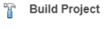

# **Central - FreeRTOS BLE Stack and App Initialize**

[Getting Started](https://onlinedocs.microchip.com/pr/GUID-A5330D3A-9F51-4A26-B71D-8503A493DF9C-en-US-2/index.html?GUID-17DABF04-E5D8-4201-A746-2FC244450A19)

[Getting Started with Central Building Blocks](https://onlinedocs.microchip.com/pr/GUID-A5330D3A-9F51-4A26-B71D-8503A493DF9C-en-US-2/index.html?GUID-E8C0DDA5-3AD0-42A4-B4EF-BCB02811BF8C)

[**FreeRTOS and BLE Stack Setup**](#GUID-897B75C0-387F-4AF8-B353-1F97A3B0BEC8) **--\>** [Adding UART](https://onlinedocs.microchip.com/pr/GUID-A5330D3A-9F51-4A26-B71D-8503A493DF9C-en-US-2/index.html?GUID-E1A0E9CA-311E-4F53-9C27-160173609975) **--\>** [Legacy Scan](https://onlinedocs.microchip.com/pr/GUID-A5330D3A-9F51-4A26-B71D-8503A493DF9C-en-US-2/index.html?GUID-950762E2-DD5E-41CD-AAB4-895439CCFBC4)

## Introduction {#INTRODUCTION .section}

This document will help users create a new MCC Harmony project, configure FreeRTOS component and BLE stack component in the project, generate code using the MPLAB MCC framework

These examples each build on top on one and other. We strongly recommend that you follow

the examples in order, to learn the basics concepts before progressing to the more advanced topics.

## Recommended Reads {#RECOMMENDED-READS .section}

-   [BLE Software Specification](https://onlinedocs.microchip.com/pr/GUID-C5EAF60E-9124-427C-A0F1-F2DBE662EA92-en-US-2/index.html?GUID-222749FE-01C5-43B6-A5C7-CD82B3FC7F5F)

## Hardware Required {#HARDWARE-REQUIRED .section}

None

## Software Setup {#SOFTWARE-SETUP .section}

-   [Getting Started with Software Development](https://onlinedocs.microchip.com/pr/GUID-A5330D3A-9F51-4A26-B71D-8503A493DF9C-en-US-2/index.html?GUID-2AD37FE2-1915-4E34-9A05-79E3810726D7)

## Steps to Init BLE Stack {#STEPS-TO-INIT-BLE-STACK .section}

This section explains the steps required by a user to develop this application example from scratch using MPLABx Code Configurator

**Tip:** New MPLAB Code Configurator Users are recommended to go through the [overview](https://onlinedocs.microchip.com/pr/GUID-1F7007B8-9A46-4D03-AEED-650357BA760D-en-US-6/index.html?GUID-B5D058F5-1D0B-4720-8649-ACE5C0EEE2C0) of the plugin.

1.  Create a new MCC Harmony Project -- [link](https://onlinedocs.microchip.com/pr/GUID-A5330D3A-9F51-4A26-B71D-8503A493DF9C-en-US-2/index.html?GUID-B86E8493-D00D-46EF-8624-D412342147F0) for instructions

2.  Open MPLAB Code Configurator

    

    Default MPLAB Code Configurator window

    

3.  **Click Plus Symbol** the **BLE Stack** component on to the project graph \(BLE Stack is part of Wireless Component\)

    

4.  Upon BLE Stack being added to project graph, the different component dependencies will be requested to be added. User has to select "yes" to add all the dependant component

    

5.  Activate the components \(snapshot below does not cover all the necessary components that need to be activated. Users are expected to select "yes" for all dependant components\)

    

6.  **Verify** Project Graph

    

7.  Display FreeRTOS component configuration options by Selecting the component in Project Graph.

    

    Tip: Upon selecting any component the default configuration options available for user are displayed

8.  **Configure FreeRTOS** component to the following. The configuration chosen here should suit most application needs, users are recommended to follow the FreeRTOS Customization documented [here](https://www.freertos.org/a00110.html) to meet their needs

    

    

9.  Display BLE Stack component configuration options by Selecting the component in Project Graph.

    Default Configuration: Peripheral Device functionality is enabled by default. Central configuration needs to enabled and peripheral configuration should be unchecked

10. [Generate Code](https://onlinedocs.microchip.com/pr/GUID-A5330D3A-9F51-4A26-B71D-8503A493DF9C-en-US-2/index.html?GUID-9C28F407-4879-4174-9963-2CF34161398E)

11. Switch to MPLAB X IDE window and Build Project. The project should compile successfully.

    

12. Ensure correct compiler version as suggested in [development environment](https://onlinedocs.microchip.com/pr/GUID-A5330D3A-9F51-4A26-B71D-8503A493DF9C-en-US-2/index.html?GUID-2AD37FE2-1915-4E34-9A05-79E3810726D7) is chosen

13. Build Project, upon building project user action is required as mentioned [here](https://onlinedocs.microchip.com/pr/GUID-A5330D3A-9F51-4A26-B71D-8503A493DF9C-en-US-2/index.html?GUID-99583057-8B1A-42F2-84E8-CFC7717FA5D1)

## Where to go from here {#WHERE-TO-GO-FROM-HERE .section}

-   [UART](https://onlinedocs.microchip.com/pr/GUID-A5330D3A-9F51-4A26-B71D-8503A493DF9C-en-US-2/index.html?GUID-E1A0E9CA-311E-4F53-9C27-160173609975)

**Parent topic:**[Central](https://onlinedocs.microchip.com/pr/GUID-A5330D3A-9F51-4A26-B71D-8503A493DF9C-en-US-2/index.html?GUID-E8C0DDA5-3AD0-42A4-B4EF-BCB02811BF8C)

