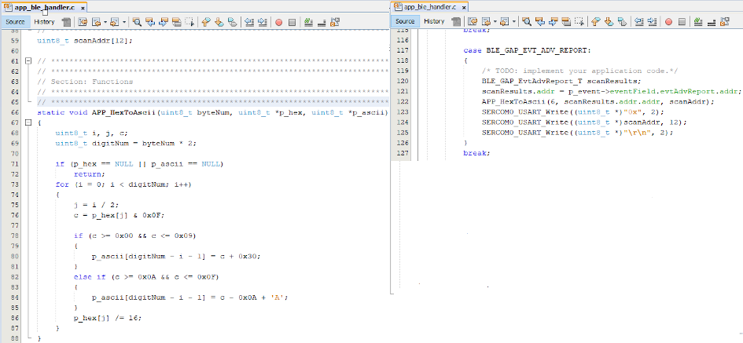

# BLE Legacy Scan

[Getting Started](https://onlinedocs.microchip.com/pr/GUID-A5330D3A-9F51-4A26-B71D-8503A493DF9C-en-US-1/index.html?GUID-17DABF04-E5D8-4201-A746-2FC244450A19)

[Getting Started with Central Building Blocks](https://onlinedocs.microchip.com/pr/GUID-A5330D3A-9F51-4A26-B71D-8503A493DF9C-en-US-1/index.html?GUID-E8C0DDA5-3AD0-42A4-B4EF-BCB02811BF8C)

[Adding UART](https://onlinedocs.microchip.com/pr/GUID-A5330D3A-9F51-4A26-B71D-8503A493DF9C-en-US-1/index.html?GUID-E1A0E9CA-311E-4F53-9C27-160173609975) **--\>** [Legacy Scan](#GUID-950762E2-DD5E-41CD-AAB4-895439CCFBC4) **--\>** [BLE Connection](https://onlinedocs.microchip.com/pr/GUID-A5330D3A-9F51-4A26-B71D-8503A493DF9C-en-US-1/index.html?GUID-7C948236-7D8E-45CA-9511-AB244B44BE64)

## Introduction {#INTRODUCTION .section}

This document will help users to enable BLE Scanning on WBZ451 Curiosity board using MPLAB Code Configurator\(MCC\). BLE Scanning is scanning for devices that are advertising. In BLE a central or observer always starts with scanning.

Users of this document can choose to just run the precompiled Application Example hex file on the WBZ451 Curiosity Board and experience the demo or can go through the steps involved in developing this Application from scratch

These examples each build on top on one and other. We strongly recommend that you follow the examples in order, to learn the basics concepts before progressing to the more advanced topics.

## Recommended Reads {#RECOMMENDED-READS .section}

1.  [BLE Software Specification](https://onlinedocs.microchip.com/pr/GUID-C5EAF60E-9124-427C-A0F1-F2DBE662EA92-en-US-1/index.html?GUID-222749FE-01C5-43B6-A5C7-CD82B3FC7F5F)

2.  [FreeRtos BLE App Initialize](https://onlinedocs.microchip.com/pr/GUID-A5330D3A-9F51-4A26-B71D-8503A493DF9C-en-US-1/index.html?GUID-897B75C0-387F-4AF8-B353-1F97A3B0BEC8)

3.  [Adding UART](https://onlinedocs.microchip.com/pr/GUID-A5330D3A-9F51-4A26-B71D-8503A493DF9C-en-US-1/index.html?GUID-E1A0E9CA-311E-4F53-9C27-160173609975)


## Hardware Required {#HARDWARE-REQUIRED .section}

|**Tool**|**Qty**|
|--------|-------|
|WBZ451 Curiosity Board|1|
|Micro USB cable|1|

## SDK Setup {#SDK-SETUP .section}

1.  [Getting Started with Sofware Development](https://onlinedocs.microchip.com/pr/GUID-A5330D3A-9F51-4A26-B71D-8503A493DF9C-en-US-1/index.html?GUID-2AD37FE2-1915-4E34-9A05-79E3810726D7)


## Software {#SOFTWARE .section}

1.  [TeraTerm](https://ttssh2.osdn.jp/index.html.en)


## Smartphone App {#SMARTPHONE-APP .section}

None

## Programming the precompiled hex file or Application Example {#PROGRAMMING-THE-PRECOMPILED-HEX-FILE-OR-APPLICATION-EXAMPLE .section}

**Programming the hex file using MPLABX IPE**

1.  Precompiled Hex file is located in "<Harmony Content Path\>/wireless\_apps\_pic32cxbz2\_wbz45\\apps\\ble\\building\_blocks\\central\\legacy\_scan\\hex" folder

2.  Follow the steps mentioned [here](https://microchipdeveloper.com/ipe:programming-device)


**Caution:** Users should choose the correct Device and Tool information

**Programming the Application using MPLABX IDE**

1.  Follow steps mentioned in of [Running a Precompiled Example](https://onlinedocs.microchip.com/pr/GUID-A5330D3A-9F51-4A26-B71D-8503A493DF9C-en-US-1/index.html?GUID-EA74172C-595E-4A34-B359-D42EE443F0EC) document

2.  Open and program the Application Example "central\_trp\_uart.x" located in "<Harmony Content Path\>/wireless\_apps\_pic32cxbz2\_wbz45\\apps\\ble\\building\_blocks\\central\\legacy\_scan\\firmware" using MPLABX IDE


<Harmony Content Path\> [how to find what is my Harmony Content Path](https://onlinedocs.microchip.com/pr/GUID-A5330D3A-9F51-4A26-B71D-8503A493DF9C-en-US-1/index.html?GUID-A55E9342-CE44-4A91-86BB-FEC6706FCD1C)

## Demo Description {#DEMO-DESCRIPTION .section}

This Application Example enables users to do passive scanning. After programming the Application Example, on reset user will be able to see the beginning of scan operation, the Bluetooth addresses of devices scanned for the next 10 seconds, the end of scanning operation

## Testing {#TESTING .section}

Connect the WBZ451 Curiosity board to PC, program the precompiled hex file or application example as mentioned. Open TeraTerm @ \(Speed: 115200, Data: 8-bit, Parity: none, stop bits: 1 bit, Flow control: none\). Reset the board. Upon reset, "Scanning" message is displayed on the TeraTerm. Once scan operation has begun user will be able to display all the Bluetooth addresses that are advertising on channel 37, 38 and 39. After 10 secs "Scan Completed" message is sent out.


Users can use another WBZ451 Curiosity Board configured as [BLE Advertiser](https://onlinedocs.microchip.com/pr/GUID-A5330D3A-9F51-4A26-B71D-8503A493DF9C-en-US-1/index.html?GUID-820CEA03-90AE-484F-87C9-9CF2CE652702) set the address and scan

## Developing this Application from scratch using MPLAB Code Configurator {#DEVELOPING-THIS-APPLICATION-FROM-SCRATCH-USING-MPLAB-CODE-CONFIGURATOR .section}

This section explains the steps required by a user to develop this application example from scratch using MPLABx Code Configurator

**Tip:** New users of MPLAB Code Configurator are recommended to go through the [overview](https://onlinedocs.microchip.com/pr/GUID-1F7007B8-9A46-4D03-AEED-650357BA760D-en-US-6/index.html?GUID-B5D058F5-1D0B-4720-8649-ACE5C0EEE2C0).

1.  Create a new MCC Harmony Project -- [link](https://onlinedocs.microchip.com/pr/GUID-A5330D3A-9F51-4A26-B71D-8503A493DF9C-en-US-1/index.html?GUID-B86E8493-D00D-46EF-8624-D412342147F0) for instructions

2. Import component configuration -- This step helps users setup the basic components and configuration required to develop this application. The imported file is of format .mc3 and is located in the path "<Harmony Content Path>\wireless_apps_pic32cxbz2_wbz45\apps\ble\building_blocks\central\legacy_scan\firmware\legacy_scan.X". Users should follow the instructions mentioned [here](https://onlinedocs.microchip.com/pr/GUID-A5330D3A-9F51-4A26-B71D-8503A493DF9C-en-US-1/index.html?GUID-F8FE2886-8A2C-4FC0-9956-C094CE44D162) to import the component configuration.

3.  Accept Dependencies or satisfiers, select "Yes"

4.  Verify if the Project Graph window has all the expected configuration

    


## Verify Scan Configuration {#VERIFY-SCAN-CONFIGURATION .section}

1.  Select **BLE\_Stack** component in project graph

    


## Generate Code {#GENERATE-CODE-LINK-FOR-INSTRUCTIONS .section}

Instructions on[how to Generate Code](https://onlinedocs.microchip.com/pr/GUID-A5330D3A-9F51-4A26-B71D-8503A493DF9C-en-US-1/index.html?GUID-9C28F407-4879-4174-9963-2CF34161398E)

## Files and Routines Automatically generated by the MCC {#FILES-AND-ROUTINES-AUTOMATICALLY-GENERATED-BY-THE-MCC .section}

After generating the program source from MCC interface by clicking Generate Code, the BLE configuration can be found in the following project directories


The [OSAL](http://ww1.microchip.com/downloads/en/DeviceDoc/MPLAB%20Harmony%20OSAL%20Libraries%20Help%20v2.06.pdf), RF System, BLE System initialization routine executed during program initialization can be found in the project files. This initialization routine is automatically generated by the MCC


The BLE stack initialization routine excuted during Application Initialization can be found in project files. This intitialization routine is automatically generated by the MCC. This call initializes and configures the GAP, GATT, SMP, L2CAP and BLE middleware layers.

Autogenerated, Scan Parameters


|**Source Files**|**Usage**|
|----------------|---------|
|app.c|Application State machine, includes calls for Initialization of all BLE stack \(GAP,GATT, SMP, L2CAP\) related component configurations|
|app\_ble\\app\_ble.c|Source Code for the BLE stack related component configurations, code related to function calls from app.c|
|app\_ble\\app\_ble\_handler.c|All GAP, GATT, SMP and L2CAP Event handlers|

> **Tip:** app.c is autogenerated and has a state machine based Application code sample, users can use this template to develop their application \|

**Header Files**

-   ble\_gap.h- This header file contains BLE GAP functions and is automatically included in the app.c file


**Function Calls**

MCC generates and adds the code to initialize the BLE Stack GAP, GATT, L2CAP and SMP in *APP\_BleStackInit\(\)* function

-   APP\_BleStackInit\(\) is the API that will be called inside the Applications Initial State -- APP\_STATE\_INIT in app.c


## User Application Development {#USER-APPLICATION-DEVELOPMENT .section}

**Include**

-   user action is required as mentioned [here](https://onlinedocs.microchip.com/pr/GUID-A5330D3A-9F51-4A26-B71D-8503A493DF9C-en-US-1/index.html?GUID-99583057-8B1A-42F2-84E8-CFC7717FA5D1)

-   definitions.h in all the files where UART will be used to print debug information Tip: definitions.h is not specific to just UART peripheral, instead it should be included in all application source files where peripheral functionality will be exercised


**Start Scanning**

```
BLE_GAP_SetScanningEnable(true, BLE_GAP_SCAN_FD_ENABLE, BLE_GAP_SCAN_MODE_OBSERVER, 100);
```

This API is called in the Applications initialstate - APP\_STATE\_INIT in app.c. Scan duration is 10 secs


**Scan Results**

-   BLE\_GAP\_EVT\_ADV\_REPORT event is generated upon finding Adverstisements on legacy channels


```
  // code snippet to print scan results
  uint8_t scanAddr[12]; //var to store ASCII address
  BLE_GAP_EvtAdvReport_T scanResults;
  scanResults.addr = p_event->eventField.evtAdvReport.addr;
  APP_HexToAscii(6, scanResults.addr.addr, scanAddr);
  SERCOM0_USART_Write((uint8_t *)"0x", 2);
  SERCOM0_USART_Write((uint8_t *)scanAddr, 12);
  SERCOM0_USART_Write((uint8_t *)"\r\n", 2);
```

```
// function to convert HEX to ASCII
static void APP_HexToAscii(uint8_t byteNum, uint8_t *p_hex, uint8_t *p_ascii)
{
    uint8_t i, j, c;
    uint8_t digitNum = byteNum * 2;

    if (p_hex == NULL || p_ascii == NULL)
        return;

    for (i = 0; i < digitNum; i++)
    {
        j = i / 2;
        c = p_hex[j] & 0x0F;

        if (c >= 0x00 && c <= 0x09)
        {
            p_ascii[digitNum - i - 1] = c + 0x30;
        }
        else if (c >= 0x0A && c <= 0x0F)
        {
            p_ascii[digitNum - i - 1] = c - 0x0A + 'A';
        }

        p_hex[j] /= 16;
    }
}
```



**Scan Timeout Event**

-   In app\_ble\_handler.c BLE\_GAP\_EVT\_SCAN\_TIMEOUT event is generated when BLE Scan duration expires.


Users can exercise various other BLE Advertisement functionalities by using [BLE Stack API](https://onlinedocs.microchip.com/pr/GUID-C5EAF60E-9124-427C-A0F1-F2DBE662EA92-en-US-1/index.html)

## Where to go from here {#WHERE-TO-GO-FROM-HERE .section}

-   [BLE Connection](https://onlinedocs.microchip.com/pr/GUID-A5330D3A-9F51-4A26-B71D-8503A493DF9C-en-US-1/index.html?GUID-F9A0C390-C124-49A7-9F22-157D20BFBE5D)


**Parent topic:**[Central](https://onlinedocs.microchip.com/pr/GUID-A5330D3A-9F51-4A26-B71D-8503A493DF9C-en-US-1/index.html?GUID-E8C0DDA5-3AD0-42A4-B4EF-BCB02811BF8C)
