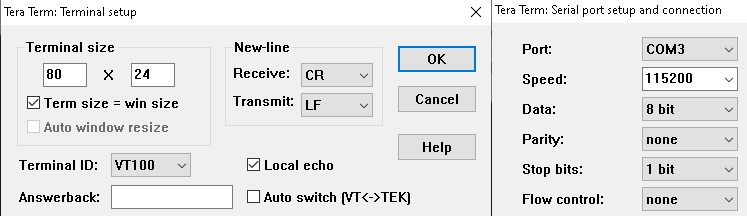
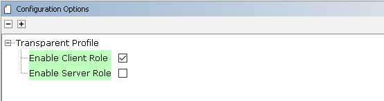
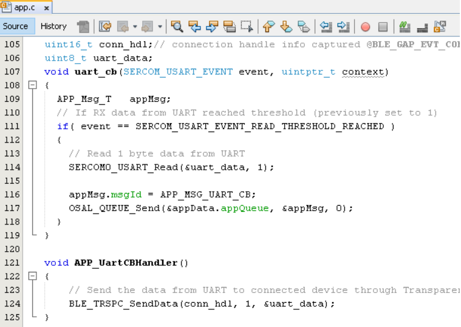
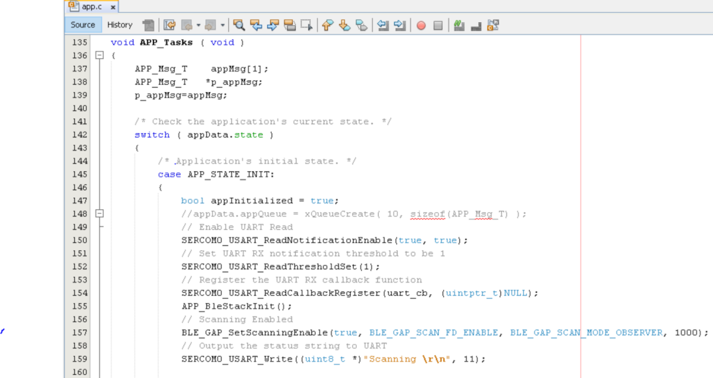
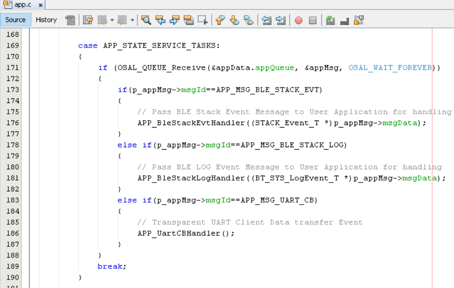

# BLE Transparent UART

[Getting Started](https://onlinedocs.microchip.com/pr/GUID-A5330D3A-9F51-4A26-B71D-8503A493DF9C-en-US-1/index.html?GUID-17DABF04-E5D8-4201-A746-2FC244450A19)

[Getting Started with Central Building Blocks](https://onlinedocs.microchip.com/pr/GUID-A5330D3A-9F51-4A26-B71D-8503A493DF9C-en-US-1/index.html?GUID-E8C0DDA5-3AD0-42A4-B4EF-BCB02811BF8C)

[BLE Connection](https://onlinedocs.microchip.com/pr/GUID-A5330D3A-9F51-4A26-B71D-8503A493DF9C-en-US-1/index.html?GUID-7C948236-7D8E-45CA-9511-AB244B44BE64) **--\>**[BLE Transparent UART\(you are here\)](#GUID-7A350957-2010-468F-AF8D-0635373EF79D) **--\>** [BLE Multilink Transparent UART](https://onlinedocs.microchip.com/pr/GUID-A5330D3A-9F51-4A26-B71D-8503A493DF9C-en-US-1/index.html?GUID-741308A7-A912-4C74-BF94-D5C44132003D)

## Introduction {#INTRODUCTION .section}

This document will help users create a central device and send/receive characters between 2 connected BLE devices over Microchip proprietary Transparent UART Profile. The central and peripheral devices in this tutorial are 2 WBZ451devices. The instructions mentioned below are applicable for a BLE Central device.

Users of this document can choose to just run the precompiled Application Example hex file on the WBZ451Curiosity board and experience the demo or can go through the steps involved in developing this Application from scratch.

These examples each build on top on one and other. We strongly recommend that you follow the examples in order, to learn the basics concepts before progressing to the more advanced topics.

## Recommended Reads {#RECOMMENDED-READS .section}

1.  [BLE Software Specification](https://onlinedocs.microchip.com/pr/GUID-C5EAF60E-9124-427C-A0F1-F2DBE662EA92-en-US-1/index.html?GUID-222749FE-01C5-43B6-A5C7-CD82B3FC7F5F)

2.  [BLE Connection\(central\)](https://onlinedocs.microchip.com/pr/GUID-A5330D3A-9F51-4A26-B71D-8503A493DF9C-en-US-1/index.html?GUID-7C948236-7D8E-45CA-9511-AB244B44BE64)


## Hardware Required {#HARDWARE-REQUIRED .section}

|**Tool**|**Qty**|
|--------|-------|
|WBZ451Curiosity Board|2|
|Micro USB cable|2|

## SDK Setup {#SDK-SETUP .section}

1.  [Getting Started with Software Development](https://onlinedocs.microchip.com/pr/GUID-A5330D3A-9F51-4A26-B71D-8503A493DF9C-en-US-1/index.html?GUID-2AD37FE2-1915-4E34-9A05-79E3810726D7)


## Software {#SOFTWARE .section}

1.  [TeraTerm](https://ttssh2.osdn.jp/index.html.en)


## Smartphone App {#SMARTPHONE-APP .section}

None

## Programming the precompiled hex file or Application Example {#PROGRAMMING-THE-PRECOMPILED-HEX-FILE-OR-APPLICATION-EXAMPLE .section}

**Programming the hex file using MPLABX IPE**

1.  Precompiled Hex file is located in "<Harmony Content Path\>/wireless\_apps\_pic32cxbz2\_wbz45\\apps\\ble\\building\_blocks\\central\\profiles\_services\\central\_trp\_uart\\hex" folder

2.  Follow the steps mentioned [here](https://microchipdeveloper.com/ipe:programming-device)


**Caution:** Users should choose the correct Device and Tool information

**Programming the Application using MPLABX IDE**

1.  Follow steps mentioned in of [Running a Precompiled Example](https://onlinedocs.microchip.com/pr/GUID-A5330D3A-9F51-4A26-B71D-8503A493DF9C-en-US-1/index.html?GUID-EA74172C-595E-4A34-B359-D42EE443F0EC) document

2.  Open and program the Application Example "central\_trp\_uart.x" located in "<Harmony Content Path\>/wireless\_apps\_pic32cxbz2\_wbz45\\apps\\ble\\building\_blocks\\central\\profiles\_services\\central\_trp\_uart\\firmware" using MPLABX IDE


<Harmony Content Path\> [how to find what is my Harmony Content Path](https://onlinedocs.microchip.com/pr/GUID-A5330D3A-9F51-4A26-B71D-8503A493DF9C-en-US-1/index.html?GUID-A55E9342-CE44-4A91-86BB-FEC6706FCD1C)

## Demo Description {#DEMO-DESCRIPTION .section}

Upon programming the demo application, central device \(WBZ451\) will start scanning for near by peripheral devices to connect. After a connection has been made data can be sent back and forth over UART between the two devices that are connected.

Demo will print start of the scanning "Scanning",connected "Connected!" and disconnected "Disconnected" state on a terminal emulator like TeraTerm@ \(Speed: 115200, Data: 8-bit, Parity: none, stop bits: 1 bit, Flow control: none\) Application Data to be sent to the connected peripheral device should be entered in the terminal emulator.

## Testing {#TESTING .section}

Users should use another WBZ451 Curiosity Board configured as [BLE Transparent UART\(peripheral\)](https://onlinedocs.microchip.com/pr/GUID-A5330D3A-9F51-4A26-B71D-8503A493DF9C-en-US-1/index.html?GUID-07EC83B7-CC28-4C55-8634-4B7F56A9DB36)

**Demo Experience when using 2 WBZ451Curiosity boards configured as Peripheral and Central device** This section assumes that a user has already programmed the peripheral\_trp\_uart and central\_trp\_uart application on 2 WBZ451Curiosity Boards.

Board1 = WBZ451Curiosity Board with peripheral\_trp\_uart application Programmed Board2 = WBZ451Curiosity Board with central\_trp\_uart applicaton Programmed

Board1: Open TeraTerm @ \(Speed: 115200, Data: 8-bit, Parity: none, stop bits: 1 bit, Flow control: none\). Reset the board. Upon reset, "Advertising" message is displayed on the TeraTerm.



Board2: Open TeraTerm @ \(Speed: 115200, Data: 8-bit, Parity: none, stop bits: 1 bit, Flow control: none\). Reset the board. Upon reset, "Scanning" message is displayed on the TeraTerm. Upon finding peripheral device with public address \{0xA1, 0xA2, 0xA3, 0xA4, 0xA5, 0xA6\} message "Found Peer Node" will be displayed and a connection request will be initiated "Initiating connection".

**Note:** Scanner is configured to scan only for 100 secs, user should ensure the peer device is advertising

After connection establishment, both the peripheral device \(Board1\) and central device\(Board2\) will display "Connected!" message on respective terminal windows.

Users can now start sending data back and forth between the central and peripheral device using the terminal emulator. Characters entered on either terminals will immediately be sent to the peer devices


## Developing this Application from scratch using MPLAB Code Configurator {#DEVELOPING-THIS-APPLICATION-FROM-SCRATCH-USING-MPLAB-CODE-CONFIGURATOR .section}

This section explains the steps required by a user to develop this application example from scratch using MPLABx Code Configurator

**Tip:** New users of MPLAB Code Configurator\(MCC\) are recommended to go through the [overview](https://onlinedocs.microchip.com/pr/GUID-1F7007B8-9A46-4D03-AEED-650357BA760D-en-US-6/index.html?GUID-B5D058F5-1D0B-4720-8649-ACE5C0EEE2C0).

1.  Create a new MPLAB MCC Harmony Project -- [link](https://onlinedocs.microchip.com/pr/GUID-A5330D3A-9F51-4A26-B71D-8503A493DF9C-en-US-1/index.html?GUID-B86E8493-D00D-46EF-8624-D412342147F0) for instructions

2.  Import component configuration -- This step helps users setup the basic components required to start their Application Development component configuration related to this Application is available. The imported file is of format .mc3 and is located in the path "<Harmony Content Path\>/wireless\_apps\_pic32cxbz2\_wbz45\\apps\\ble\\building\_blocks\\central\\profiles\_services\\central\_trp\_uart\\firmware\\central\_trp\_uart.X". Users should follow the instructions mentioned [here](https://microchipdeveloper.com/mcc:peripheralconfig) to import the component configuration.


**Tip:** Import and Export functionality of component configuration will help users to start from a known working setup of configuration

1.  Accept Dependencies or satisfiers, select "Yes"

2.  Verify if the Project Graph window has all the expected configuration

    


## Verify Scan,Connection and Transparent UART Profile Configuration {#VERIFY-SCANCONNECTION-AND-TRANSPARENT-UART-PROFILE-CONFIGURATION .section}

1.  Select **BLE\_Stack** component in project graph

    

2.  Select **Transparent Profile** component in project graph

    


## Generate Code {#GENERATE-CODE-LINK-FOR-INSTRUCTIONS .section}

Instructions on[how to Generate Code](https://onlinedocs.microchip.com/pr/GUID-A5330D3A-9F51-4A26-B71D-8503A493DF9C-en-US-1/index.html?GUID-9C28F407-4879-4174-9963-2CF34161398E)

## Files and Routines Automatically generated by the MCC {#FILES-AND-ROUTINES-AUTOMATICALLY-GENERATED-BY-THE-MCC .section}

After generating the program source from MCC interface by clicking Generate Code, the BLE configuration can be found in the following project directories


The [OSAL](http://ww1.microchip.com/downloads/en/DeviceDoc/MPLAB%20Harmony%20OSAL%20Libraries%20Help%20v2.06.pdf), RF System, BLE System initialization routine executed during program initialization can be found in the project files. This initialization routine is automatically generated by the MCC


The BLE stack initialization routine excuted during Application Initialization can be found in project files. This intitialization routine is automatically generated by the MCC. This call initializes and configures the GAP, GATT, SMP, L2CAP and BLE middleware layers.


|**Source Files**|**Usage**|
|----------------|---------|
|app.c|Application State machine, includes calls for Initialization of all BLE stack \(GAP,GATT, SMP, L2CAP\) related component configurations|
|app\_ble\\app\_ble.c|Source Code for the BLE stack related component configurations, code related to function calls from app.c|
|app\_ble\\app\_ble\_handler.c|All GAP, GATT, SMP and L2CAP Event handlers|
|app\_ble\\app\_trspc\_handler.c|All Transparent UART Client related Event handlers|
|ble\_trspc.c|All Transparent Client Functions for user application|

**Tip:**

app.c is autogenerated and has a state machine based Application code sample, users can use this template to develop their application

**Header Files**

-   ble\_gap.h- This header file contains BLE GAP functions and is automatically included in the app.c file

-   ble\_trspc.h is the Header File associated with API’s and structures related to BLE Transparent Client functions for Application User


**Function Calls**

MCC generates and adds the code to initialize the BLE Stack GAP, GATT, L2CAP and SMP in *APP\_BleStackInit\(\)* function

-   APP\_BleStackInit\(\) is the API that will be called inside the Applications Initial State -- APP\_STATE\_INIT in app.c


## User Application Development {#USER-APPLICATION-DEVELOPMENT .section}

**Include**

-   "ble\_trspc.h" in app.c, BLE Transparent UART Server related API's are available here

-   "osal/osal\_freertos\_extend.h" in app\_trsps\_handler.c, OSAL related API's are available here

-   definitions.h in all the files where UART will be used to print debug information Tip: definitions.h is not specific to just UART peripheral, instead it should be included in all application source files where peripheral functionality will be exercised

-   user action is required as mentioned [here](https://onlinedocs.microchip.com/pr/GUID-A5330D3A-9F51-4A26-B71D-8503A493DF9C-en-US-1/index.html?GUID-99583057-8B1A-42F2-84E8-CFC7717FA5D1)


**Start Scanning**

```
BLE_GAP_SetScanningEnable(true, BLE_GAP_SCAN_FD_ENABLE, BLE_GAP_SCAN_MODE_OBSERVER, 1000);
```


This API is called in the Applications initialstate - APP\_STATE\_INIT in app.c. Scan duration is 100 secs

**Scan Results and initiating a BLE connection**

-   BLE\_GAP\_EVT\_ADV\_REPORT event is generated upon finding Adverstisements on legacy channels

-   BLE connection can be initiated by using the API BLE\_GAP\_CreateConnection\(&createConnParam\_t\);


```
  // code snippet to filter scan results and initiate connection
  if (p_event->eventField.evtAdvReport.addr.addr[0] == 0xA1 && p_event->eventField.evtAdvReport.addr.addr[1] == 0xA2)
  {
      SERCOM0_USART_Write((uint8_t *)"Found Peer Node\r\n", 17);
      BLE_GAP_CreateConnParams_T createConnParam_t;
      createConnParam_t.scanInterval = 0x3C; // 37.5 ms
      createConnParam_t.scanWindow = 0x1E; // 18.75 ms
      createConnParam_t.filterPolicy = BLE_GAP_SCAN_FP_ACCEPT_ALL;
      createConnParam_t.peerAddr.addrType = p_event->eventField.evtAdvReport.addr.addrType;
      memcpy(createConnParam_t.peerAddr.addr, p_event->eventField.evtAdvReport.addr.addr, GAP_MAX_BD_ADDRESS_LEN);
      createConnParam_t.connParams.intervalMin = 0x10; // 20ms
      createConnParam_t.connParams.intervalMax = 0x10; // 20ms
      createConnParam_t.connParams.latency = 0;
      createConnParam_t.connParams.supervisionTimeout = 0x48; // 720ms
      SERCOM0_USART_Write((uint8_t *)"Initiating Connection\r\n", 23);
      BLE_GAP_CreateConnection(&createConnParam_t);
  }

```


**Connected & Disconnected Events**

-   In app\_ble\_handler.c BLE\_GAP\_EVT\_CONNECTED event will be generated when a BLE connection is completed


**Connection Handler**

-   Connection handle associated with the peer peripheral device needs to be saved for data exchange after a BLE connection

-   p\_event-\>eventField.evtConnect.connHandle has this information

    


**Transmit Data**

-   BLE\_TRSPC\_SendData\(conn\_hdl , 1, &data\); is the API to be used for sending data towards the central device **Note:** The precompiled application example uses a UART callback to initiate the data transmission upon receiving a character on UART


Example Implementation for Transmitting the received data over UART using the BLE\_TRSPC\_SendData API

```
uint16_t conn_hdl;// connection handle info captured @BLE_GAP_EVT_CONNECTED event
uint8_t uart_data;
void uart_cb(SERCOM_USART_EVENT event, uintptr_t context)
{
  APP_Msg_T   appMsg;   
  // If RX data from UART reached threshold (previously set to 1)
  if( event == SERCOM_USART_EVENT_READ_THRESHOLD_REACHED )
  {
    // Read 1 byte data from UART
    SERCOM0_USART_Read(&uart_data, 1);

    appMsg.msgId = APP_MSG_UART_CB;
    OSAL_QUEUE_Send(&appData.appQueue, &appMsg, 0);     
  }
}
void APP_UartCBHandler()
{
    // Send the data from UART to connected device through Transparent service
    BLE_TRSPC_SendData(conn_hdl, 1, &uart_data);     
}
  // Register call back when data is available on UART for Peripheral Device to send
  // Enable UART Read
  SERCOM0_USART_ReadNotificationEnable(true, true);
  // Set UART RX notification threshold to be 1
  SERCOM0_USART_ReadThresholdSet(1);
  // Register the UART RX callback function
  SERCOM0_USART_ReadCallbackRegister(uart_cb, (uintptr_t)NULL);

//If msg received in Queue, handle the Queue message based on msgID
if (OSAL_QUEUE_Receive(&appData.appQueue, &appMsg, OSAL_WAIT_FOREVER))
  {
    if(p_appMsg->msgId==APP_MSG_BLE_STACK_EVT)
    {
     // Pass BLE Stack Event Message to User Application for handling
     APP_BleStackEvtHandler((STACK_Event_T *)p_appMsg->msgData);
     }
     else if(p_appMsg->msgId==APP_MSG_BLE_STACK_LOG)
     {
     // Pass BLE LOG Event Message to User Application for handling
     APP_BleStackLogHandler((BT_SYS_LogEvent_T *)p_appMsg->msgData);
      }
      else if(p_appMsg->msgId==APP_MSG_UART_CB)
      {
       // Transparent UART Client Data transfer Event
       APP_UartCBHandler();
       }                
  }
```







**Receive Data**

-   BLE\_TRSPC\_EVT\_RECEIVE\_DATA is the event generated when data is sent from central device

-   Users need to use the BLE\_TRSPC\_GetDataLength\(&data\_len\) API to extract the length of application data received

-   BLE\_TRSPC\_GetData\(&conn\_hdl, data\); API is used to retrieve the data, conn\_hdl is the value obtained from Connection Handler section


**Tip:** BLE\_TRSPC\_Event\_T p\_event structure stores the information about BLE transparent UART callback functions

Example Implementation for printing the received data from peripheral device over UART

```
  /* TODO: implement your application code.*/
    uint16_t data_len;
    uint8_t *data;
    // Retrieve received data length
    BLE_TRSPC_GetDataLength(p_event->eventField.onReceiveData.connHandle, &data_len);
    // Allocate memory according to data length
    data = OSAL_Malloc(data_len);
    if(data == NULL)
    break;
    // Retrieve received data
    BLE_TRSPC_GetData(p_event->eventField.onReceiveData.connHandle, data);
    // Output received data to UART
    SERCOM0_USART_Write(data, data_len);
    // Free memory
    OSAL_Free(data);
```


Users can exercise various other BLE functionalities by using [BLE Stack API](https://onlinedocs.microchip.com/pr/GUID-C5EAF60E-9124-427C-A0F1-F2DBE662EA92-en-US-1/index.html)

## Where to go from here {#WHERE-TO-GO-FROM-HERE .section}

-   [BLE Multilink Transparent UART](https://onlinedocs.microchip.com/pr/GUID-A5330D3A-9F51-4A26-B71D-8503A493DF9C-en-US-1/index.html?GUID-741308A7-A912-4C74-BF94-D5C44132003D)


**Parent topic:**[Central](https://onlinedocs.microchip.com/pr/GUID-A5330D3A-9F51-4A26-B71D-8503A493DF9C-en-US-1/index.html?GUID-E8C0DDA5-3AD0-42A4-B4EF-BCB02811BF8C)

