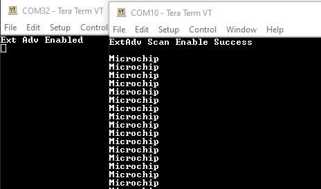
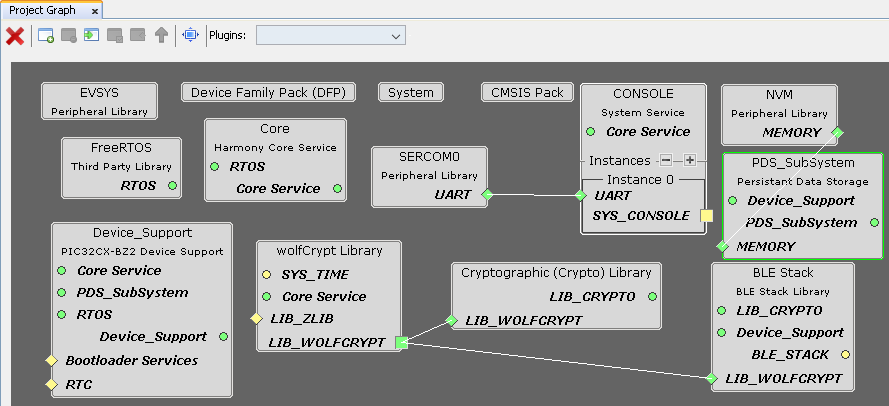
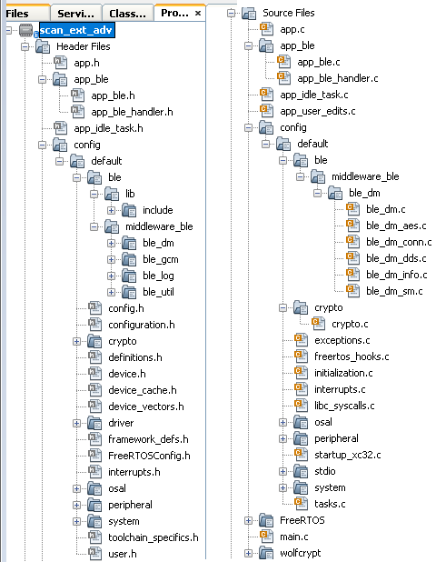
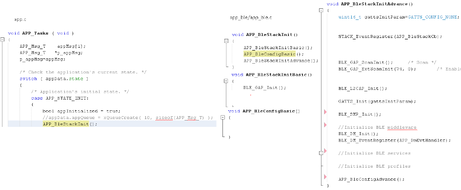
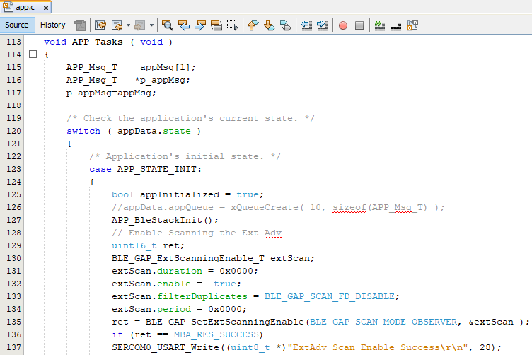
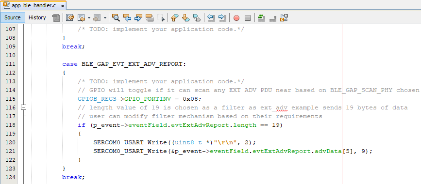

# BLE Scanning Extended Advertisements

[Getting Started](https://onlinedocs.microchip.com/pr/GUID-A5330D3A-9F51-4A26-B71D-8503A493DF9C-en-US-1/index.html?GUID-17DABF04-E5D8-4201-A746-2FC244450A19)

[Getting Started with Central Building Blocks](https://onlinedocs.microchip.com/pr/GUID-A5330D3A-9F51-4A26-B71D-8503A493DF9C-en-US-1/index.html?GUID-E8C0DDA5-3AD0-42A4-B4EF-BCB02811BF8C)

[Adding UART](https://onlinedocs.microchip.com/pr/GUID-A5330D3A-9F51-4A26-B71D-8503A493DF9C-en-US-1/index.html?GUID-E1A0E9CA-311E-4F53-9C27-160173609975) **--\>** [**Extended Advertisements** \(you are here\)](#GUID-8C3372E5-CAB6-4923-9B59-E97022E1252D)

## Introduction {#INTRODUCTION .section}

This document will enable scanning of Extended Advertisements \(ADV\_EXT\_IND, ADV\_AUX\_IND\) on WBZ451 Curiosity board. For a successful scan of Extended Advertisement user needs to have a broadcaster transmitting these Advertisements. In BLE a central or observer always starts with scanning.

Usage of scan\_ext\_adv Application example in combination with ext\_adv example will enable users to test features like long range \(Coded PHY\) and sending data \(1M, 2M, Coded PHY\) over extended advertisements

Users can run run the precompiled Application Example hex file on the WBZ451 Curiosity Board and go through the steps involved in developing this Application from scratch

These examples each build on top on one and other. We strongly recommend that you follow the examples in order, to learn the basics concepts before progressing to the more advanced topics.

## Recommended Reads {#RECOMMENDED-READS .section}

1.  [BLE Software Specification](https://onlinedocs.microchip.com/pr/GUID-C5EAF60E-9124-427C-A0F1-F2DBE662EA92-en-US-1/index.html?GUID-222749FE-01C5-43B6-A5C7-CD82B3FC7F5F)

2.  [FreeRtos BLE App Initialize](https://onlinedocs.microchip.com/pr/GUID-A5330D3A-9F51-4A26-B71D-8503A493DF9C-en-US-1/index.html?GUID-897B75C0-387F-4AF8-B353-1F97A3B0BEC8)

3.  [Adding UART](https://onlinedocs.microchip.com/pr/GUID-A5330D3A-9F51-4A26-B71D-8503A493DF9C-en-US-1/index.html?GUID-E1A0E9CA-311E-4F53-9C27-160173609975)


## Hardware Required {#HARDWARE-REQUIRED .section}

|**Tool**|**Qty**|
|--------|-------|
|WBZ451 Curiosity Board|2|
|Micro USB cable|2|

## SDK Setup {#SDK-SETUP .section}

1.  [Getting Started with Software Development](https://onlinedocs.microchip.com/pr/GUID-A5330D3A-9F51-4A26-B71D-8503A493DF9C-en-US-1/index.html?GUID-2AD37FE2-1915-4E34-9A05-79E3810726D7)


## Software {#SOFTWARE .section}

1.  [TeraTerm](https://ttssh2.osdn.jp/index.html.en)


## Smartphone App {#SMARTPHONE-APP .section}

None

## Programming the precompiled hex file or Application Example {#PROGRAMMING-THE-PRECOMPILED-HEX-FILE-OR-APPLICATION-EXAMPLE .section}

**Programming the hex file using MPLABX IPE**

1.  Precompiled Hex file is located in "<Harmony Content Path\>\\wireless\_apps\_pic32cxbz2\_wbz45\\apps\\ble\\building\_blocks\\central\\scan\_ext\_adv\\hex" folder

2.  Follow the steps mentioned [here](https://microchipdeveloper.com/ipe:programming-device)


**Caution:** Users should choose the correct Device and Tool information

**Programming the Application using MPLABX IDE**

1.  Follow steps mentioned in of [Running a Precompiled Example](https://onlinedocs.microchip.com/pr/GUID-A5330D3A-9F51-4A26-B71D-8503A493DF9C-en-US-1/index.html?GUID-EA74172C-595E-4A34-B359-D42EE443F0EC) document

2.  Open and program the Application Example "scan\_ext\_adv.x" located in "<Harmony Content Path\>\\wireless\_apps\_pic32cxbz2\_wbz45\\apps\\ble\\building\_blocks\\central\\scan\_ext\_adv\\firmware" using MPLABX IDE


<Harmony Content Path\> [how to find what is my Harmony Content Path](https://onlinedocs.microchip.com/pr/GUID-A5330D3A-9F51-4A26-B71D-8503A493DF9C-en-US-1/index.html?GUID-A55E9342-CE44-4A91-86BB-FEC6706FCD1C)

## Demo Description {#DEMO-DESCRIPTION .section}

This Application Example enables users to do scanning of Extended Advertisements \(ADV\_EXT\_IND, ADV\_AUX\_IND PDU's\). Scanning of CODED PHY \(125 knps\) is enabled by default in the application. After programming the Application Example, on reset "ExtAdv Scan Enable Success" will be printed in the terminal window and if there is a broadcaster sending extended advertisements the Green LED will toggle. If this broadcaster is another WBZ451 module programmed with ext\_adv example it will print the Application Data sent in Auxiliary packet - ADV\_AUX\_IND on TeraTerm \(115200, Data: 8-bit, Parity: none, stop bits: 1 bit, Flow control: none\). Green LED toggles denote the reception of Extended Advertisements.

## Testing {#TESTING .section}

Users should use another WBZ451 Curiosity Board configured as [BLE Ext Adv](https://onlinedocs.microchip.com/pr/GUID-A5330D3A-9F51-4A26-B71D-8503A493DF9C-en-US-1/index.html?GUID-9A3C4C97-E09F-4FF9-878C-3873892445F4)

This section assumes that a user has already programmed the ext\_adv and scan\_ext\_adv application on 2 WBZ451 Curiosity Boards.

Board1 = WBZ451 Curiosity Board with Ext Adv Programmed Board2 = WBZ451 Curiosity Board with Scan Ext Adv Programmed

Board1: Open TeraTerm @ \(Speed: 115200, Data: 8-bit, Parity: none, stop bits: 1 bit, Flow control: none\). Reset the board. Upon reset, "Ext Adv Enable" message is displayed on the TeraTerm.

Board2: Open TeraTerm @ \(Speed: 115200, Data: 8-bit, Parity: none, stop bits: 1 bit, Flow control: none\). Reset the board. Upon reset, "ExtAdv Scan Enable Success" message is displayed on the TeraTerm. "Microchip" message will be displayed as soon the WBZ451 module performs an extended advertisement scan.

Data from advertiser is sent every 2 secs, Green LED is toggled when the observer device receives these extended advertisements.



## Developing this Application from scratch using MPLAB Code Configurator {#DEVELOPING-THIS-APPLICATION-FROM-SCRATCH-USING-MPLAB-CODE-CONFIGURATOR .section}

This section explains the steps required by a user to develop this application example from scratch using MPLABx Code Configurator

**Tip:** New users of MPLAB Code Configurator are recommended to go through the [overview](https://onlinedocs.microchip.com/pr/GUID-1F7007B8-9A46-4D03-AEED-650357BA760D-en-US-6/index.html?GUID-B5D058F5-1D0B-4720-8649-ACE5C0EEE2C0) .

1.  Create a new MCC Harmony Project - [instructions.](https://onlinedocs.microchip.com/pr/GUID-A5330D3A-9F51-4A26-B71D-8503A493DF9C-en-US-1/index.html?GUID-B86E8493-D00D-46EF-8624-D412342147F0)

2. Import component configuration -- This step helps users setup the basic components and configuration required to develop this application. The imported file is of format .mc3 and is located in the path "<Harmony Content Path>\wireless_apps_pic32cxbz2_wbz45\apps\ble\building_blocks\central\scan_ext_adv\firmware\scan_ext_adv.X\". Users should follow the instructions mentioned [here](https://onlinedocs.microchip.com/pr/GUID-A5330D3A-9F51-4A26-B71D-8503A493DF9C-en-US-1/index.html?GUID-F8FE2886-8A2C-4FC0-9956-C094CE44D162) to import the component configuration.

    **Tip:** Import and Export functionality of component configuration will help users to start from a known working setup of configuration

3.  Accept Dependencies or satisfiers, select "Yes"

4.  Verify if the Project Graph window has all the expected configuration

    


## Verify Scan Configuration {#VERIFY-SCAN-CONFIGURATION .section}

1.  Select **BLE\_Stack** component in project graph

    


## Generate Code {#GENERATE-CODE--LINK--FOR-INSTRUCTIONS .section}

Instructions on[how to Generate Code](https://onlinedocs.microchip.com/pr/GUID-A5330D3A-9F51-4A26-B71D-8503A493DF9C-en-US-1/index.html?GUID-9C28F407-4879-4174-9963-2CF34161398E)

## Files and Routines Automatically generated by the MCC {#FILES-AND-ROUTINES-AUTOMATICALLY-GENERATED-BY-THE-MCC .section}

After generating the program source from MCC interface by clicking Generate Code, the BLE configuration can be found in the following project directories



The [OSAL](http://ww1.microchip.com/downloads/en/DeviceDoc/MPLAB%20Harmony%20OSAL%20Libraries%20Help%20v2.06.pdf), RF System, BLE System initialization routine executed during program initialization can be found in the project files. This initialization routine is automatically generated by the MCC


The BLE stack initialization routine excuted during Application Initialization can be found in project files. This intitialization routine is automatically generated by the MCC. This call initializes and configures the GAP, GATT, SMP, L2CAP and BLE middleware layers.



Configuration for scanning extended advertisements is autogenerated

|**Source Files**|**Usage**|
|----------------|---------|
|app.c|Application State machine, includes calls for Initialization of all BLE stack \(GAP,GATT, SMP, L2CAP\) related component configurations|
|app\_ble\\app\_ble.c|Source Code for the BLE stack related component configurations, code related to function calls from app.c|
|app\_ble\\app\_ble\_handler.c|All GAP, GATT, SMP and L2CAP Event handlers|
|app\_user\_edits.c|User Code Change instruction|

> **Tip:** app.c is autogenerated and has a state machine based Application code sample, users can use this template to develop their application \|

**Header Files**

-   ble\_gap.h \(Header Files\\config\\default\\ble\\lib\\include\\\)- This header file contains BLE GAP functions and is automatically included in the app.c file


**Function Calls**

MCC generates and adds the code to initialize the BLE Stack GAP, GATT, L2CAP and SMP in *APP\_BleStackInit\(\)* function

-   APP\_BleStackInit\(\) is the API that will be called inside the Applications Initial State -- APP\_STATE\_INIT in app.c


## User Application Development {#USER-APPLICATION-DEVELOPMENT .section}

**Include**

-   definitions.h in all the files where UART will be used to print debug information


> Tip: definitions.h is not specific to just UART peripheral, instead it should be included in all application source files where peripheral functionality will be exercised

-   user action is required as mentioned [User Action](https://onlinedocs.microchip.com/pr/GUID-A5330D3A-9F51-4A26-B71D-8503A493DF9C-en-US-1/index.html?GUID-99583057-8B1A-42F2-84E8-CFC7717FA5D1)


**Enable Scanning of Extended Advertisement**

-   BLE\_GAP\_SetExtScanningEnable\(BLE\_GAP\_SCAN\_MODE\_OBSERVER, &extScan \);


API's mentioned in this section are called in the Applications initial state - APP\_STATE\_INIT in app.c



**Configure LED**

Add the following piece of code in GPIO\_Initialize\(\) available in - Source Files\\config\\default\\peripheral\\gpio\\plib\_gpio.c

```
    GPIOB_REGS->GPIO_LAT = 0x0; /* Initial Latch Value */
    GPIOB_REGS->GPIO_TRISCLR = 0x8; /* Direction Control */
    GPIOB_REGS->GPIO_ANSELCLR = 0x8; /* Digital Mode Enable */
```

**Scan Results**

-   BLE\_GAP\_EVT\_EXT\_ADV\_REPORT event is generated upon finding Adverstisements on legacy channels


```
  // code snippet to print ext adv data
    // GPIO will toggle if it can scan any EXT ADV PDU near based on BLE_GAP_SCAN_PHY chosen
    GPIOB_REGS->GPIO_PORTINV = 0x08;
    // length value of 19 is chosen as a filter as ext_adv example sends 19 bytes of data
    // user can modify filter mechanism based on their requirements
    if (p_event->eventField.evtExtAdvReport.length == 19)
    {
        SERCOM0_USART_Write((uint8_t *)"\r\n", 2);
        SERCOM0_USART_Write(&p_event->eventField.evtExtAdvReport.advData[5], 9);
    }
```



Users can exercise various other BLE Scanning functionalities by using [BLE Stack API](https://onlinedocs.microchip.com/pr/GUID-C5EAF60E-9124-427C-A0F1-F2DBE662EA92-en-US-1/index.html)

## Where to go from here {#WHERE-TO-GO-FROM-HERE .section}

[Getting Started with Central Building Blocks](https://onlinedocs.microchip.com/pr/GUID-A5330D3A-9F51-4A26-B71D-8503A493DF9C-en-US-1/index.html?GUID-E8C0DDA5-3AD0-42A4-B4EF-BCB02811BF8C)

**Parent topic:**[Central](https://onlinedocs.microchip.com/pr/GUID-A5330D3A-9F51-4A26-B71D-8503A493DF9C-en-US-1/index.html?GUID-E8C0DDA5-3AD0-42A4-B4EF-BCB02811BF8C)
