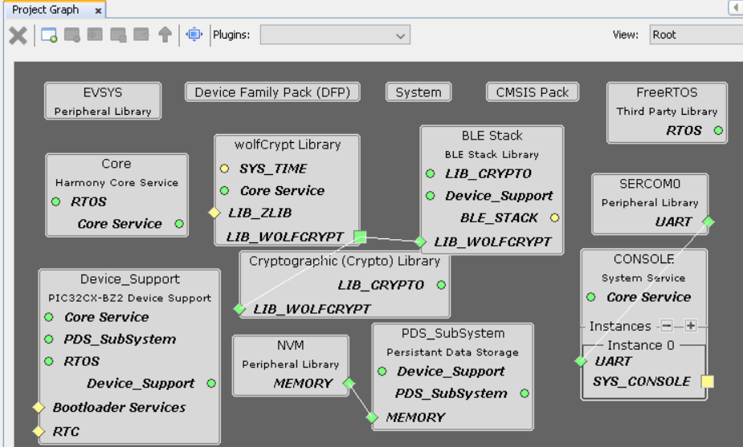
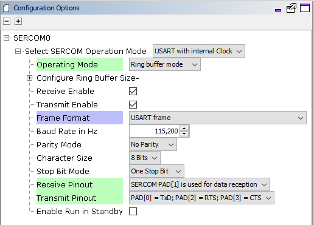
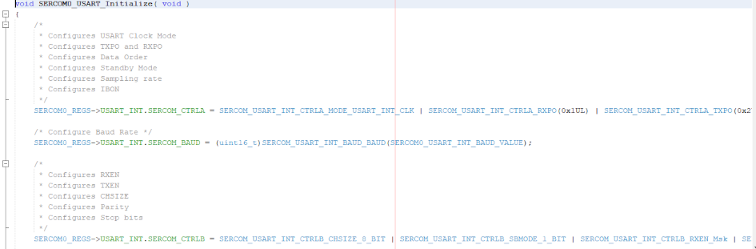

# UART -- Hello World

[Getting Started](https://onlinedocs.microchip.com/pr/GUID-A5330D3A-9F51-4A26-B71D-8503A493DF9C-en-US-2/index.html?GUID-17DABF04-E5D8-4201-A746-2FC244450A19)

[Getting Started with Peripheral Building Blocks](https://onlinedocs.microchip.com/pr/GUID-A5330D3A-9F51-4A26-B71D-8503A493DF9C-en-US-2/index.html?GUID-B3B46369-F5B4-401B-8405-658BE34988F4)

[Getting Started with Central Building Blocks](https://onlinedocs.microchip.com/pr/GUID-A5330D3A-9F51-4A26-B71D-8503A493DF9C-en-US-2/index.html?GUID-E8C0DDA5-3AD0-42A4-B4EF-BCB02811BF8C)

BLE Peripheral Developers: [FreeRTOS and BLE Stack Setup](https://onlinedocs.microchip.com/pr/GUID-A5330D3A-9F51-4A26-B71D-8503A493DF9C-en-US-2/index.html?GUID-AB1A02BF-4F9B-4058-90D9-02BFB3136682) **--\>** [Adding UART](#GUID-E1A0E9CA-311E-4F53-9C27-160173609975) **--\>** [Legacy Advertisements](https://onlinedocs.microchip.com/pr/GUID-A5330D3A-9F51-4A26-B71D-8503A493DF9C-en-US-2/index.html?GUID-820CEA03-90AE-484F-87C9-9CF2CE652702)

BLE Central Developers: [FreeRTOS and BLE Stack Setup](https://onlinedocs.microchip.com/pr/GUID-A5330D3A-9F51-4A26-B71D-8503A493DF9C-en-US-2/index.html?GUID-897B75C0-387F-4AF8-B353-1F97A3B0BEC8) **--\>** [Adding UART](#GUID-E1A0E9CA-311E-4F53-9C27-160173609975) **--\>** [Legacy Scan](https://onlinedocs.microchip.com/pr/GUID-A5330D3A-9F51-4A26-B71D-8503A493DF9C-en-US-2/index.html?GUID-950762E2-DD5E-41CD-AAB4-895439CCFBC4)

## Introduction {#INTRODUCTION .section}

This document will help users to enable UART functionality on WBZ451 Curiosity board using MPLAB Code Configurator

Users of this document can choose to just run the precompiled Application Example hex on the WBZ451 Curiosity Board and experience the demo or can go through the steps involved in enabling UART from scratch using MPLAB Code Configurator

## Recommended Reads {#RECOMMENDED-READS .section}

1.  [BLE Software Specification](https://onlinedocs.microchip.com/pr/GUID-C5EAF60E-9124-427C-A0F1-F2DBE662EA92-en-US-2/index.html?GUID-222749FE-01C5-43B6-A5C7-CD82B3FC7F5F)

2.  [FreeRtos BLE App Initialize \(Peripheral\)](https://onlinedocs.microchip.com/pr/GUID-A5330D3A-9F51-4A26-B71D-8503A493DF9C-en-US-2/index.html?GUID-AB1A02BF-4F9B-4058-90D9-02BFB3136682)

3.  [FreeRtos BLE App Initialize \(Central\)](https://onlinedocs.microchip.com/pr/GUID-A5330D3A-9F51-4A26-B71D-8503A493DF9C-en-US-2/index.html?GUID-897B75C0-387F-4AF8-B353-1F97A3B0BEC8)

## Hardware Required {#HARDWARE-REQUIRED .section}

|**Tool**|**Qty**|
|--------|-------|
|WBZ451 Curiosity Board|1|
|Micro USB cable|1|

## SDK Setup {#SDK-SETUP .section}

1.  [Getting Started with Software Development](https://onlinedocs.microchip.com/pr/GUID-A5330D3A-9F51-4A26-B71D-8503A493DF9C-en-US-2/index.html?GUID-2AD37FE2-1915-4E34-9A05-79E3810726D7)

## Software {#SOFTWARE .section}

1.  [TeraTerm](https://ttssh2.osdn.jp/index.html.en)

## Programming the precompiled hex file or Application Example {#PROGRAMMING-THE-PRECOMPILED-HEX-FILE-OR-APPLICATION-EXAMPLE .section}

**Programming the hex file using MPLABX IPE**

1.  Precompiled Hex file is located in "<Harmony Content Path\>\\wireless\_apps\_pic32cxbz2\_wbz45\\apps\\ble\\building\_blocks\\chip\_peripherals\\uart\_hello\_world\\hex" folder

2.  Follow the steps mentioned [here](https://microchipdeveloper.com/ipe:programming-device)

**Caution:** Users should choose the correct Device and Tool information

**Programming the Application using MPLABX IDE**

1.  Follow steps mentioned in of [Running a Precompiled Example](https://onlinedocs.microchip.com/pr/GUID-A5330D3A-9F51-4A26-B71D-8503A493DF9C-en-US-2/index.html?GUID-EA74172C-595E-4A34-B359-D42EE443F0EC) document

2.  Open and program the Application Example "uart\_hello\_world.x" located in "<Harmony Content Path\>\\wireless\_apps\_pic32cxbz2\_wbz45\\apps\\ble\\building\_blocks\\chip\_peripherals\\uart\_hello\_world\\firmware" using MPLABX IDE

<Harmony Content Path\> [how to find what is my Harmony Content Path](https://onlinedocs.microchip.com/pr/GUID-A5330D3A-9F51-4A26-B71D-8503A493DF9C-en-US-2/index.html?GUID-A55E9342-CE44-4A91-86BB-FEC6706FCD1C)

## Demo Description {#DEMO-DESCRIPTION .section}

This Application Example enables users to print data over a terminal emulator like TeraTerm

## Testing {#TESTING .section}

Connect the WBZ451 Curiosity board to PC, program the application example. Open Terarerm\(Speed: 115200, Data: 8-bit, Parity: none, stop bits: 1 bit, Flow control: none\) and select the COM port that is enumerated when connecting the WBZ451 Curiosity Board. Reset the board and Demo will print "Hello World"

## Developing this Application from scratch using MPLAB Code Configurator {#DEVELOPING-THIS-APPLICATION-FROM-SCRATCH-USING-MPLAB-CODE-CONFIGURATOR .section}

This section explains the steps required by a user to develop this application example from scratch using MPLABx Code Configurator

**Tip:** New users of MPLAB Code Configurator are recommended to go through the [overview](https://onlinedocs.microchip.com/pr/GUID-1F7007B8-9A46-4D03-AEED-650357BA760D-en-US-6/index.html?GUID-B5D058F5-1D0B-4720-8649-ACE5C0EEE2C0).

1.  Create a new MCC Harmony Project -- [link](https://onlinedocs.microchip.com/pr/GUID-A5330D3A-9F51-4A26-B71D-8503A493DF9C-en-US-2/index.html?GUID-B86E8493-D00D-46EF-8624-D412342147F0) for instructions

2.  Import component configuration -- This step helps users setup the basic components required to start their Application Development component configuration related to this Application is available. The imported file is of format .mc3 and is located in the path "<Harmony Content Path>\wireless_apps_pic32cxbz2_wbz45\apps\ble\building_blocks\chip_peripherals\uart_hello_world\firmware\uart_hello_world.X". Users should follow the instructions mentioned [here](https://onlinedocs.microchip.com/pr/GUID-A5330D3A-9F51-4A26-B71D-8503A493DF9C-en-US-2/index.html?GUID-F8FE2886-8A2C-4FC0-9956-C094CE44D162) to import the component configuration.

    **Tip:** Import and Export functionality of component configuration will help users to start from a known working setup of configuration

3.  Accept Dependencies or satisfiers, select "Yes"

4.  Verify if the Project Graph window has all the expected configuration

    

## Verify UART Configuration {#VERIFY-UART-CONFIGURATION .section}

1.  Select **SERCOM0** component in project graph

    

2.  Select **system** component in project graph

    

    **Important:**

    Direct - Digital peripheral is enabled on the default dedicated pins and can operate with Maximum Clock Frequency

    PPS - Digital peripheral is enabled on pins selected by the MCC pin configurator and can operate with Maximum Clock Frequency/2

## Generate Code {#GENERATE-CODE-LINK-FOR-INSTRUCTIONS .section}

Instructions on[how to Generate Code](https://onlinedocs.microchip.com/pr/GUID-A5330D3A-9F51-4A26-B71D-8503A493DF9C-en-US-2/index.html?GUID-9C28F407-4879-4174-9963-2CF34161398E)

## Files and Routines Automatically generated by the MCC {#FILES-AND-ROUTINES-AUTOMATICALLY-GENERATED-BY-THE-MCC .section}

After generating the program source from MCC interface by clicking Generate Code, the peripheral libraries \(PLIBs\) configuration can be found in the following project directories

The sercom initialization routine executed during program initialization can be found in the project files. This initialization routine is automatically generated by the MCC according to the user settings

**Header Files**

-   Header File associated with the sercom0 peripheral library or any other peripheral library for a different example is included in definitions.h file

**Tip:** To use all the SERCOM0 functionality include the definitions.h file in Application code

**Function Calls**

MCC generates and adds the code to initialize the UART peripheral in *SYS\_Initialize\(\)* function

-   SERCOM0\_USART\_Initialize\(\) is the API that will be called inside the SYS\_Initialize\(\) function

## User Application Development {#USER-APPLICATION-DEVELOPMENT .section}

**Include**

-   definitions.h in app.c \(definitions.h is called to include the peripheral.h files\)

-   app\_idle\_task.h in app.c

**Transfer Data using UART**

-   Add app\_idle\_task\(\) in the function vApplicationIdleHook\(\) in freertos\_hooks.c

-   SERCOM0\_USART\_Write\(\) is the used to submit a write buffer to the given USART peripheral to transfer data, user can call this API in APP\_STATE\_INIT:

Users can exercise various other UART/SERCOM functionalities by using the peripheral library [documentation](https://microchip-mplab-harmony.github.io/csp/frames.html?frmname=topic&frmfile=05544.html)

## Where to go from here {#WHERE-TO-GO-FROM-HERE .section}

-   Central role [BLE Scanner](https://onlinedocs.microchip.com/pr/GUID-A5330D3A-9F51-4A26-B71D-8503A493DF9C-en-US-2/index.html?GUID-950762E2-DD5E-41CD-AAB4-895439CCFBC4)

-   Peripheral Role [BLE Advertisements](https://onlinedocs.microchip.com/pr/GUID-A5330D3A-9F51-4A26-B71D-8503A493DF9C-en-US-2/index.html?GUID-820CEA03-90AE-484F-87C9-9CF2CE652702)

-   Peripheral Role [BLE Extended Advertisements \(sleep\)](https://onlinedocs.microchip.com/pr/GUID-A5330D3A-9F51-4A26-B71D-8503A493DF9C-en-US-2/index.html?GUID-9A3C4C97-E09F-4FF9-878C-3873892445F4)

**Parent topic:**[Chip Peripherals](https://onlinedocs.microchip.com/pr/GUID-A5330D3A-9F51-4A26-B71D-8503A493DF9C-en-US-2/index.html?GUID-CB26EBC2-7D3B-454B-98D1-C29A3223ADE6)
