# BLE Multirole Multilink Transparent UART

[Getting Started](https://onlinedocs.microchip.com/pr/GUID-A5330D3A-9F51-4A26-B71D-8503A493DF9C-en-US-1/index.html?GUID-17DABF04-E5D8-4201-A746-2FC244450A19)

[Getting Started with Peripheral Building Blocks](https://onlinedocs.microchip.com/pr/GUID-A5330D3A-9F51-4A26-B71D-8503A493DF9C-en-US-1/index.html?GUID-B3B46369-F5B4-401B-8405-658BE34988F4)

[Getting Started with Central Building Blocks](https://onlinedocs.microchip.com/pr/GUID-A5330D3A-9F51-4A26-B71D-8503A493DF9C-en-US-1/index.html?GUID-B3B46369-F5B4-401B-8405-658BE34988F4)

**[BLE Transparent UART --\> BLE Multilink Transparent UART](https://onlinedocs.microchip.com/pr/GUID-A5330D3A-9F51-4A26-B71D-8503A493DF9C-en-US-1/index.html?GUID-3D0C03E0-8EFC-455C-970B-17EBE5CB8F78)**

## Introduction {#GUID-E5A5126A-BEC8-4541-9415-F6005C391E89 .section}

This document will help users create a multirole multilink device and send/receive characters between connected BLE devices over Microchip proprietary Transparent UART Profile. The multilink central will enable users to connect multiple peripheral devices to a central device. The multilink central device will act as peripheral device and will be connected to an another central device\(MBD application\). The central is MBD application and peripheral devices in this tutorial are WBZ45x devices.

Users of this document can choose to just run the precompiled Application Example hex file on the WBZ451 Curiosity board and experience the demo or can go through the steps involved in developing this Application from scratch.

## Recommended Reads {#GUID-F90C9AF2-9298-4F77-908D-493BCF52E866 .section}

1.  [BLE Software Specification](https://onlinedocs.microchip.com/pr/GUID-C5EAF60E-9124-427C-A0F1-F2DBE662EA92-en-US-1/index.html?GUID-222749FE-01C5-43B6-A5C7-CD82B3FC7F5F)

2.  [BLE Connection](https://onlinedocs.microchip.com/pr/GUID-A5330D3A-9F51-4A26-B71D-8503A493DF9C-en-US-1/index.html?GUID-AB1A02BF-4F9B-4058-90D9-02BFB3136682)
3.  [BLE Transparent UART](GUID-994B6462-D0F1-4B8C-A97B-A9CBF20426C2.md)

## Hardware Required {#GUID-7EA51B0D-8E4A-4555-BD4B-0D1B90A07BB1 .section}

|Tool|Qty|
|----|---|
|WBZ451 Curiosity Board|3 \(min\)|
|Micro USB cable|3|

## SDK Setup {#GUID-21D0FA9A-083B-41A6-8D3F-BE24E852031A .section}

1.  [Getting Started with Software Development](https://onlinedocs.microchip.com/pr/GUID-A5330D3A-9F51-4A26-B71D-8503A493DF9C-en-US-1/index.html?GUID-2AD37FE2-1915-4E34-9A05-79E3810726D7)

## Software {#GUID-C2836D07-01B1-49EF-AAC2-CE48326BC119 .section}

1.  [TeraTerm](https://ttssh2.osdn.jp/index.html.en)

## Smartphone App {#GUID-6BE272DC-6424-4165-B344-CBF5ECDA37D7 .section}

1.  Light Blue

## Programming the precompiled hex file or Application Example {#GUID-223374A9-C495-4FB3-B331-1874CE132816 .section}

**Programming the hex file using MPLABX IPE**

1.  Precompiled Hex file is located in "<Harmony Content Path\>\\wireless\_apps\_pic32cxbz2\_wbz45\\apps\\ble\\building\_blocks\\multirole\\multilink\\hex" folder
2.  Follow the steps mentioned [here](https://microchipdeveloper.com/ipe:programming-device)

**Caution:** Users should choose the correct Device and Tool information

**Programming the Application using MPLABX IDE**

1.  Follow steps mentioned in of [Running a Precompiled Example](https://onlinedocs.microchip.com/pr/GUID-A5330D3A-9F51-4A26-B71D-8503A493DF9C-en-US-1/index.html?GUID-EA74172C-595E-4A34-B359-D42EE443F0EC) document
2.  Open and program the Application Example "mr\_ml\_trp\_uart.x" located in "<Harmony Content Path\>\\wireless\_apps\_pic32cxbz2\_wbz45\\apps\\ble\\building\_blocks\\multirole\\multilink\\firmware" using MPLABX IDE

<Harmony Content Path\> [how to find what is my Harmony Content Path](https://onlinedocs.microchip.com/pr/GUID-A5330D3A-9F51-4A26-B71D-8503A493DF9C-en-US-1/index.html?GUID-A55E9342-CE44-4A91-86BB-FEC6706FCD1C)

## Demo Description {#GUID-7AEB4551-8490-4AF3-AAD0-B605BC8A1DD8 .section}

Upon programming the demo application, multirole multilink device \(WBZ45x\) will start scanning for near by peripheral devices to connect. After a connection has been made data can be sent back and forth over UART between the two devices that are connected. The multirole multilink device continues scanning until 100 secs and allows new peripheral devices that are advertising to join. For this example we are going to demonstrate 2 BLE links

Central Device → MultiRole MultiLink Device → Peripheral Device1 & Peripheral Device2 & Peripheral Device3

Demo will print start of the scanning "Scanning",connected "Connected!" and disconnected "Disconnected" state on a terminal emulator like TeraTerm@ \(Speed: 115200, Data: 8-bit, Parity: none, stop bits: 1 bit, Flow control: none\) Application Data to be sent to the connected peripheral device should be entered in the terminal emulator.

## Testing {#GUID-137E096D-51A6-4909-A4B9-DB6AD83C8AD7 .section}

Users should use 3 WBZ451 Curiosity boards.

Note For demo testing with multiple links, users need to configure the BLE Device Address for the 3 peripheral devices as follows Device 1 will have PUBLIC address of \{0xA1, 0xA2, 0xA3, 0xA4, 0xA5, 0xA6\}

Device 2 will have PUBLIC address of \{0xB1, 0xB2, 0xB3, 0xB4, 0xB5, 0xB6\}

Device 3 will have PUBLIC address of \{0xC1, 0xC2, 0xC3, 0xC4, 0xC5, 0xC6\}

Precompiled Hex files for peripheral devices with different addresses as mentioned above are available here here

Demo Experience when using 4 WBZ45x Curiosity boards 3 configured as Peripheral and 1 configured as MultiRole device This section assumes that a user has already programmed the peripheral\_trp\_uart application on 3 WBZ451 Curiosity Boards.

Board1 = WBZ451 Curiosity Board with **mr\_ml\_trp\_uart** applicaton Programmed Board2\(Device1\) = WBZ451 Curiosity Board with peripheral\_trp\_uart application Programmed Board3\(Device2\) = WBZ451 Curiosity Board with peripheral\_trp\_uart application Programmed Board4\(Device3\) = WBZ451 Curiosity Board with peripheral\_trp\_uart application Programmed

**Note****:** It is recommended to reset multirole multilink device first and then the peripheral devices one by one

**Board1:**

-   Open TeraTerm @ \(Speed: 115200, Data: 8-bit, Parity: none, stop bits: 1 bit, Flow control: none\).
-   Reset the board. Upon reset, "Scanning" message is displayed on the TeraTerm.
-   Upon finding peripheral device with public address \{0xA1, 0xA2, 0xA3, 0xA4, 0xA5, 0xA6\} message "Found Peer Node" will be displayed and a connection request will be initiated "Initiating connection".
-   During the scan time if more devices are available which will be true in this case, multirole multilink device will keep initiating connections with the new peer nodes.

**Board2/Board3/Board4:**

-   Open TeraTerm @ \(Speed: 115200, Data: 8-bit, Parity: none, stop bits: 1 bit, Flow control: none\).
-   Reset the board. Upon reset, "Advertising" message is displayed on the TeraTerm.

**Note:** Scanner is configured to scan only for 100 secs, user should ensure the peer device is advertising

After connection establishment, both the peripheral device \(Board2/3/4\) and multirole multilink device\(Board1\) will display "Connected!" message on respective terminal windows.

Users can now start sending data back and forth between the multirole multilink device and central/peripheral device using the terminal emulator.

-   Characters entered on any peripheral device's \(Board2,3,4\) terminal emulator will appear on central device's \(Board1\) terminal emulator.
-   Characters entered on any central device\(MBD app\) terminal will appear on multirole device's \(Board1\) terminal emulator and also send to all peripheral devices connected.
-   Characters entered on multirole multilink device terminal emulator will appear on peripheral devices emulator in a round-robin fashion without priority. For example in order to send character "a" to all peripheral devices, "aaa" needs to be entered on terminal emulator of the central device

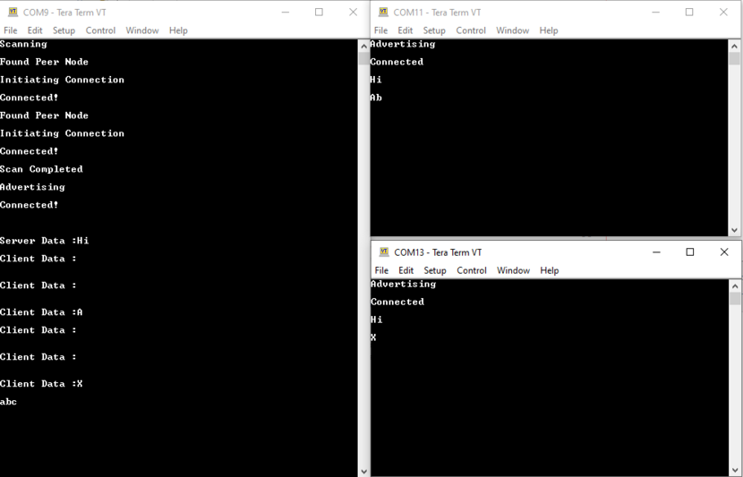

## Developing this Application from scratch using MPLAB Code Configurator {#GUID-49D50497-1913-485A-9D9B-F744A1C9AC9C .section}

This section explains the steps required by a user to develop this application example from scratch using MPLABx Code Configurator.

**Tip:** New users of MPLAB Code Configurator are recommended to go through the [overview](https://onlinedocs.microchip.com/pr/GUID-1F7007B8-9A46-4D03-AEED-650357BA760D-en-US-6/index.html?GUID-B5D058F5-1D0B-4720-8649-ACE5C0EEE2C0)

1.  Create a new MCC Harmony Project -- [link](https://onlinedocs.microchip.com/pr/GUID-A5330D3A-9F51-4A26-B71D-8503A493DF9C-en-US-1/index.html?GUID-B86E8493-D00D-46EF-8624-D412342147F0) for instructions
2.  Import component configuration -- This step helps users setup the basic components required to start their Application Development Users should follow the instructions mentioned [here](https://microchipdeveloper.com/mcc/peripheralconfig) to import the component configuration.

    **Tip:** Import and Export functionality of component configuration will help users to start from a known working setup of configuration

3.  Accept Dependencies or satisfiers, select "Yes".
4.  Verify if the Project Graph window has all the expected configuration.

    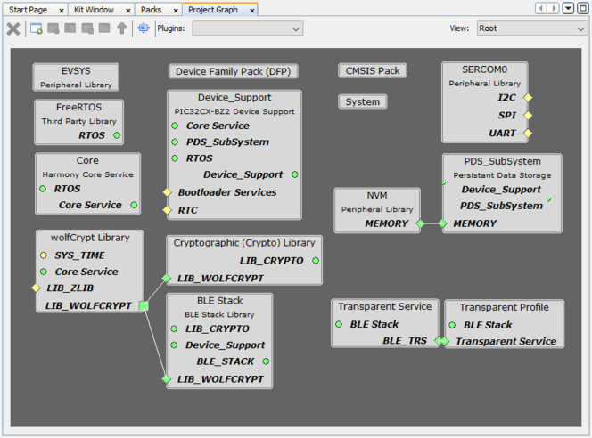


## Verify Scan, Advertisement and Transparent Profile Configuration {#GUID-A4C19FCA-2304-42E3-A5A6-5C550A9F715E .section}

1.  Select **BLE\_Stack** component in project graph.

    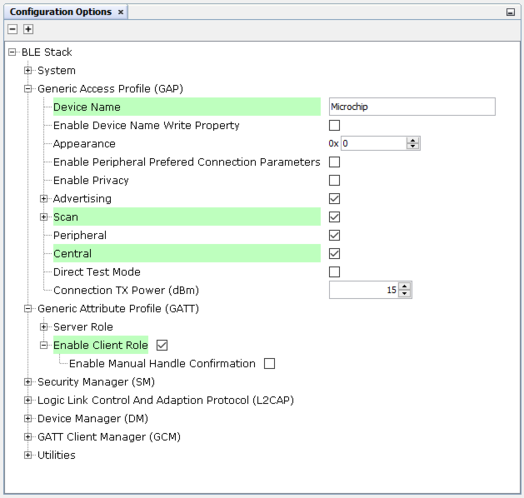

    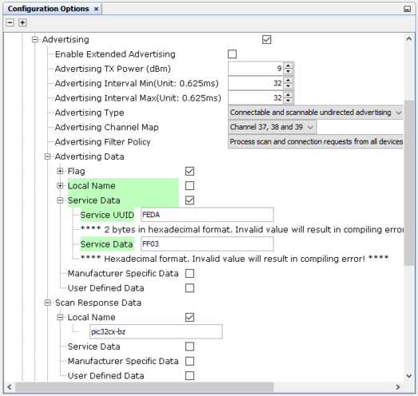

    **Note:** Advertising Interval Min and Max can be modified.

    **Tip:** Advertisement payload can be configured by user here.

2.  Select Transparent Profile configuration.

    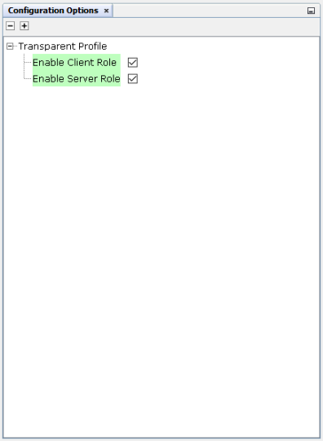


## Generate Code {#GUID-76B31218-70DA-4848-9E20-56E6BE9063C7 .section}

Instructions on[how to Generate Code](https://onlinedocs.microchip.com/pr/GUID-A5330D3A-9F51-4A26-B71D-8503A493DF9C-en-US-1/index.html?GUID-9C28F407-4879-4174-9963-2CF34161398E)

After generating the program source from MCC interface by clicking Generate Code, the BLE configuration can be found in the following project directories.

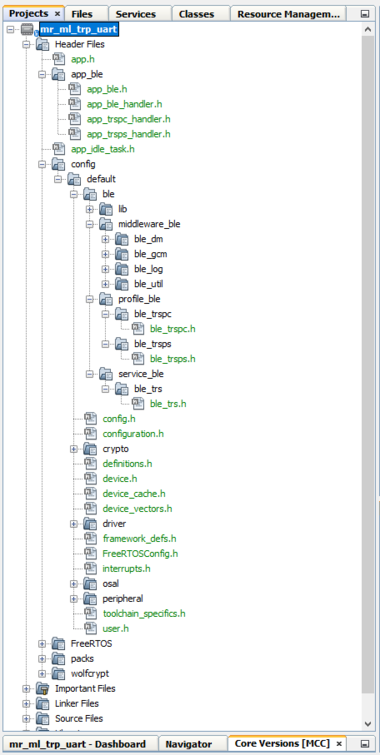

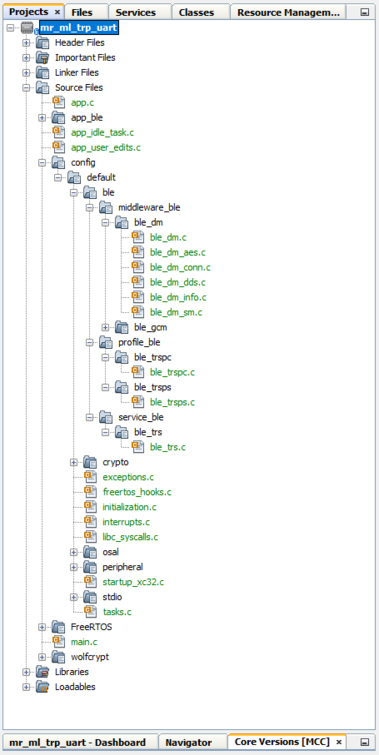

The [OSAL](http://ww1.microchip.com/downloads/en/DeviceDoc/MPLAB%20Harmony%20OSAL%20Libraries%20Help%20v2.06.pdf), RF System, BLE System initialization routine executed during program initialization can be found in the project files. This initialization routine is automatically generated by the MCC.

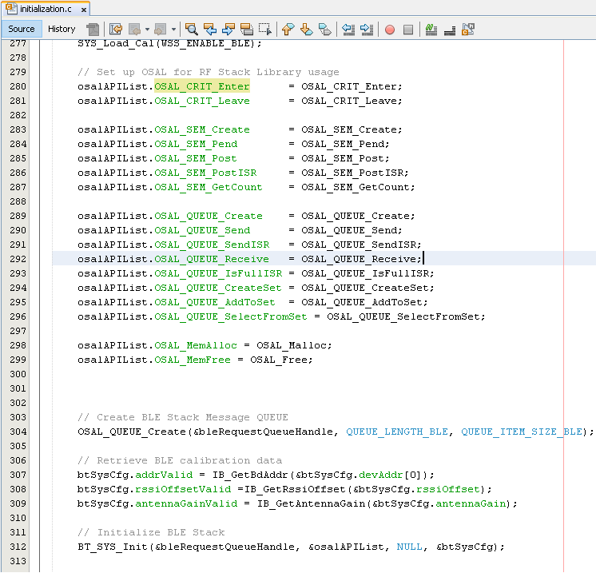

The BLE stack initialization routine excuted during Application Initialization can be found in project files. This intitialization routine is automatically generated by the MCC. This call initializes and configures the GAP, GATT, SMP, L2CAP and BLE middleware layers.

During system sleep, clock \(system PLL\) will be disabled and system tick will be turned off. FreeRTOS timer needs to be componsated for the time spent in sleep. RTC timer which works in the sleep mode is used to accomplish this. RTC timer will be initialized after BLE stack initialization.


|Source Files|Usage|
|------------|-----|
|app.c|Application State machine, includes calls for Initialization of all BLE stack \(GAP,GATT, SMP, L2CAP\) related component configurations|
|app\_ble.c|Source Code for the BLE stack related component configurations, code related to function calls from app.c|
|app\_ble\_handler.c|All GAP, GATT, SMP and L2CAP Event handlers|
|app\_trspc\_handler.c|All Transparent UART Client related Event handlers|
|app\_trsps\_handler.c|All Transparent UART Server related Event handlers|
|ble\_trspc.c|All Transparent Client Functions for user application|
|ble\_trsps.c|All Transparent Server Functions for user application|

**Tip:** app.c is autogenerated and has a state machine based Application code sample, users can use this template to develop their application

## Header Files {#SECTION_RCD_KKM_25B .section}

-   ble\_gap.h- This header file contains BLE GAP functions and is automatically included in the app.c file
-   ble\_trspc.h is the Header File associated with API’s and structures related to BLE Transparent Client functions for Application User
-   ble\_trsps.h is the Header File associated with API’s and structures related to BLE Transparent Server functions for Application User

## Function Calls {#SECTION_FVG_XKM_25B .section}

MCC Framework generates and adds the code to initialize the BLE Stack GAP, GATT, L2CAP and SMP in APP\_BleStackInit\(\) function

-   APP\_BleStackInit\(\) is the API that will be called inside the Applications Initial State -- APP\_STATE\_INIT in app.c

## User Application Development {#SECTION_XYS_1LM_25B .section}

**Include**

-   "ble\_trspc.h" in app.c, BLE Transparent UART client related API's are available here

-   "ble\_trsps.h" in app.c, BLE Transparent UART Server related API's are available here

-   "osal/osal\_freertos\_extend.h" in app\_trsps\_handler.c, OSAL related API's are available here

-   definitions.h in all the files where UART will be used to print debug information


**Tip**: definitions.h is not specific to just UART peripheral, instead it should be included in all application source files where peripheral functionality will be exercised

-   user action is required as mentioned here.

**Start Scanning**

```
BLE_GAP_SetScanningEnable(true, BLE_GAP_SCAN_FD_ENABLE, BLE_GAP_SCAN_MODE_OBSERVER, 1000);
```

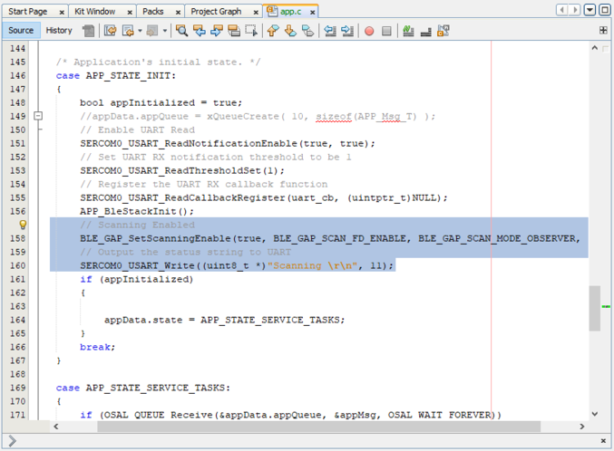

This API is called in the Applications initialstate - APP\_STATE\_INIT in app.c. Scan duration is 100 secs

**Scan Results and intiating a BLE Connection**

-   BLE\_GAP\_EVT\_ADV\_REPORT event is generated upon finding Adverstisements on legacy channels

-   BLE connection can be initiated by using the API BLE\_GAP\_CreateConnection\(&createConnParam\_t\);

    ```
    // code snippet to filter scan results and initiate connection
      // Filter Devices based of Address, for this example address checking only 2 bytes
      if ((p_event->eventField.evtAdvReport.addr.addr[0] == 0xA1 && p_event->eventField.evtAdvReport.addr.addr[1] == 0xA2) ||
          (p_event->eventField.evtAdvReport.addr.addr[0] == 0xB1 && p_event->eventField.evtAdvReport.addr.addr[1] == 0xB2) ||
          (p_event->eventField.evtAdvReport.addr.addr[0] == 0xC1 && p_event->eventField.evtAdvReport.addr.addr[1] == 0xC2))
      {
          SERCOM0_USART_Write((uint8_t *)"Found Peer Node\r\n", 17);
          BLE_GAP_CreateConnParams_T createConnParam_t;
          createConnParam_t.scanInterval = 0x3C; // 37.5 ms
          createConnParam_t.scanWindow = 0x1E; // 18.75 ms
          createConnParam_t.filterPolicy = BLE_GAP_SCAN_FP_ACCEPT_ALL;
          createConnParam_t.peerAddr.addrType = p_event->eventField.evtAdvReport.addr.addrType;
          memcpy(createConnParam_t.peerAddr.addr, p_event->eventField.evtAdvReport.addr.addr, GAP_MAX_BD_ADDRESS_LEN);
          createConnParam_t.connParams.intervalMin = 0x10;
          createConnParam_t.connParams.intervalMax = 0x10;
          createConnParam_t.connParams.latency = 0;
          createConnParam_t.connParams.supervisionTimeout = 0x48;
          SERCOM0_USART_Write((uint8_t *)"Initiating Connection\r\n", 23);
          BLE_GAP_CreateConnection(&createConnParam_t);
      }
    ```

    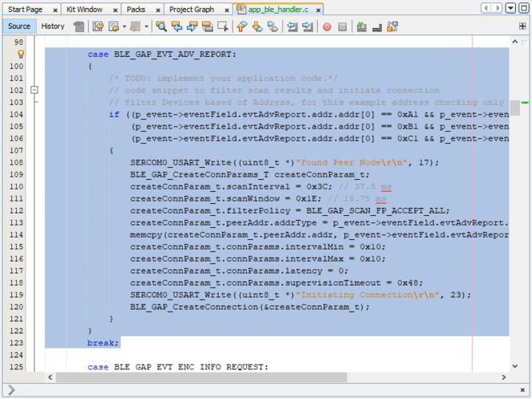


**Connected & Disconnected Events**

-   In app\_ble\_handler.c BLE\_GAP\_EVT\_CONNECTED event will be generated when a BLE connection is completed

**Connection Handler**

-   Connection handle associated with the peer peripheral device needs to be saved for data exchange after a BLE connection

-   p\_event-\>eventField.evtConnect.connHandle has this information

-   In Multilink Application, unique connection handler's will be generated for all the peripheral links

    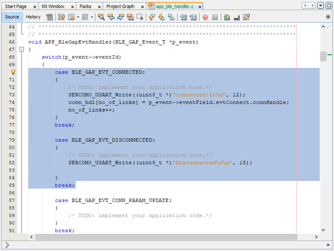


**Scan Timeout Handler**

-   The initiated scan operation will provide scan timeout event, we can start the advertisement to connect with another central device

    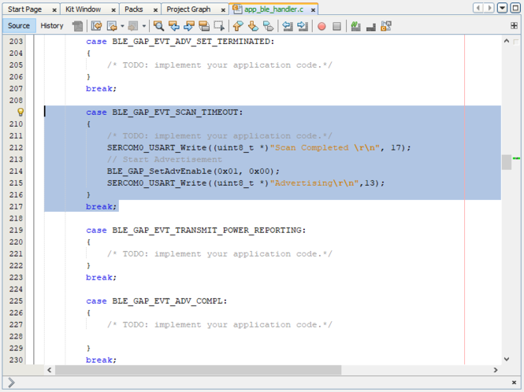


**Transmit Data**

-   BLE\_TRSPC\_SendData\(conn\_hdl\[i\], 1, &uart\_data\); is the API to be used for sending data towards the Client device

-   BLE\_TRSPS\_SendData\(conn\_hdl\[i\], 1, &uart\_data\); is the API to be used for sending data towards the Server device

    **Note:**\* The precompiled application example uses a UART callback to initiate the data transmission upon receiving a character on UART

    Example Implementation for Transmitting the received data over UART using the BLE\_TRSPC\_SendData API

    ```
    uint16_t conn_hdl[3];// connection handle info captured @BLE_GAP_EVT_CONNECTED event
    uint8_t uart_data;
    uint8_t no_of_links;// No of connected peripheral devices
    uint8_t i = 0;// link index
    void uart_cb(SERCOM_USART_EVENT event, uintptr_t context)
    {
      APP_Msg_T   appMsg;   
      // If RX data from UART reached threshold (previously set to 1)
      if( event == SERCOM_USART_EVENT_READ_THRESHOLD_REACHED )
      {
        // Read 1 byte data from UART
        SERCOM0_USART_Read(&uart_data, 1);
     
        appMsg.msgId = APP_MSG_UART_CB;
        OSAL_QUEUE_Send(&appData.appQueue, &appMsg, 0);     
      }
    }
     
    void APP_UartCBHandler()
    {
        // Send the data from UART to connected device through Transparent service
        BLE_TRSPC_SendData(conn_hdl[i], 1, &uart_data);
        i++;
        if(i==no_of_links) i = 0; //reset link index    
    }
     
      // Register call back when data is available on UART for Peripheral Device to send
      // Enable UART Read
      SERCOM0_USART_ReadNotificationEnable(true, true);
      // Set UART RX notification threshold to be 1
      SERCOM0_USART_ReadThresholdSet(1);
      // Register the UART RX callback function
      SERCOM0_USART_ReadCallbackRegister(uart_cb, (uintptr_t)NULL);
    ```


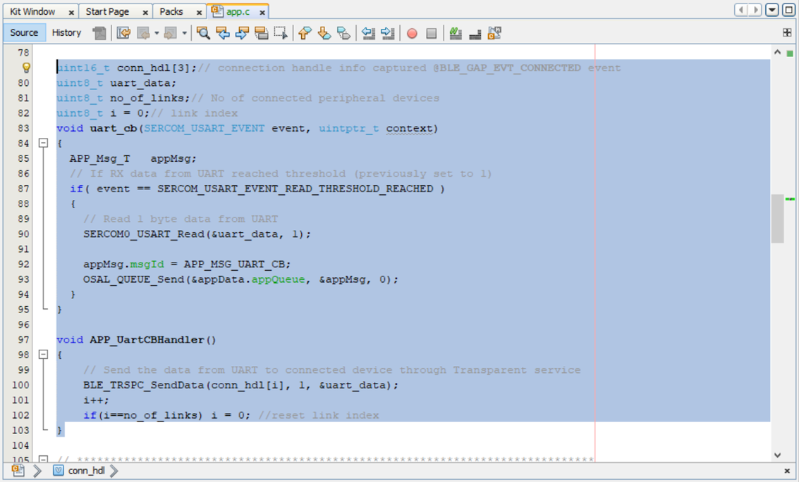

**Receive Data**

-   BLE\_TRSPC\_EVT\_RECEIVE\_DATA is the event generated when data is sent from central device

-   Users need to use the BLE\_TRSPC\_GetDataLength\(&data\_len\) & BLE\_TRSPS\_GetDataLength\(&data\_len\) API to extract the length of application data received

-   BLE\_TRSPC\_GetData\(&conn\_hdl, data\); & BLE\_TRSPS\_GetData\(&conn\_hdl, data\); API is used to retrieve the data, conn\_hdl is the value obtained from Connection Handler section

    **Tip:** BLE\_TRSPC\_Event\_T p\_event structure stores the information about BLE transparent UART callback functions

    **Tip:** BLE\_TRSPS\_Event\_T p\_event structure stores the information about BLE transparent UART callback functions

    Example Implementation for printing the received data from peripheral device over UART

    ```
                /* TODO: implement your application code.*/
                uint16_t data_len;
                uint8_t *data;
                // Retrieve received data length
                BLE_TRSPC_GetDataLength(p_event->eventField.onReceiveData.connHandle, &data_len);
                // Allocate memory according to data length
                data = OSAL_Malloc(data_len);
                if(data == NULL)
                break;
                // Retrieve received data
                BLE_TRSPC_GetData(p_event->eventField.onReceiveData.connHandle, data);
                // Output received data to UART
                SERCOM0_USART_Write((uint8_t *)"\r\nClient Data :", 15);
                SERCOM0_USART_Write(data, data_len);
                // Free memory
                OSAL_Free(data);
    ```


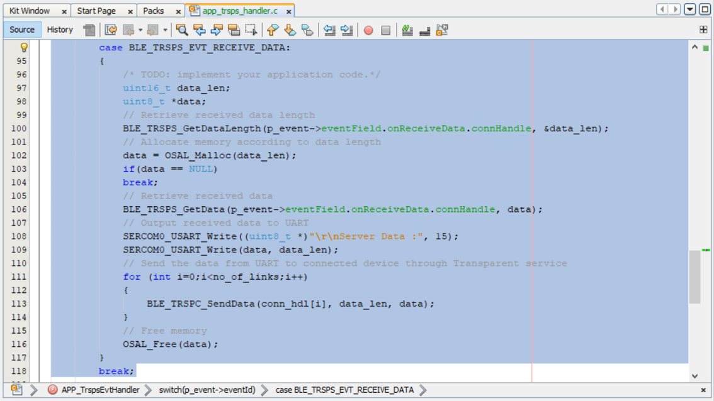

Users can exercise various other BLE functionalities by using[BLE Stack API](https://onlinedocs.microchip.com/pr/GUID-C5EAF60E-9124-427C-A0F1-F2DBE662EA92-en-US-1/index.html)

**Parent topic:**[Building Block Examples](https://onlinedocs.microchip.com/pr/GUID-A5330D3A-9F51-4A26-B71D-8503A493DF9C-en-US-1/index.html?GUID-17DABF04-E5D8-4201-A746-2FC244450A19)

