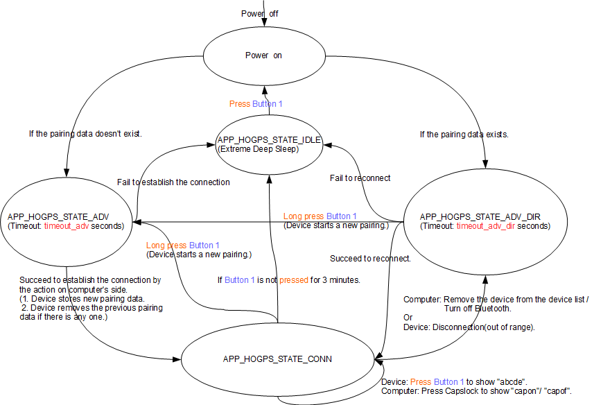

# HID Principal Application

## Table of Contents
- 1.Introduction
- 2.Contents
  - 2.1 Working Flow
  - 2.2 Testing
    - 2.2.1 Environment Setup
    - 2.2.2 Test Introduction
    - 2.2.3 Test Cases

## 1. Introduction
 This application which implements HID over GATT profile, Human Interface Device Service, Battery Service and Device information works as a peripheral role. There are two parts in this document. The first part is **2.1 Working Flow** which describes how this application works. Second part is **2.2 Testing** which introduces the test environment and three test cases. The curiosity board in the document is referring to WBZ series curiosity board like WBZ451 curiosity board,… .

## 2. Contents
### 2.1 Working Flow

| Description                        | Variable        | Value      |
| ---------------------------------- | --------------- | ---------- |
|The timeout of advertising          | timeout_adv     | 60 seconds |
|The timeout of directed advertising | timeout_adv_dir | 30 seconds |

This application demonstrates how to simulate a keyboard on the curiosity board which is **Device** in the state machine. There are the following states and their introductions behind in the state machine:
- **APP_HOGPS_STATE_IDLE**: This application enters Extreme Deep Sleep mode for less power consumption.
- **APP_HOGPS_STATE_ADV**: The application is waiting for pairing for timeout_adv seconds.
- **APP_HOGPS_STATE_ADV_DIR**: The application is waiting for reconnection for timeout_adv_dir seconds.
- **APP_HOGPS_STATE_CONN**: The application is ready for sending keys/receiving events.

This application relies on Button 1 as the input and LEDs as the output to have interactions with users.
- Button 1:
  - Type of Pressing:
    - Press: Press the button for less than 500 ms.
    - Long press: Press the button for more than 500 ms.
  - Functions:

| State                         | Action      | Behavior    |
| :---------------------------- | :---------- | :---------- |
| **APP_HOGPS_STATE_CONN** | Press Button 1 | Show “abcde” on Computer |
| **APP_HOGPS_STATE_CONN** | Long press Button 1 | Disconnect Device from Computer and start a new pairing |
| **APP_HOGPS_STATE_ADV_DIR** | Long press Button 1 | Start a new pairing |
| **APP_HOGPS_STATE_IDLE** | Press Button 1 | Wake up Device from Extreme Deep Sleep mode |

- LEDs indicate the current state according to the following table:

| APP Connection State        | LED behavior                                                           |
| --------------------------- | ---------------------------------------------------------------------- |
| APP_HOGPS_STATE_IDLE         | All LEDs are off                                                       |
| APP_HOGPS_STATE_ADV          | Blue LED flashes one time every 3 seconds. (On: 50 ms, Off: 2950 ms)   |
| APP_HOGPS_STATE_ADV_DIR      | Blue LED flashes two time every 3 seconds. (On: 50 ms, Off: 50 ms)     |
| APP_HOGPS_STATE_CONN         | Blue LED flashes two times every 1.5 seconds. (On: 50 ms, Off: 150 ms) |

This application will terminate the connection and enter Extreme Deep Sleep mode once Button 1 is not pressed for 3 minutes during the connection.

### 2.2 Testing
#### 2.2.1 Environment Setup
- A Microsoft Window 10 computer, “the computer” is used instead in the following section.
- A WBZ series curiosity board, “the curiosity board” is used instead in the following section.

#### 2.2.2 Test Introduction
There are three tests which are described below, please do them in order.

**Test 1**: Basically, the idea is to demonstrate:
- How to establish the connection and pair with the curiosity board.
- The simulating keyboard behaviors after establishing the connection.
- How to reconnect to the curiosity board after disconnecting from it.

**Test 2**: Basically, the idea is to demonstrate:
- How to reconnect to curiosity board after disconnected by it.

**Test 3**: Basically, the idea is to demonstrate:
- How to remove the existing pairing data and redo the pairing with curiosity board.
The LEDs behave according to “APP Connection State”.

#### 2.2.3 Test Cases
**Test 1**:

1. On the computer, remove “Microchip Keyboard” if it was paired over BLE.
2. For the curiosity board, compile and program the application.
    - The curiosity board will enter **APP_HOGPS_STATE_ADV** and wait for the pairing for timeout_adv seconds.
3. On the computer, open “Settings -> Bluetooth & other devices -> Add a device -> Bluetooth” and click “Microchip Keyboard” to connect to and pair with curiosity board.
4. For the curiosity board, it will enter **APP_HOGPS_STATE_CONN** when the connection is established.
5. On the computer, open a text editor (e.g., Notepad) and click the left key of the mouse to put the focus on it.
6. On the curiosity board, press Button 1.
7. On the computer, the text editor will show “abcde”.
8. On the computer, turn Caps Lock on and the text editor will show “CAPON”.
9. On the curiosity board, press Button 1.
10. On the computer, the text editor will show “ABCDE”.
11. On the computer, turn Caps Lock off and the text editor will show “capof”.
12. On the curiosity board, unplug USB cable from it to turn off the power.
13. On the computer, the status of “Microchip Keyboard” should be “Paired” which is disconnected.
14. On the curiosity board, plug USB cable to it to turn on the power.
    - The curiosity board will enter **APP_HOGPS_STATE_ADV_DIR** and wait for reconnecting for timeout_adv_dir seconds.
15. On the computer, the status of “Microchip Keyboard” should be “Connected”.
16. For the curiosity board, it will enter **APP_HOGPS_STATE_CONN** when reconnection is successful.

**Test 2**:

17. For the curiosity board, move it far away from the computer to disconnect.
    - The curiosity board will enter **APP_HOGPS_STATE_ADV_DIR** and wait for reconnecting for timeout_adv_dir seconds.
18. On the computer, the status of “Microchip Keyboard” should be “Paired”.
19. For the curiosity board, move it close back to the computer and then press Button 1 to wake up.
20. For the curiosity board, it will automatically reconnect to the computer after successful disconnection from the computer.
    - The curiosity board, it will enter **APP_HOGPS_STATE_CONN** when reconnection is successful.
21. On the computer, the status of “Microchip Keyboard” should be “Connected”.

**Test 3**:

22. On the computer, remove “Microchip Keyboard”.
23. On the curiosity board, unplug USB cable from it to turn off the power.
24. On the curiosity board, plug USB cable to it to turn on the power.
    - The curiosity board will enter **APP_HOGPS_STATE_ADV_DIR** and wait for reconnecting for timeout_adv_dir seconds.
25. On the curiosity board, long press Button 1.
    - The curiosity board will enter **APP_HOGPS_STATE_ADV** and wait for the pairing for timeout_adv seconds.
26. On the computer, open “Settings -> Bluetooth & other devices -> Add a device -> Bluetooth” and click “Microchip Keyboard” to connect to and pair with curiosity board.
27. For the curiosity board, it will enter **APP_HOGPS_STATE_CONN** when the connection is established.
