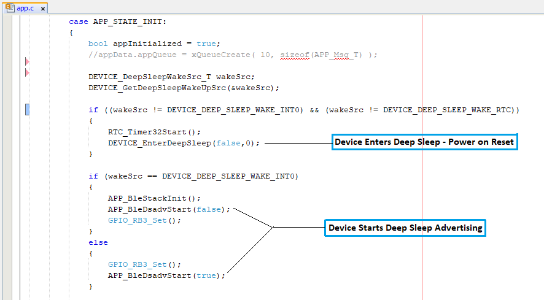

# BLE Deep Sleep Advertising

[Getting Started](https://onlinedocs.microchip.com/pr/GUID-A5330D3A-9F51-4A26-B71D-8503A493DF9C-en-US-2/index.html?GUID-17DABF04-E5D8-4201-A746-2FC244450A19)

[Getting Started with Peripheral Building Blocks](https://onlinedocs.microchip.com/pr/GUID-A5330D3A-9F51-4A26-B71D-8503A493DF9C-en-US-2/index.html?GUID-B3B46369-F5B4-401B-8405-658BE34988F4)

**[BLE Deep Sleep Advertising](#GUID-3D0C03E0-8EFC-455C-970B-17EBE5CB8F78)**

## Introduction {#GUID-E5A5126A-BEC8-4541-9415-F6005C391E89 .section}

This document will help users to enable "Deep sleep" mode with BLE Advertisements on WBZ451 Curiosity board using MPLAB Code Configurator\(MCC\) In this basic application example the Deep Sleep advertisement interval will be set to 960 millisecond. The advertisement interval will dictate the application Deep sleep time.

Users of this document can choose to just run the precompiled Application Example hex file on the WBZ451 Curiosity Board and experience the demo or can go through the steps involved in developing this Application from scratch.

These examples each build on top on one and other. We strongly recommend that you follow the examples in order, to learn the basics concepts before progressing to the more advanced topics.

## Recommended Reads {#GUID-F90C9AF2-9298-4F77-908D-493BCF52E866 .section}

1.  [BLE Software Specification](https://onlinedocs.microchip.com/pr/GUID-C5EAF60E-9124-427C-A0F1-F2DBE662EA92-en-US-2/index.html?GUID-222749FE-01C5-43B6-A5C7-CD82B3FC7F5F)

2.  [FreeRtos BLE App Initialize](https://onlinedocs.microchip.com/pr/GUID-A5330D3A-9F51-4A26-B71D-8503A493DF9C-en-US-2/index.html?GUID-AB1A02BF-4F9B-4058-90D9-02BFB3136682)
3.  [Low Power Notes](GUID-994B6462-D0F1-4B8C-A97B-A9CBF20426C2.md)

## Hardware Required {#GUID-7EA51B0D-8E4A-4555-BD4B-0D1B90A07BB1 .section}

|Tool|Qty|
|----|---|
|WBZ451 Curiosity Board|1|
|Micro USB cable|1|
|[Power Debugger](https://www.microchip.com/en-us/development-tool/ATPOWERDEBUGGER)/Multimeter|1|

## SDK Setup {#GUID-21D0FA9A-083B-41A6-8D3F-BE24E852031A .section}

1.  [Getting Started with Software Development](https://onlinedocs.microchip.com/pr/GUID-A5330D3A-9F51-4A26-B71D-8503A493DF9C-en-US-2/index.html?GUID-2AD37FE2-1915-4E34-9A05-79E3810726D7)


## Software {#GUID-C2836D07-01B1-49EF-AAC2-CE48326BC119 .section}

1.  [TeraTerm](https://ttssh2.osdn.jp/index.html.en)


## Smartphone App {#GUID-6BE272DC-6424-4165-B344-CBF5ECDA37D7 .section}

1.  Light Blue


## Programming the precompiled hex file or Application Example {#GUID-223374A9-C495-4FB3-B331-1874CE132816 .section}

**Programming the hex file using MPLABX IPE**

1.  Precompiled Hex file is located in "<Harmony Content Path\>\\wireless\_apps\_pic32cxbz2\_wbz45\\apps\\ble\\building\_blocks\\peripheral\\deep\_sleep\_adv\\hex" folder

2.  Follow the steps mentioned [here](https://microchipdeveloper.com/ipe:programming-device)


**Caution:** Users should choose the correct Device and Tool information

**Programming the Application using MPLABX IDE**

1.  Follow steps mentioned in of [Running a Precompiled Example](https://onlinedocs.microchip.com/pr/GUID-A5330D3A-9F51-4A26-B71D-8503A493DF9C-en-US-2/index.html?GUID-EA74172C-595E-4A34-B359-D42EE443F0EC) document

2.  Open and program the Application Example "ble\_deep\_sleep\_adv.x" located in "<Harmony Content Path\>\\wireless\_apps\_pic32cxbz2\_wbz45\\apps\\ble\\building\_blocks\\peripheral\\deep\_sleep\_adv\\firmware" using MPLABX IDE


<Harmony Content Path\> [how to find what is my Harmony Content Path](https://onlinedocs.microchip.com/pr/GUID-A5330D3A-9F51-4A26-B71D-8503A493DF9C-en-US-2/index.html?GUID-A55E9342-CE44-4A91-86BB-FEC6706FCD1C)

## Demo Description {#GUID-7AEB4551-8490-4AF3-AAD0-B605BC8A1DD8 .section}

This Application Example enables users to enter Deep sleep mode while transmitting Connectable, Undirected BLE Advertisements. On power on reset demo will enter "Deep Sleep Mode", when the USR\_BTN\(SW2\) is pressed the device onboard led\(green\) starts blinking which denotes start of advertisements, Device will enter Deep sleep mode periodically based on the advertisement interval which is set to 960 milliseconds for this example. When device connects with the mobile App the onboard led start to glow solid, which indicates the connection established and the device will enter Standby Sleep Mode during Idle state.

## Testing {#GUID-137E096D-51A6-4909-A4B9-DB6AD83C8AD7 .section}

Connect the WBZ451 Curiosity board to PC, program the precompiled hex file or application example as mentioned. Upon flashing, there will not be any indication on the board, since the device enters deep sleep mode. User can press the USR\_BTN\(SW2\) available on the board to start Deep sleep Advertising. To connect to the WBZ451, User can open the Light Blue App on Smartphone to scan for Advertisements. Device name "BLE\_DSADV" will appear.


## Current Consumption Measurement {#GUID-48F0CD47-35F7-4174-9EB7-2F5D4C925553 .section}

Connect the Multimeter/Power Debugger to Power Measurement Header J6. Power on the Board. If using Power Debugger, users can use Data Visualizer to measure the current consumption.

Current measured in **Deep sleep** mode is around 1.6 uA.


Current measured in **Deep sleep + Advertising** mode is around 225.3 uA average.


Current measured in **connected + standby sleep** mode is 626.1uA and average current consumption is around 1.26mA.


Users of this Early adopter package should go through the known issues document and understand the limitations if any with the current low power mode implementation.

## Developing this Application from scratch using MPLAB Code Configurator {#GUID-49D50497-1913-485A-9D9B-F744A1C9AC9C .section}

This section explains the steps required by a user to develop this application example from scratch using MPLABx Code Configurator.

**Tip:** New users of MPLAB Code Configurator are recommended to go through the [overview](https://onlinedocs.microchip.com/pr/GUID-1F7007B8-9A46-4D03-AEED-650357BA760D-en-US-6/index.html?GUID-B5D058F5-1D0B-4720-8649-ACE5C0EEE2C0)

1.  Create a new MCC Harmony Project -- [link](https://onlinedocs.microchip.com/pr/GUID-A5330D3A-9F51-4A26-B71D-8503A493DF9C-en-US-2/index.html?GUID-B86E8493-D00D-46EF-8624-D412342147F0) for instructions

2.  Import component configuration --This step helps users setup the basic components and configuration required to develop this application. The imported file is of format .mc3 and is located in the path "<Harmony Content Path>\wireless_apps_pic32cxbz2_wbz45\apps\ble\building_blocks\peripheral\deep_sleep_adv\firmware\ble_deep_sleep_adv.X". Users should follow the instructions mentioned [here](https://onlinedocs.microchip.com/pr/GUID-A5330D3A-9F51-4A26-B71D-8503A493DF9C-en-US-2/index.html?GUID-F8FE2886-8A2C-4FC0-9956-C094CE44D162) to import the component configuration.

    **Tip:** Import and Export functionality of component configuration will help users to start from a known working setup of configuration

3.  Accept Dependencies or satisfiers, select "Yes".

4.  Verify if the Project Graph window has all the expected configuration.

    


## Verify Deep Sleep, Advertisement, system sleep and RTC Clock Source Configuration {#GUID-A4C19FCA-2304-42E3-A5A6-5C550A9F715E .section}

1.  Select **BLE\_Stack** component in project graph.

    

    **Note:** Advertising Interval Min can be modified to adjust Deep Sleep Advertising interval.

    **Tip:** Advertisement payload can be configured by user here.

2.  Select clock configuration.

    

3.  Configure RTC clock configuration.

    

4.  Select Device Support Configure PMU Mode configuration.

    

5.  Configure LED GPIO Configuration.

    

    **Note:** The above GPIO configuration is used for indication of the device state in this example and is optional.

    **Tip:** The configuration bits will be generated after user Generates code.


## Generate Code {#GUID-76B31218-70DA-4848-9E20-56E6BE9063C7 .section}

Instructions on[how to Generate Code](https://onlinedocs.microchip.com/pr/GUID-A5330D3A-9F51-4A26-B71D-8503A493DF9C-en-US-2/index.html?GUID-9C28F407-4879-4174-9963-2CF34161398E)

After generating the program source from MCC interface by clicking Generate Code, the BLE configuration can be found in the following project directories.


The [OSAL](http://ww1.microchip.com/downloads/en/DeviceDoc/MPLAB%20Harmony%20OSAL%20Libraries%20Help%20v2.06.pdf), RF System, BLE System initialization routine executed during program initialization can be found in the project files. This initialization routine is automatically generated by the MCC.


The BLE stack initialization routine excuted during Application Initialization can be found in project files. This intitialization routine is automatically generated by the MCC. This call initializes and configures the GAP, GATT, SMP, L2CAP and BLE middleware layers.

During system sleep, clock \(system PLL\) will be disabled and system tick will be turned off. FreeRTOS timer needs to be componsated for the time spent in sleep. RTC timer which works in the sleep mode is used to accomplish this. RTC timer will be initialized after BLE stack initialization.


|Source Files|Usage|
|------------|-----|
|app.c|Application State machine, includes calls for Initialization of all BLE stack \(GAP,GATT, SMP, L2CAP\) related component configurations|
|app\_ble.c|Source Code for the BLE stack related component configurations, code related to function calls from app.c|
|app\_ble\_handler.c|All GAP, GATT, SMP and L2CAP Event handlers|
|app\_ble\_dsadv.c|Source Code for utilizing the deep sleep advertising functionality|
|device\_deep\_sleep.c|Source Code for deep Sleep and wake up related system configurations|

**Tip:** app.c is autogenerated and has a state machine based Application code sample, users can use this template to develop their application.

**Header Files**

-   ble\_gap.h- This header file contains BLE GAP functions and is automatically included in the app.c file


**Function Calls**

MCC generates and adds the following code to initialize the BLE Stack GAP, GATT, L2CAP and SMP in APP\_BleStackInit\(\) and Deep Sleep Advertising Functionality in APP\_BleDsadvStart\(flag\) function

-   APP\_BleStackInit\(\) and APP\_BleDsadvStart\(flag\) are the API's that will be called inside the Applications Initial State -- APP\_STATE\_INIT in app.c.


## System Manual Configurations {#GUID-AF8A2E92-D354-4BEA-B4D7-2DE10A0FE36D .section}

The following code modifications needs to be done to utilize the deep sleep Advertising functionality.

**Step 1 - Initialization.c**

-   CLK\_Initialize\(\);

    This API call will be originally available in SYS\_Initialize function and should be called part of \_on\_reset\(\) function inside initialization.c file.

    

-   void SYS\_Initialize \(void\* data\)

    The below generated code should be removed from the SYS\_Initialize Function.

    

    Add the below code inside **SYS\_Initialize** Function.

    ```
    DEVICE_DeepSleepWakeSrc_T wakeSrc;
    DEVICE_GetDeepSleepWakeUpSrc(&wakeSrc);
    if (wakeSrc == DEVICE_DEEP_SLEEP_WAKE_NONE) //Initialize RTC if wake source is none(i.e power on reset)
    {
     RTC_Initialize();
    }
    ```

    

    **Step 2 - startup\_xc32.c**

    -   PCHE\_SetupRam\(\)

        Copy the below code into the startup\_xc32.c

        ```
        __attribute__((ramfunc, long_call, section(".ramfunc"),unique_section)) void PCHE_SetupRam(void)
        {
          // Set Flash Wait states and enable pre-fetch
          // clear PFMWS and ADRWS
          PCHE_REGS->PCHE_CHECON = (PCHE_REGS->PCHE_CHECON & (~(PCHE_CHECON_PFMWS_Msk | PCHE_CHECON_ADRWS_Msk | PCHE_CHECON_PREFEN_Msk)))
                                          | (PCHE_CHECON_PFMWS(1) | PCHE_CHECON_PREFEN(1));

          // write completion delay
          for(int i=1; i<10; i++)
          {
              asm ("NOP");
          }
        }
        ```

        

        Copy the below code into the Reset\_Handler Handler Function after \_\_pic32c\_data\_initialization\(\) Function Call.

        ```
        if (!(DSU_REGS->DSU_DID & DSU_DID_REVISION_Msk))   //HW A0 version
           {
               PCHE_SetupRam();
           }
        ```

        

        **Step 3 - heap\_4.c**

        Modify with the below code inside heap\_4.c \(available as part of FreeRTOS--\>MemMang\)

        ```
        static uint8_t ucHeap[ configTOTAL_HEAP_SIZE ]; --> Original Code

        static uint8_t  __attribute__((section (".bss.ucHeap"), noload)) ucHeap[ configTOTAL_HEAP_SIZE ]; -->Modified Code
        ```

        

       **Step 4 - device_deep_sleep.c** (Optional)

      Include the Below code inside device_deep_sleep.c to configure the GPIO setting for deep sleep.

      ```
      Device_GpioConfig();
      ```

      

## User Application Development {#GUID-5F491E2B-E79E-4CA1-B300-B395F2957CD2 .section}

**Include**

-   user action is required as mentioned here

-   app\_ble\_dsadv.h into app.c file

-   definitions.h in all the files where port pin macros are used.

    **Tip:** definitions.h is not specific to just port peripheral, instead it should be included in all application source files where peripheral functionality will be exercised.


**Enter Deep Sleep mode**

-   DEVICE\_EnterDeepSleep\(false,0\);

    This API can be called to put the device to deep sleep mode.


**Start Deep Sleep Advertisement**

-   APP\_BleDsadvStart\(false\);

    This API can be called to start the Deep sleep Advertising.

    This API is called in the Applications initialstate - APP\_STATE\_INIT in app.c

    

    Users can exercise various other BLE Advertisement functionalities by using [BLE Stack API](https://onlinedocs.microchip.com/pr/GUID-C5EAF60E-9124-427C-A0F1-F2DBE662EA92-en-US-2/index.html).

**Known Issues**

In the DeepSleep application, System sleep Implementation source(device_sleep.c) and header(device_sleep.h) files are may not be included sometimes when regenerating the project through MCC.

**Note:** It is recommended to follow the below steps to avoid the mentioned known issue whenever deep sleep project is opened through MCC.

**Step-1:** Please uncheck and re-enable the **Enable Sleep Mode** and **Enable Deep Sleep Advertising** option inside BLE stack Component Configuration Options as shown in the figure below and accept the dependencies requested.


**Step-2**Enable force update option and press Generate.


## Where to go from here {#GUID-CA011F22-EC45-4B7C-A12C-4BAF0C6BC04A .section}

-   [BLE Connection](https://onlinedocs.microchip.com/pr/GUID-A5330D3A-9F51-4A26-B71D-8503A493DF9C-en-US-2/index.html?GUID-F9A0C390-C124-49A7-9F22-157D20BFBE5D)


**Parent topic:**[Peripheral](https://onlinedocs.microchip.com/pr/GUID-A5330D3A-9F51-4A26-B71D-8503A493DF9C-en-US-2/index.html?GUID-B3B46369-F5B4-401B-8405-658BE34988F4)
