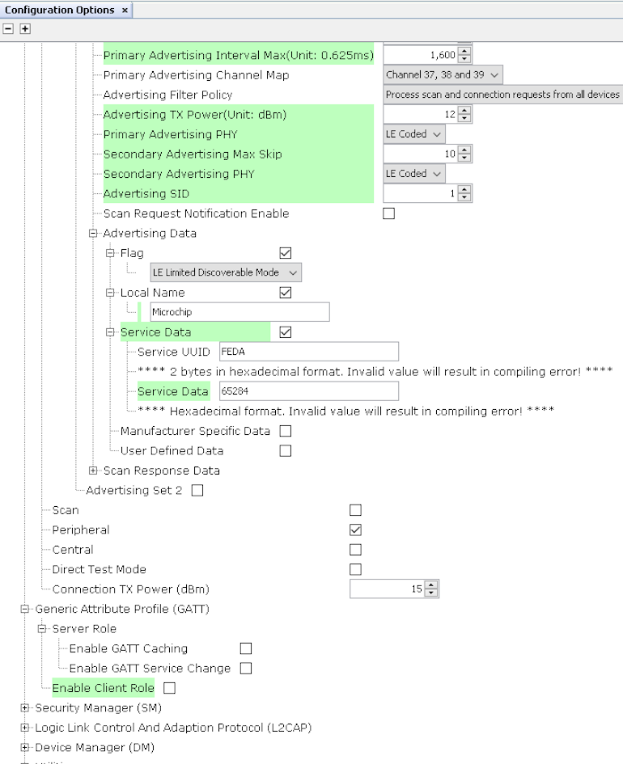
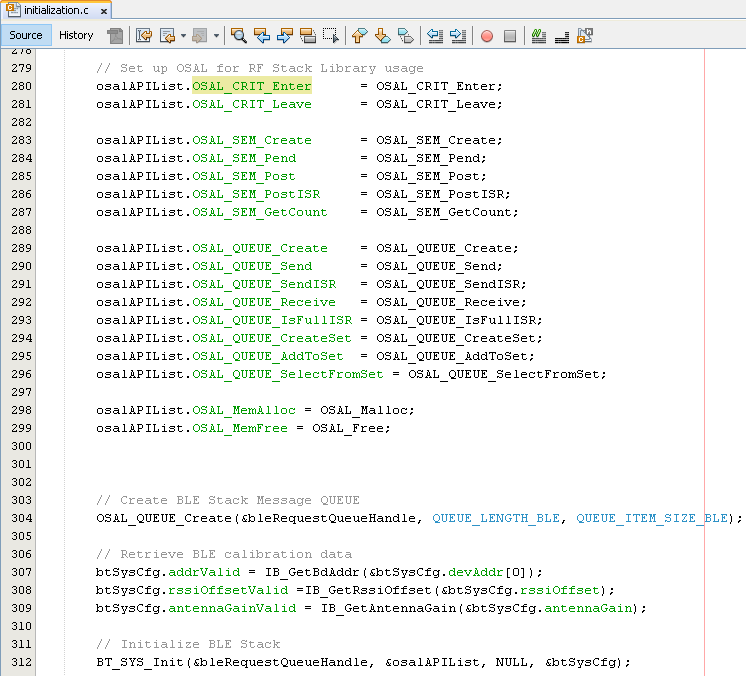

# BLE Extended Advertisements

[Getting Started](https://onlinedocs.microchip.com/pr/GUID-A5330D3A-9F51-4A26-B71D-8503A493DF9C-en-US-2/index.html?GUID-17DABF04-E5D8-4201-A746-2FC244450A19)

[Getting Started with Peripheral Building Blocks](https://onlinedocs.microchip.com/pr/GUID-A5330D3A-9F51-4A26-B71D-8503A493DF9C-en-US-2/index.html?GUID-B3B46369-F5B4-401B-8405-658BE34988F4)

[Adding UART](https://onlinedocs.microchip.com/pr/GUID-A5330D3A-9F51-4A26-B71D-8503A493DF9C-en-US-2/index.html?GUID-E1A0E9CA-311E-4F53-9C27-160173609975) **--\>** [Extended Advertisements](#GUID-9A3C4C97-E09F-4FF9-878C-3873892445F4)

## Introduction {#INTRODUCTION .section}

This document will help users enable Extended Advertisements \(1M, 2M, coded PHY -- 125kbps\) on WBZ451 Curiosity Board. This example \(ext\_adv\) enables users to send application data using extended advertisements. Extended Advertisements are used to send more data than the legacy advertisements allow and allow long range functionality when using Coded PHY. Use of Extended Advertisements also enables the users to select between different PHYs \(1M, 2M and **LE Coded**\) which are not permitted when using legacy advertisements. In BLE a peripheral or broadcaster always starts with advertisements. Advertisement packets enable a central or observer to discover a peripheral or broadcaster.

Extended Advertisements implemented in this example can be used for sending more data \(2M PHY\) or do range tests \(Coded PHY\). For testing these features a scanner Application can be used which is configured to scan the extended advertisement packets.

To save power, low power mode can be enabled. If conditions are met then WBZ451 will enter into sleep mode. Details will be discussed in later section.

Users can run the precompiled Application Example hex file provided with this example on the WBZ451 Curiosity Board and go through the steps involved in developing this Application application from the scratch

These examples each build on top on one and other. We strongly recommend that you follow the examples in order, to learn the basics concepts before progressing to the more advanced topics.

## Recommended Reads {#RECOMMENDED-READS .section}

1.  [BLE Software Specification](https://onlinedocs.microchip.com/pr/GUID-C5EAF60E-9124-427C-A0F1-F2DBE662EA92-en-US-2/index.html?GUID-222749FE-01C5-43B6-A5C7-CD82B3FC7F5F)

2.  3.  [FreeRtos BLE App Initialize](https://onlinedocs.microchip.com/pr/GUID-A5330D3A-9F51-4A26-B71D-8503A493DF9C-en-US-2/index.html?GUID-AB1A02BF-4F9B-4058-90D9-02BFB3136682)

4.  [Adding UART](https://onlinedocs.microchip.com/pr/GUID-A5330D3A-9F51-4A26-B71D-8503A493DF9C-en-US-2/index.html?GUID-E1A0E9CA-311E-4F53-9C27-160173609975)

5.  [Low Power Details](GUID-994B6462-D0F1-4B8C-A97B-A9CBF20426C2.md)

## Hardware Required {#HARDWARE-REQUIRED .section}

|**Tool**|**Qty**|
|--------|-------|
|WBZ451 Curiosity Board|1 \(2 if testing with a scanner\)|
|Micro USB cable|1|

Optional [Power Debugger](https://www.microchip.com/en-us/development-tool/ATPOWERDEBUGGER)/Multimeter/OscilloScope to measure power.

## SDK Setup {#SDK-SETUP .section}

1.  [Getting Started with Software Development](https://onlinedocs.microchip.com/pr/GUID-A5330D3A-9F51-4A26-B71D-8503A493DF9C-en-US-2/index.html?GUID-2AD37FE2-1915-4E34-9A05-79E3810726D7)

## Software {#SOFTWARE .section}

1.  [TeraTerm](https://ttssh2.osdn.jp/index.html.en)

## Smartphone App {#SMARTPHONE-APP .section}

None

## Programming the precompiled hex file or Application Example {#PROGRAMMING-THE-PRECOMPILED-HEX-FILE-OR-APPLICATION-EXAMPLE .section}

**Programming the hex file using MPLABX IPE**

1.  Precompiled Hex file is located in "<Harmony Content Path\>\\wireless\_apps\_pic32cxbz2\_wbz45\\apps\\ble\\building\_blocks\\peripheral\\ext\_adv\\hex" folder

2.  Follow the steps mentioned [here](https://microchipdeveloper.com/ipe:programming-device)

**Caution:** Users should choose the correct Device and Tool information

**Programming the Application using MPLABX IDE**

1.  Follow steps mentioned in of [Running a Precompiled Example](https://onlinedocs.microchip.com/pr/GUID-A5330D3A-9F51-4A26-B71D-8503A493DF9C-en-US-2/index.html?GUID-EA74172C-595E-4A34-B359-D42EE443F0EC) document

2.  Open and program the Application Example "ext\_adv.x" located in "<Harmony Content Path\>\\wireless\_apps\_pic32cxbz2\_wbz45\\apps\\ble\\building\_blocks\\peripheral\\ext\_adv\\firmware" using MPLABX IDE

<Harmony Content Path\> [how to find what is my Harmony Content Path](https://onlinedocs.microchip.com/pr/GUID-A5330D3A-9F51-4A26-B71D-8503A493DF9C-en-US-2/index.html?GUID-A55E9342-CE44-4A91-86BB-FEC6706FCD1C)

## Demo Description {#DEMO-DESCRIPTION .section}

This Application Example enables users to transmit Extended Advertisements @ Coded PHY data rate of 125 Kbps. PDU types of ADV\_EXT\_IND and ADV\_AUX\_IND will be transmitted. Application data \("Microchip"\) is transmitted in Auxiliary packets \(ADV\_AUX\_IND\). ADV\_EXT\_IND carries the Auxiliary Packet Information \(ADV\_AUX\_IND\) for scanner to collect the data.

Demo will print "Ext Adv Enabled" information indicating the successful start of Coded PHY Advertisements on a terminal emulator like TeraTerm @ \(Speed: 115200, Data: 8-bit, Parity: none, stop bits: 1 bit, Flow control: none\). Coded PHY Advertisements are configured to be sent every 2 secs.

BLE Extended Advertisements \(125 kbps, 500 kbps\)cannot be scanned using a smartphone app. This could be due to support of only legacy advertisements on the smartphone or disabled extended adv API's in smartphone app.

## Testing {#TESTING .section}

Users can use another WBZ451 Curiosity Board configured as [BLE Scan Ext Adv](https://onlinedocs.microchip.com/pr/GUID-A5330D3A-9F51-4A26-B71D-8503A493DF9C-en-US-2/index.html?GUID-8C3372E5-CAB6-4923-9B59-E97022E1252D)

This section assumes that a user has already programmed the ext\_adv and scan\_ext\_adv application on 2 WBZ451 Curiosity Boards.

Board1 = WBZ451 Curiosity Board with Ext Adv Programmed Board2 = WBZ451 Curiosity Board with Scan Ext Adv Programmed

Board1: Open TeraTerm @ \(Speed: 115200, Data: 8-bit, Parity: none, stop bits: 1 bit, Flow control: none\). Reset the board. Upon reset, "Ext Adv Enable" message is displayed on the TeraTerm.

Board2: Open TeraTerm @ \(Speed: 115200, Data: 8-bit, Parity: none, stop bits: 1 bit, Flow control: none\). Reset the board. Upon reset, "ExtAdv Scan Enable Success" message is displayed on the TeraTerm. "Microchip" message will be displayed as soon the WBZ451 module performs an extended advertisement scan.

## Current Consumption Measurement {#CURRENT-CONSUMPTION-MEASUREMENT .section}

-   Connect the Multimeter/Power Debugger/Oscillo Scope to Power Measurement Header J6. If using Power Debugger, users can use [Data Visualizer](https://www.microchip.com/en-us/development-tools-tools-and-software/embedded-software-center/atmel-data-visualizer) to measure the current consumption

Current measured in sleep/standby mode is 575.6 uA and avg current consumption is around 723.0 uA

Users of this package should go through the known issues document and understand the limitations if any with the current low power mode implementation

## Developing this Application from scratch using MPLAB Code Configurator {#DEVELOPING-THIS-APPLICATION-FROM-SCRATCH-USING-MPLAB-CODE-CONFIGURATOR .section}

This section explains the steps required by a user to develop this application example from scratch using MPLABx Code Configurator

**Tip:** New users of MPLAB Code Configurator are recommended to go through the [overview](https://onlinedocs.microchip.com/pr/GUID-1F7007B8-9A46-4D03-AEED-650357BA760D-en-US-6/index.html?GUID-B5D058F5-1D0B-4720-8649-ACE5C0EEE2C0).

1.  Setup Harmony framework. EA release package has all the neccessary component and should be downloaded individually from the link provided in the package. It is recommended to create framework in the root directory. The framework looks like

    

2.  Create a new MCC Harmony project - [instructions](https://onlinedocs.microchip.com/pr/GUID-A5330D3A-9F51-4A26-B71D-8503A493DF9C-en-US-2/index.html?GUID-B86E8493-D00D-46EF-8624-D412342147F0)

3.  Import component configuration --This step helps users setup the basic components and configuration required to develop this application. The imported file is of format .mc3 and is located in the path "<Harmony Content Path>\wireless_apps_pic32cxbz2_wbz45\apps\ble\building_blocks\peripheral\scan_ext_adv\firmware\scan_ext_adv.X". Users should follow the instructions mentioned [here](https://onlinedocs.microchip.com/pr/GUID-A5330D3A-9F51-4A26-B71D-8503A493DF9C-en-US-2/index.html?GUID-F8FE2886-8A2C-4FC0-9956-C094CE44D162) to import the component configuration.

4.  Also manually can Drag and drop BLE\_Stack in the project graph and select **Yes** to all pop ups. Drag and Drop SERCOM0 from Peripherals into project graph for UART messages. Project Graph will look like

    

5.  Enable Low Power

    -   Enable Low power mode by selecting **Low Power Enable** in BLE\_Stack Configuration. Select **Yes** to all pop ups

    

    -   Click on Window-\>MCC-\>Harmony-\>Clock Configuration

    

    -   Enable SOSC clock

    

## Configure Advertisement Configuration {#CONFIGURE-ADVERTISEMENT-CONFIGURATION .section}

-   Select **BLE\_Stack** component in project graph and make modifications as shown below

## Configure UART {#CONFIGURE-UART .section}

Uart Configuration Details can be found [here](https://onlinedocs.microchip.com/pr/GUID-A5330D3A-9F51-4A26-B71D-8503A493DF9C-en-US-2/index.html?GUID-E1A0E9CA-311E-4F53-9C27-160173609975)

## Generate Code {#GENERATE-CODE-LINK-FOR-INSTRUCTIONS .section}

Instructions on[how to Generate Code](https://onlinedocs.microchip.com/pr/GUID-A5330D3A-9F51-4A26-B71D-8503A493DF9C-en-US-2/index.html?GUID-9C28F407-4879-4174-9963-2CF34161398E)

## Files and Routines Automatically generated by the MCC {#FILES-AND-ROUTINES-AUTOMATICALLY-GENERATED-BY-THE-MCC .section}

After generating the program source from MCC interface by clicking Generate Code, the BLE configuration can be found in the following project directories

The [OSAL](http://ww1.microchip.com/downloads/en/DeviceDoc/MPLAB%20Harmony%20OSAL%20Libraries%20Help%20v2.06.pdf) , RF System, BLE System initialization routine executed during program initialization can be found in the project files. This initialization routine is automatically generated by the MCC

The BLE stack initialization routine excuted during Application Initialization can be found in project files. This intitialization routine is automatically generated by the MCC. This call initializes and configures the GAP, GATT, SMP, L2CAP and BLE middleware layers.

Autogenerated, extended adverisement Data Format

|**Source Files**|**Usage**|
|----------------|---------|
|app.c|Application State machine, includes calls for Initialization of all BLE stack \(GAP,GATT, SMP, L2CAP\) related component configurations|
|app\_ble\\app\_ble.c|Source Code for the BLE stack related component configurations, code related to function calls from app.c|
|app\_ble\\app\_ble\_handler.c|All GAP, GATT, SMP and L2CAP Event handlers|
|app\_user\_edits.c|User Code Change instruction|

> **Tip:** app.c is autogenerated and has a state machine based Application code sample, users can use this template to develop the application\|

**Header Files**

-   ble\_gap.h- This header file contains BLE GAP functions and is automatically included in the app.c file

**Function Calls**

MCC generates and adds the code to initialize the BLE Stack GAP, GATT, L2CAP and SMP in *APP\_BleStackInit\(\)* function

-   APP\_BleStackInit\(\) is the API that will be called inside the Applications Initial State -- APP\_STATE\_INIT in app.c

-   RTC\_Timer32Start\(\) defined in plib\_rtc\_timer.c. It call to start RTC Timer clock to facilitate low power mode.

## User Application Development {#USER-APPLICATION-DEVELOPMENT .section}

**Include**

-   definitions.h in all the files where UART will be used to print debug information

> Tip: definitions.h is not specific to just UART peripheral, instead it should be included in all application source files where peripheral functionality will be exercised

-   user action is required as mentioned [here](https://onlinedocs.microchip.com/pr/GUID-A5330D3A-9F51-4A26-B71D-8503A493DF9C-en-US-2/index.html?GUID-99583057-8B1A-42F2-84E8-CFC7717FA5D1)

**Start Ext Advertisement**

-   BLE\_GAP\_SetExtAdvEnable\(true, 0x01, &extAdvEnableParam\);

This API is called in the Applications initialstate - APP\_STATE\_INIT in app.c. Parameters for extended advertisement should be chosen. Below is an example.

Users can exercise various other BLE Advertisement functionalities by using [BLE Stack API](https://onlinedocs.microchip.com/pr/GUID-C5EAF60E-9124-427C-A0F1-F2DBE662EA92-en-US-2/index.html)

## Where to go from here {#WHERE-TO-GO-FROM-HERE .section}

[Getting Started with Peripheral Building Blocks](https://onlinedocs.microchip.com/pr/GUID-A5330D3A-9F51-4A26-B71D-8503A493DF9C-en-US-2/index.html?GUID-B3B46369-F5B4-401B-8405-658BE34988F4)

**Parent topic:**[Peripheral](https://onlinedocs.microchip.com/pr/GUID-A5330D3A-9F51-4A26-B71D-8503A493DF9C-en-US-2/index.html?GUID-B3B46369-F5B4-401B-8405-658BE34988F4)
