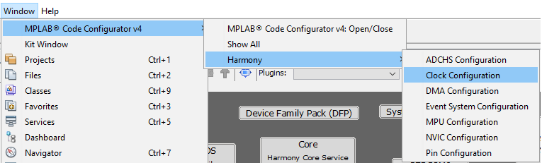
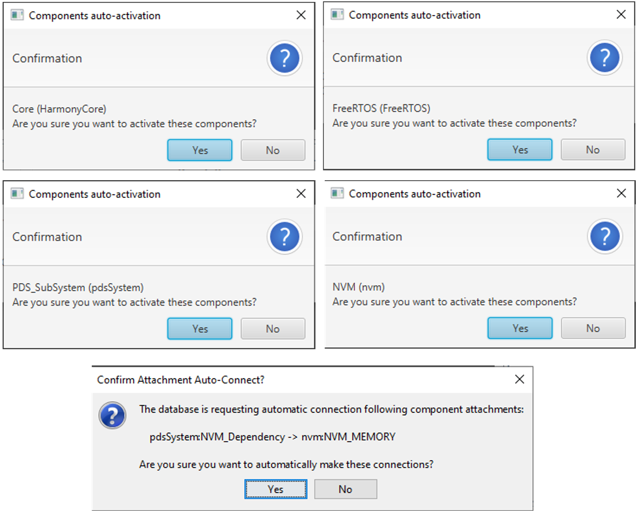
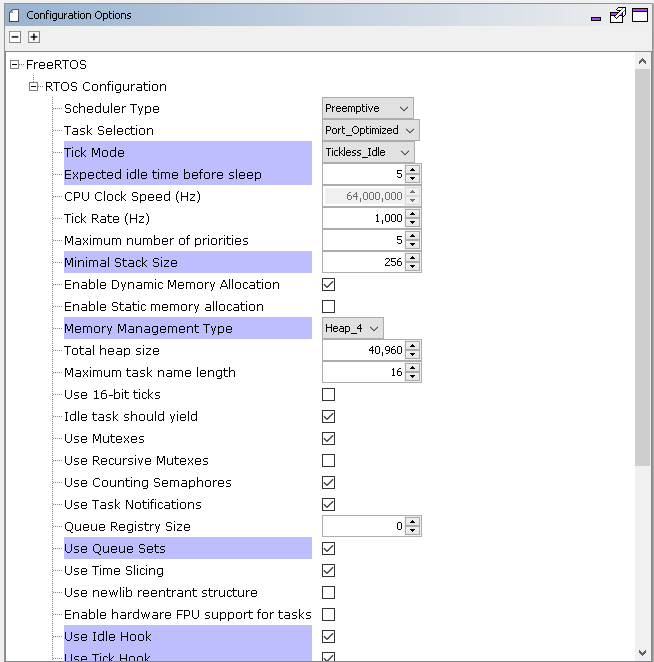

# **Peripheral - FreeRTOS BLE Stack and App Initialize**

[Getting Started](https://onlinedocs.microchip.com/pr/GUID-A5330D3A-9F51-4A26-B71D-8503A493DF9C-en-US-2/index.html?GUID-17DABF04-E5D8-4201-A746-2FC244450A19)

[Getting Started with Peripheral Building Blocks](https://onlinedocs.microchip.com/pr/GUID-A5330D3A-9F51-4A26-B71D-8503A493DF9C-en-US-2/index.html?GUID-B3B46369-F5B4-401B-8405-658BE34988F4)

[**FreeRTOS and BLE Stack Setup**](#GUID-AB1A02BF-4F9B-4058-90D9-02BFB3136682) **--\>** [Adding UART **--\>**](https://onlinedocs.microchip.com/pr/GUID-A5330D3A-9F51-4A26-B71D-8503A493DF9C-en-US-2/index.html?GUID-E1A0E9CA-311E-4F53-9C27-160173609975) [Legacy Advertisements\(sleep\)](https://onlinedocs.microchip.com/pr/GUID-A5330D3A-9F51-4A26-B71D-8503A493DF9C-en-US-2/index.html?GUID-820CEA03-90AE-484F-87C9-9CF2CE652702)

## Introduction {#INTRODUCTION .section}

This document will help users create a new MCC Harmony project, configure FreeRTOS component and BLE stack component in the project, generate code using the MPLAB Code Configurator

These examples each build on top on one and other. We strongly recommend that you follow the examples in order, to learn the basics concepts before progressing to the more advanced topics.

## Recommended Reads {#RECOMMENDED-READS .section}

1.  [BLE Software Specification](https://onlinedocs.microchip.com/pr/GUID-C5EAF60E-9124-427C-A0F1-F2DBE662EA92-en-US-2/index.html?GUID-222749FE-01C5-43B6-A5C7-CD82B3FC7F5F)

## Hardware Required {#HARDWARE-REQUIRED .section}

None

## Software Setup {#SOFTWARE-SETUP .section}

-   [Getting Started with Software Development](https://onlinedocs.microchip.com/pr/GUID-A5330D3A-9F51-4A26-B71D-8503A493DF9C-en-US-2/index.html?GUID-2AD37FE2-1915-4E34-9A05-79E3810726D7)

## Steps to Init BLE Stack {#STEPS-TO-INIT-BLE-STACK .section}

This section explains the steps required by a user to develop this application example from scratch using MPLABx Code Configurator

**Tip:** New users of MPLAB Code Configurator are recommended to go through the [overview](https://onlinedocs.microchip.com/pr/GUID-1F7007B8-9A46-4D03-AEED-650357BA760D-en-US-6/index.html?GUID-B5D058F5-1D0B-4720-8649-ACE5C0EEE2C0).

1.  Create a new MCC Harmony Project -- [link](https://onlinedocs.microchip.com/pr/GUID-A5330D3A-9F51-4A26-B71D-8503A493DF9C-en-US-2/index.html?GUID-B86E8493-D00D-46EF-8624-D412342147F0) for instructions

2.  Open MPLAB Code Configurator

    

    Default MPLAB Code Configurator window

    

3.  In Available component window, **expand Wireless \> BLE** and **click plus symbol** the BLE stack component on to the project graph

    

4.  Upon BLE Stack being added to project graph, the different component dependencies will be requested to be added. User has to select "yes" to add the dependant component

5.  Activate the components, select "yes"

    

6.  **Verify** Project Graph

    

7.  Display FreeRTOS component configuration options by Selecting the component in Project Graph. **Configure FreeRTOS** component to the following. The configuration chosen here should suit most application needs, users are recommended to follow the FreeRTOS Customization documented [here](https://www.freertos.org/a00110.html) to meet their needs Tip: Upon selecting any component the default configuration options available for user are displayed

    

    

8.  Display BLE Stack component configuration options by Selecting the component in Project Graph.

    Default Configuration: Peripheral Device functionality is enabled by default.

    

9.  [Generate Code](https://onlinedocs.microchip.com/pr/GUID-A5330D3A-9F51-4A26-B71D-8503A493DF9C-en-US-2/index.html?GUID-9C28F407-4879-4174-9963-2CF34161398E)

10. Switch to IDE window, right click on project and open Project Properties

11. Ensure correct compiler version as suggested in[Getting Started with Software Development](https://onlinedocs.microchip.com/pr/GUID-A5330D3A-9F51-4A26-B71D-8503A493DF9C-en-US-2/index.html?GUID-2AD37FE2-1915-4E34-9A05-79E3810726D7) is chosen

12. Build Project, upon building project user action is required as mentioned [here](https://onlinedocs.microchip.com/pr/GUID-A5330D3A-9F51-4A26-B71D-8503A493DF9C-en-US-2/index.html?GUID-99583057-8B1A-42F2-84E8-CFC7717FA5D1)

13. Build Project. The project will compile successfully. 

## Where to go from here {#WHERE-TO-GO-FROM-HERE .section}

-   [UART](https://onlinedocs.microchip.com/pr/GUID-A5330D3A-9F51-4A26-B71D-8503A493DF9C-en-US-2/index.html?GUID-E1A0E9CA-311E-4F53-9C27-160173609975)

**Parent topic:**[Peripheral](https://onlinedocs.microchip.com/pr/GUID-A5330D3A-9F51-4A26-B71D-8503A493DF9C-en-US-2/index.html?GUID-B3B46369-F5B4-401B-8405-658BE34988F4)

