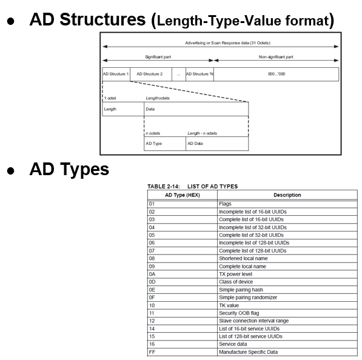

# BLE Sleep Mode Legacy Advertisements

[Getting Started](https://onlinedocs.microchip.com/pr/GUID-A5330D3A-9F51-4A26-B71D-8503A493DF9C-en-US-1/index.html?GUID-17DABF04-E5D8-4201-A746-2FC244450A19)

[Getting Started with Peripheral Building Blocks](https://onlinedocs.microchip.com/pr/GUID-A5330D3A-9F51-4A26-B71D-8503A493DF9C-en-US-1/index.html?GUID-B3B46369-F5B4-401B-8405-658BE34988F4)

[**BLE Sleep Mode Legacy Advertisements**](#GUID-820CEA03-90AE-484F-87C9-9CF2CE652702)

## Introduction {#INTRODUCTION .section}

This document will help users to enable "sleep/standby" mode with BLE Advertisements on WBZ451 Curiosity board using MPLAB Code Configurator\(MCC\) In this basic application example the advertisement interval will be set to 1 sec. The advertisement interval will dictate the application sleep time.

Users of this document can choose to just run the precompiled Application Example hex file on the WBZ451 Curiosity Board and experience the demo or can go through the steps involved in developing this Application from scratch

These examples each build on top on one and other. We strongly recommend that you follow the examples in order, to learn the basics concepts before progressing to the more advanced topics.

## Recommended Reads {#RECOMMENDED-READS .section}

1.  [BLE Software Specification](https://onlinedocs.microchip.com/pr/GUID-C5EAF60E-9124-427C-A0F1-F2DBE662EA92-en-US-1/index.html?GUID-222749FE-01C5-43B6-A5C7-CD82B3FC7F5F)

2.  [FreeRtos BLE App Initialize](https://onlinedocs.microchip.com/pr/GUID-A5330D3A-9F51-4A26-B71D-8503A493DF9C-en-US-1/index.html?GUID-AB1A02BF-4F9B-4058-90D9-02BFB3136682)

3.  [Low Power Notes](GUID-994B6462-D0F1-4B8C-A97B-A9CBF20426C2.md)


## Hardware Required {#HARDWARE-REQUIRED .section}

|**Tool**|**Qty**|
|--------|-------|
|WBZ451 Curiosity Board|1|
|Micro USB cable|1|
|[Power Debugger](https://www.microchip.com/en-us/development-tool/ATPOWERDEBUGGER)/Multimeter|1|

## SDK Setup {#SDK-SETUP .section}

1.  [Gettting Started with Software Development](https://onlinedocs.microchip.com/pr/GUID-A5330D3A-9F51-4A26-B71D-8503A493DF9C-en-US-1/index.html?GUID-2AD37FE2-1915-4E34-9A05-79E3810726D7)


## Software {#SOFTWARE .section}

1.  [TeraTerm](https://ttssh2.osdn.jp/index.html.en)


## Smartphone App {#SMARTPHONE-APP .section}

1.  Light Blue


## Programming the precompiled hex file or Application Example {#PROGRAMMING-THE-PRECOMPILED-HEX-FILE-OR-APPLICATION-EXAMPLE .section}

**Programming the hex file using MPLABX IPE**

1.  Precompiled Hex file is located in "<Harmony Content Path\>\\wireless\_apps\_pic32cxbz2\_wbz45\\apps\\ble\\building\_blocks\\peripheral\\legacy\_adv\\hex" folder

2.  Follow the steps mentioned [here](https://microchipdeveloper.com/ipe:programming-device)


**Caution:** Users should choose the correct Device and Tool information

**Programming the Application using MPLABX IDE**

1.  Follow steps mentioned in of [Running a Precompiled Example](https://onlinedocs.microchip.com/pr/GUID-A5330D3A-9F51-4A26-B71D-8503A493DF9C-en-US-1/index.html?GUID-EA74172C-595E-4A34-B359-D42EE443F0EC) document

2.  Open and program the Application Example "legacy\_adv.x" located in "<Harmony Content Path\>\\wireless\_apps\_pic32cxbz2\_wbz45\\apps\\ble\\building\_blocks\\peripheral\\legacy\_adv\\firmware" using MPLABX IDE


<Harmony Content Path\> [how to find what is my Harmony Content Path](https://onlinedocs.microchip.com/pr/GUID-A5330D3A-9F51-4A26-B71D-8503A493DF9C-en-US-1/index.html?GUID-A55E9342-CE44-4A91-86BB-FEC6706FCD1C)

## Demo Description {#DEMO-DESCRIPTION .section}

This Application Example enables users to enable sleep mode while transmitting non Connectable, Undirected BLE Advertisements. On reset demo will print "Advertising" on a terminal emulator like TeraTerm, this denotes start of advertisements, Device will enter sleep mode periodically based on the advertisement interval which is set to 1 sec for this example

## Testing {#TESTING .section}

Connect the WBZ451 Curiosity board to PC, program the precompiled hex file or application example as mentioned. Open TeraTerm @ \(Speed: 115200, Data: 8-bit, Parity: none, stop bits: 1 bit, Flow control: none\). Reset the board. Upon reset, "Advertising" message is displayed on the TeraTerm. User can open the LightBlue App on Smartphone to scan for Advertisements. Device with device name "Microchip" will appear.


users using a wireshark sniffer can examine the complete Application Payload sent


Users can use another WBZ451 Curiosity Board configured as [BLE scanner](https://onlinedocs.microchip.com/pr/GUID-A5330D3A-9F51-4A26-B71D-8503A493DF9C-en-US-1/index.html?GUID-950762E2-DD5E-41CD-AAB4-895439CCFBC4)

## Current Consumption Measurement {#CURRENT-CONSUMPTION-MEASUREMENT .section}

-   Connect the Multimeter/Power Debugger to Power Measurement Header J6. Power on the Board. If using Power Debugger, users can use [Data Visualizer](https://www.microchip.com/en-us/development-tools-tools-and-software/embedded-software-center/atmel-data-visualizer) to measure the current consumption


Current measured in sleep/standby mode is 577.9 uA and avg current consumption is around 624.8 uA Users of this Early adopter package should go through the known issues document and understand the limitations if any with the current low power mode implementation


## Developing this Application from scratch using MPLAB Code Configurator {#DEVELOPING-THIS-APPLICATION-FROM-SCRATCH-USING-MPLAB-CODE-CONFIGURATOR .section}

This section explains the steps required by a user to develop this application example from scratch using MPLABx Code Configurator

**Tip:** New users of MPLAB Code Configurator are recommended to go through the [overview](https://onlinedocs.microchip.com/pr/GUID-1F7007B8-9A46-4D03-AEED-650357BA760D-en-US-6/index.html?GUID-B5D058F5-1D0B-4720-8649-ACE5C0EEE2C0).

1.  Create a new MCC Harmony Project -- [link](https://onlinedocs.microchip.com/pr/GUID-A5330D3A-9F51-4A26-B71D-8503A493DF9C-en-US-1/index.html?GUID-B86E8493-D00D-46EF-8624-D412342147F0) for instructions

2.  Import component configuration --This step helps users setup the basic components and configuration required to develop this application. The imported file is of format .mc3 and is located in the path "<Harmony Content Path>\wireless_apps_pic32cxbz2_wbz45\apps\ble\building_blocks\peripheral\legacy_adv\firmware\legacy_adv.X". Users should follow the instructions mentioned [here](https://onlinedocs.microchip.com/pr/GUID-A5330D3A-9F51-4A26-B71D-8503A493DF9C-en-US-1/index.html?GUID-F8FE2886-8A2C-4FC0-9956-C094CE44D162) to import the component configuration.

3.  Accept Dependencies or satisfiers, select "Yes"

4.  Verify if the Project Graph window has all the expected configuration

    


## Verify Advertisement, system sleep and RTC Clock Source Configuration {#VERIFY-ADVERTISEMENT-SYSTEM-SLEEP-AND-RTC-CLOCK-SOURCE-CONFIGURATION .section}

1.  Select **BLE\_Stack** component in project graph

    


> **Tip:** advertisement payload can be configured by user here

1.  Select **clock configuration**

    

2.  Configure **RTC clock configuration**

    


> **Tip:** The configuration bits will be generated after user Generates code

## Generate Code {#GENERATE-CODE-LINK-FOR-INSTRUCTIONS .section}

Instructions on[how to Generate Code](https://onlinedocs.microchip.com/pr/GUID-A5330D3A-9F51-4A26-B71D-8503A493DF9C-en-US-1/index.html?GUID-9C28F407-4879-4174-9963-2CF34161398E)

## Files and Routines Automatically generated by the MCC {#FILES-AND-ROUTINES-AUTOMATICALLY-GENERATED-BY-THE-MCC .section}

After generating the program source from MCC interface by clicking Generate Code, the BLE configuration can be found in the following project directories


The [OSAL](http://ww1.microchip.com/downloads/en/DeviceDoc/MPLAB%20Harmony%20OSAL%20Libraries%20Help%20v2.06.pdf), RF System, BLE System initialization routine executed during program initialization can be found in the project files. This initialization routine is automatically generated by the MCC


The BLE stack initialization routine excuted during Application Initialization can be found in project files. This intitialization routine is automatically generated by the MCC. This call initializes and configures the GAP, GATT, SMP, L2CAP and BLE middleware layers.

During system sleep, clock \(system PLL\) will be disabled and syatem tick will be turned off. FreeRTOS timer needs to be componsated for the time spent in sleep. RTC timer which works in the sleep mode is used to accomplish this. RTC timer will be initialized after BLE stack initialization.


Autogenerated, adverisement Data Format



|**Source Files**|**Usage**|
|----------------|---------|
|app.c|Application State machine, includes calls for Initialization of all BLE stack \(GAP,GATT, SMP, L2CAP\) related component configurations|
|app\_ble.c|Source Code for the BLE stack related component configurations, code related to function calls from app.c|
|app\_ble\_handler.c|All GAP, GATT, SMP and L2CAP Event handlers|

> **Tip:** app.c is autogenerated and has a state machine based Application code sample, users can use this template to develop their application \|

**Header Files**

-   ble\_gap.h- This header file contains BLE GAP functions and is automatically included in the app.c file


**Function Calls**

MCC generates and adds the code to initialize the BLE Stack GAP, GATT, L2CAP and SMP in *APP\_BleStackInit\(\)* function

-   APP\_BleStackInit\(\) is the API that will be called inside the Applications Initial State -- APP\_STATE\_INIT in app.c


## User Application Development {#USER-APPLICATION-DEVELOPMENT .section}

**Include**

-   user action is required as mentioned [here](https://onlinedocs.microchip.com/pr/GUID-A5330D3A-9F51-4A26-B71D-8503A493DF9C-en-US-1/index.html?GUID-99583057-8B1A-42F2-84E8-CFC7717FA5D1)

-   definitions.h in all the files where UART will be used to print debug information


> Tip: definitions.h is not specific to just UART peripheral, instead it should be included in all application source files where peripheral functionality will be exercised

**Set PUBLIC Device Address**

-   BLE\_GAP\_SetDeviceAddr\(&devAddr\);


This API can be called in APP\_BleConfig\(\) located in file app\_ble.c

```
    BLE_GAP_Addr_T devAddr;
    devAddr.addrType = BLE_GAP_ADDR_TYPE_PUBLIC;
    devAddr.addr[0] = 0xA1;
    devAddr.addr[1] = 0xA2;
    devAddr.addr[2] = 0xA3;
    devAddr.addr[3] = 0xA4;
    devAddr.addr[4] = 0xA5;
    devAddr.addr[5] = 0xA6;

    // Configure device address
    BLE_GAP_SetDeviceAddr(&devAddr);
```


**Start Advertisement**

-   BLE\_GAP\_SetAdvEnable\(0x01, 0\);


This API is called in the Applications initialstate - APP\_STATE\_INIT in app.c


Users can exercise various other BLE Advertisement functionalities by using [BLE Stack API](https://onlinedocs.microchip.com/pr/GUID-C5EAF60E-9124-427C-A0F1-F2DBE662EA92-en-US-1/index.html)

## Where to go from here {#WHERE-TO-GO-FROM-HERE .section}

-   [BLE Connection](https://onlinedocs.microchip.com/pr/GUID-A5330D3A-9F51-4A26-B71D-8503A493DF9C-en-US-1/index.html?GUID-F9A0C390-C124-49A7-9F22-157D20BFBE5D)


**Parent topic:**[Peripheral](https://onlinedocs.microchip.com/pr/GUID-A5330D3A-9F51-4A26-B71D-8503A493DF9C-en-US-1/index.html?GUID-B3B46369-F5B4-401B-8405-658BE34988F4)
