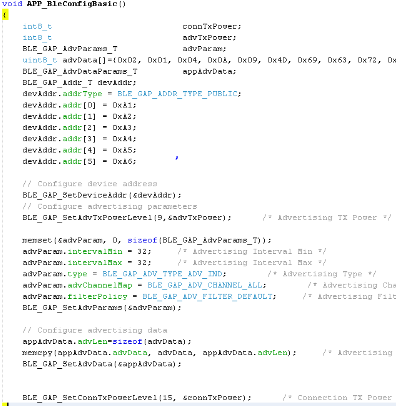

# BLE Connection

[Getting Started](https://onlinedocs.microchip.com/pr/GUID-A5330D3A-9F51-4A26-B71D-8503A493DF9C-en-US-1/index.html?GUID-17DABF04-E5D8-4201-A746-2FC244450A19)

[Getting Started with Peripheral Building Blocks](https://onlinedocs.microchip.com/pr/GUID-A5330D3A-9F51-4A26-B71D-8503A493DF9C-en-US-1/index.html?GUID-B3B46369-F5B4-401B-8405-658BE34988F4)

[Legacy Advertisements](https://onlinedocs.microchip.com/pr/GUID-A5330D3A-9F51-4A26-B71D-8503A493DF9C-en-US-1/index.html?GUID-820CEA03-90AE-484F-87C9-9CF2CE652702) **--\>** [BLE Connection](#GUID-F9A0C390-C124-49A7-9F22-157D20BFBE5D) **--\>**[BLE Transparent UART](https://onlinedocs.microchip.com/pr/GUID-A5330D3A-9F51-4A26-B71D-8503A493DF9C-en-US-1/index.html?GUID-07EC83B7-CC28-4C55-8634-4B7F56A9DB36)

## Introduction {#INTRODUCTION .section}

This document will help users enable advertisements and connection on WBZ451 Curiosity board using MPLAB Code Configurator\(MCC\) BLE Advertisement is Broadcasting of small packets to peer devices. In BLE a peripheral device always starts with advertisements.Advertisement packets enable a central or observer to discover and connect to a peripheral.

Users of this document can choose to just run the precompiled Application Example hex file on the WBZ451 Curiosity Board and experience the demo or can go through the steps involved in developing this Application from scratch

These examples each build on top on one and other. We strongly recommend that you follow the examples in order, to learn the basics concepts before progressing to the more advanced topics.

## Recommended Reads {#RECOMMENDED-READS .section}

1.  [BLE Software Specification](https://onlinedocs.microchip.com/pr/GUID-C5EAF60E-9124-427C-A0F1-F2DBE662EA92-en-US-1/index.html?GUID-222749FE-01C5-43B6-A5C7-CD82B3FC7F5F)

2.  [FreeRtos BLE App Initialize](https://onlinedocs.microchip.com/pr/GUID-A5330D3A-9F51-4A26-B71D-8503A493DF9C-en-US-1/index.html?GUID-AB1A02BF-4F9B-4058-90D9-02BFB3136682)

3.  [BLE Legacy Advertisements](https://onlinedocs.microchip.com/pr/GUID-A5330D3A-9F51-4A26-B71D-8503A493DF9C-en-US-1/index.html?GUID-820CEA03-90AE-484F-87C9-9CF2CE652702)


## Hardware Required {#HARDWARE-REQUIRED .section}

|**Tool**|**Qty**|
|--------|-------|
|WBZ451 Curiosity Board|1|
|Micro USB cable|1|

## SDK Setup {#SDK-SETUP .section}

1.  [Getting started with Software Development](https://onlinedocs.microchip.com/pr/GUID-A5330D3A-9F51-4A26-B71D-8503A493DF9C-en-US-1/index.html?GUID-2AD37FE2-1915-4E34-9A05-79E3810726D7)


## Software {#SOFTWARE .section}

1.  [TeraTerm](https://ttssh2.osdn.jp/index.html.en)


## Smartphone App {#SMARTPHONE-APP .section}

1.  Light Blue


## Programming the precompiled hex file or Application Example {#PROGRAMMING-THE-PRECOMPILED-HEX-FILE-OR-APPLICATION-EXAMPLE .section}

**Programming the hex file using MPLABX IPE**

1.  Precompiled Hex file is located in "<Harmony Content Path\>\\wireless\_apps\_pic32cxbz2\_wbz45\\apps\\ble\\building\_blocks\\peripheral\\peripheral\_conn\\hex" folder

2.  Follow the steps mentioned [here](https://microchipdeveloper.com/ipe:programming-device)


**Caution:** Users should choose the correct Device and Tool information

**Programming the Application using MPLABX IDE**

1.  Follow steps mentioned in of [Running a Precompiled Example](https://onlinedocs.microchip.com/pr/GUID-A5330D3A-9F51-4A26-B71D-8503A493DF9C-en-US-1/index.html?GUID-EA74172C-595E-4A34-B359-D42EE443F0EC) document

2.  Open and program the Application Example "peripheral\_conn.x" located in "<Harmony Content Path\>\\wireless\_apps\_pic32cxbz2\_wbz45\\apps\\ble\\building\_blocks\\peripheral\\peripheral\_conn\\firmware" using MPLABX IDE


<Harmony Content Path\> [how to find what is my Harmony Content Path](https://onlinedocs.microchip.com/pr/GUID-A5330D3A-9F51-4A26-B71D-8503A493DF9C-en-US-1/index.html?GUID-A55E9342-CE44-4A91-86BB-FEC6706FCD1C)

## Demo Description {#DEMO-DESCRIPTION .section}

This Application Example enables users to transmit Connectable and Scannable Undirected BLE Advertisements.On reset demo will print "Advertising" on a terminal emulator like TeraTerm, this denotes start of advertisements. Central device scanning these advertisements can issue connection request and get connected with this device. Upon connection demo prints "Connected" message on terminal window

## Testing {#TESTING .section}

Connect the WBZ451 Curiosity board to PC, program the precompiled hex file or application example as mentioned. Open TeraTerm @ \(Speed: 115200, Data: 8-bit, Parity: none, stop bits: 1 bit, Flow control: none\). Reset the board. Upon reset, "Advertising" message is displayed on the TeraTerm. User can open the LightBlue App on Smartphone to scan for Advertisements. Device with device name "Microchip" will appear.


Select the device to get connected, after successful connection user can view the advertisement data.


Terminal output


Users can use another WBZ451 Curiosity Board configured as [BLE Connection\(central\)](https://onlinedocs.microchip.com/pr/GUID-A5330D3A-9F51-4A26-B71D-8503A493DF9C-en-US-1/index.html?GUID-7C948236-7D8E-45CA-9511-AB244B44BE64) instead of using a Smartphone App

## Developing this Application from scratch using MPLAB Code Configurator {#DEVELOPING-THIS-APPLICATION-FROM-SCRATCH-USING-MPLAB-CODE-CONFIGURATOR .section}

This section explains the steps required by a user to develop this application example from scratch using MPLABx Code Configurator

**Tip:** New users of MPLAB Code Configurator are recommended to go through the [overview](https://onlinedocs.microchip.com/pr/GUID-1F7007B8-9A46-4D03-AEED-650357BA760D-en-US-6/index.html?GUID-B5D058F5-1D0B-4720-8649-ACE5C0EEE2C0).

1.  Create a new MCC Harmony Project -- [link](https://onlinedocs.microchip.com/pr/GUID-A5330D3A-9F51-4A26-B71D-8503A493DF9C-en-US-1/index.html?GUID-B86E8493-D00D-46EF-8624-D412342147F0) for instructions

2.  Import component configuration -- This step helps users setup the basic components required to start their Application Development component configuration related to this Application is available. The imported file is of format .mc3 and is located in the path "<Harmony Content Path\>/wireless\_apps\_pic32cxbz2\_wbz45\\apps\\ble\\building\_blocks\\peripheral\\peripheral\_conn\\firmware\\peripheral\_conn.X". Users should follow the instructions mentioned [here](https://microchipdeveloper.com/mcc:peripheralconfig) to import the component configuration.


**Tip:** Import and Export functionality of Harmony component configuration will help users to start from a known working setup of MCC configuration

1.  Accept Dependencies or satisfiers, select "Yes"

2.  Verify if the Project Graph window has all the expected configuration

    


## Verify Advertisement and Connection Configuration {#VERIFY-ADVERTISEMENT-AND-CONNECTION-CONFIGURATION .section}

1.  Select **BLE\_Stack** component in project graph

    


## Generate Code {#GENERATE-CODE-LINK-FOR-INSTRUCTIONS .section}

Instructions on[how to Generate Code](https://onlinedocs.microchip.com/pr/GUID-A5330D3A-9F51-4A26-B71D-8503A493DF9C-en-US-1/index.html?GUID-9C28F407-4879-4174-9963-2CF34161398E)

## Files and Routines Automatically generated by the MCC {#FILES-AND-ROUTINES-AUTOMATICALLY-GENERATED-BY-THE-MCC .section}

After generating the program source from MCC interface by clicking Generate Code, the BLE configuration can be found in the following project directories


The [OSAL](http://ww1.microchip.com/downloads/en/DeviceDoc/MPLAB%20Harmony%20OSAL%20Libraries%20Help%20v2.06.pdf), RF System, BLE System initialization routine executed during program initialization can be found in the project files. This initialization routine is automatically generated by the MCC


The BLE stack initialization routine excuted during Application Initialization can be found in project files. This intitialization routine is automatically generated by the MCC. This call initializes and configures the GAP, GATT, SMP, L2CAP and BLE middleware layers.


Autogenerated, advertisement data format


|**Source Files**|**Usage**|
|----------------|---------|
|app.c|Application State machine, includes calls for Initialization of all BLE stack \(GAP,GATT, SMP, L2CAP\) related component configurations|
|app\_ble\\app\_ble.c|Source Code for the BLE stack related component configurations, code related to function calls from app.c|
|app\_ble\\app\_ble\_handler.c|All GAP, GATT, SMP and L2CAP Event handlers|

> **Tip:** app.c is autogenerated and has a state machine based Application code sample, users can use this template to develop their application \|

**Header Files**

-   ble\_gap.h- This header file contains BLE GAP functions and is automatically included in the app.c file


**Function Calls**

MCC generates and adds the code to initialize the BLE Stack GAP, GATT, L2CAP and SMP in *APP\_BleStackInit\(\)* function

-   APP\_BleStackInit\(\) is the API that will be called inside the Applications Initial State -- APP\_STATE\_INIT in app.c


## User Application Development {#USER-APPLICATION-DEVELOPMENT .section}

**Include**

-   user action is required as mentioned [here](https://onlinedocs.microchip.com/pr/GUID-A5330D3A-9F51-4A26-B71D-8503A493DF9C-en-US-1/index.html?GUID-99583057-8B1A-42F2-84E8-CFC7717FA5D1)

-   definitions.h in all the files where UART will be used to print debug information


> Tip: definitions.h is not specific to just UART peripheral, instead it should be included in all application source files where peripheral functionality will be exercised

**Set PUBLIC Device Address**

-   BLE\_GAP\_SetDeviceAddr\(&devAddr\);


```
    BLE_GAP_Addr_T devAddr;
    devAddr.addrType = BLE_GAP_ADDR_TYPE_PUBLIC;
    devAddr.addr[0] = 0xA1;
    devAddr.addr[1] = 0xA2;
    devAddr.addr[2] = 0xA3;
    devAddr.addr[3] = 0xA4;
    devAddr.addr[4] = 0xA5;
    devAddr.addr[5] = 0xA6;

    // Configure device address
    BLE_GAP_SetDeviceAddr(&devAddr);
```



**Start Advertisement**

-   BLE\_GAP\_SetAdvEnable\(0x01, 0\);


**Connected & Disconnected Events**

-   All the possible GAP, GATT, SMP and L2CAP Event handlers are available in file app\_ble\_handler.c, users can implement application code to denote Connection State here.


Users can exercise various other BLE Advertisement functionalities by using [BLE Stack API](https://onlinedocs.microchip.com/pr/GUID-C5EAF60E-9124-427C-A0F1-F2DBE662EA92-en-US-1/index.html)

## Where to go from here {#WHERE-TO-GO-FROM-HERE .section}

-   [BLE Transparent UART](https://onlinedocs.microchip.com/pr/GUID-A5330D3A-9F51-4A26-B71D-8503A493DF9C-en-US-1/index.html?GUID-07EC83B7-CC28-4C55-8634-4B7F56A9DB36)


**Parent topic:**[Peripheral](https://onlinedocs.microchip.com/pr/GUID-A5330D3A-9F51-4A26-B71D-8503A493DF9C-en-US-1/index.html?GUID-B3B46369-F5B4-401B-8405-658BE34988F4)

