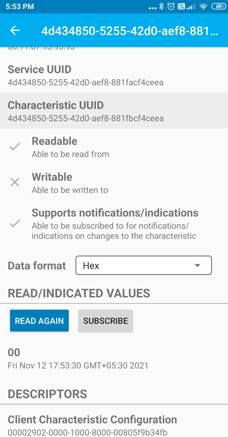
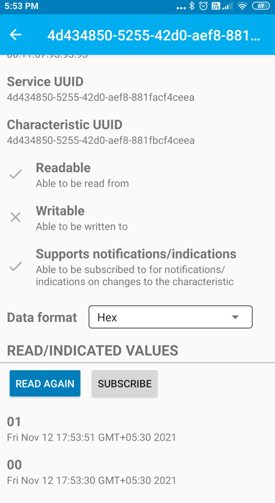
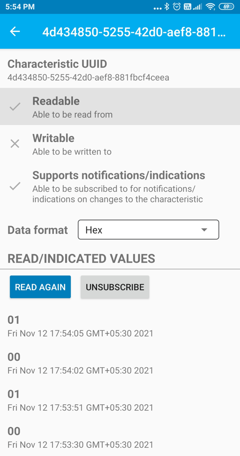
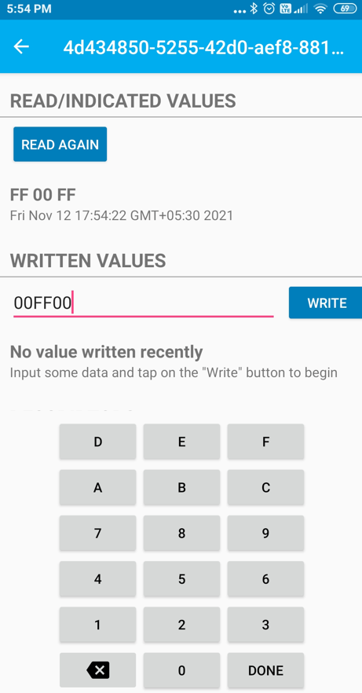

# BLE Custom service

[Getting Started](https://onlinedocs.microchip.com/pr/GUID-A5330D3A-9F51-4A26-B71D-8503A493DF9C-en-US-1/index.html?GUID-17DABF04-E5D8-4201-A746-2FC244450A19)

[Getting Started with Peripheral Building Blocks](https://onlinedocs.microchip.com/pr/GUID-A5330D3A-9F51-4A26-B71D-8503A493DF9C-en-US-1/index.html?GUID-B3B46369-F5B4-401B-8405-658BE34988F4)

[BLE Connection](https://onlinedocs.microchip.com/pr/GUID-A5330D3A-9F51-4A26-B71D-8503A493DF9C-en-US-1/index.html?GUID-F9A0C390-C124-49A7-9F22-157D20BFBE5D) **–\>** [BLE Custom Service](#GUID-0F3193BF-C61D-4DDB-9E98-7F0A444269A8)

## Introduction {#GUID-0A942040-F974-455F-8FD7-95AC500F5A33 .section}

This tutorial will help users create a peripheral device with custom profile and control the RGB LEDs on the WBZ451 Curiosity board and button on the WBZ451 Curiosity board shall be used to enable or disable the LED status. Peripheral device will be WBZ45x Device and Central device can be a Smartphone with Light Blue App.The instructions mentioned below are applicable for a BLE Peripheral device.

Users of this document can choose to just run the precompiled Application Example hex file on the WBZ451 Curiosity board and experience the demo or can go through the steps involved in developing this Application from scratch.

## Recommended Reads {#GUID-C0352C80-A168-45C6-89EF-0B6DE5D6B3B4 .section}

1.  [BLE Software Specification](https://onlinedocs.microchip.com/pr/GUID-C5EAF60E-9124-427C-A0F1-F2DBE662EA92-en-US-1/index.html?GUID-222749FE-01C5-43B6-A5C7-CD82B3FC7F5F)

2.  [BLE Connection](https://onlinedocs.microchip.com/pr/GUID-A5330D3A-9F51-4A26-B71D-8503A493DF9C-en-US-1/index.html?GUID-F9A0C390-C124-49A7-9F22-157D20BFBE5D)


## Hardware Required {#GUID-A964CAA3-59B6-4653-BD68-533A405424C2 .section}

|Tool Required|Qty|
|**WBZ451 Curiosity Board**|1|
|Micro USB Cable|1|

## SDK Setup {#GUID-C332DB1D-7014-4E9D-99C8-A91745C3E600 .section}

1.  [Getting Started with Software Development](https://onlinedocs.microchip.com/pr/GUID-A5330D3A-9F51-4A26-B71D-8503A493DF9C-en-US-1/index.html?GUID-2AD37FE2-1915-4E34-9A05-79E3810726D7)


## Software {#SOFTWARE .section}

1.  [TeraTerm](https://ttssh2.osdn.jp/index.html.en)


## Smartphone App {#SMARTPHONE-APP .section}

1.  Light Blue


## Programming the precompiled hex file or Application Example {#PROGRAMMING-THE-PRECOMPILED-HEX-FILE-OR-APPLICATION-EXAMPLE .section}

**Programming the hex file using MPLABX IPE**

1.  Precompiled Hex file is located in "<Harmony Content Path\>\\wireless\_apps\_pic32cxbz2\_wbz45\\apps\\ble\\building\_blocks\\peripheral\\profiles\_services\\custom\_service\\hex" folder

2.  Follow the steps mentioned [here](https://microchipdeveloper.com/ipe:programming-device)


**Caution:** Users should choose the correct Device and Tool information

**Programming the Application using MPLABX IDE**

1.  Follow steps mentioned in of [Running a Precompiled Example](https://onlinedocs.microchip.com/pr/GUID-A5330D3A-9F51-4A26-B71D-8503A493DF9C-en-US-1/index.html?GUID-EA74172C-595E-4A34-B359-D42EE443F0EC) document

2.  Open and program the Application Example "peripheral\_trp\_uart.x" located in "<Harmony Content Path\>\\wireless\_apps\_pic32cxbz2\_wbz45\\apps\\ble\\building\_blocks\\peripheral\\profiles\_services\\custom\_service\\firmware" using MPLABX IDE


<Harmony Content Path\> [how to find what is my Harmony Content Path](https://onlinedocs.microchip.com/pr/GUID-A5330D3A-9F51-4A26-B71D-8503A493DF9C-en-US-1/index.html?GUID-A55E9342-CE44-4A91-86BB-FEC6706FCD1C)

## Demo Description {#DEMO-DESCRIPTION .section}

Upon programming the demo application, WBZ45x will start Advertising \(connectable\), central device \(Smartphone\) scanning for these advertisements will connect to the device. In case of using Light Blue App search for “pic32cx-bz” and connect. After a connection has been made Button and RGB LED status can be read and RGB LED can be controlled from the central device \(Smartphone - Light Blue App\). Button status will be notified if subscribed from central device \(Smartphone\).

Demo will print various events on a terminal emulator like Tera Term @ \(Speed: 115200, Data: 8-bit,Partity: none, stop bits: bit, Flow control: none\)

-   Start of the advertisement - "\[BLE\] Device Initialized. Ready for connection"

-   Connection completed - "\[BLE\] Connected to Peer Device: "&" \[BLE \] Connection Handle:"

-   Write Request Received - "\[BLE\] GATT Write ATTR Handle 0x"

-   Read Request Received - "\[BLE\] GATT Read ATTR Handle 0x"

-   Received RGB Data - "\[BLE\] RGB LED data 0x 0x 0x"

-   Button press event - “\[BLE\] Custom Service Button Event : RGB LED ON” & “\[BLE\] Custom Service Button Event : RGB LED OFF”

-   BLE Disconnected - “\[BLE\] Disconnected Handle: %d, Reason: 0x<reason\_code\>”.


## Testing {#TESTING .section}

This section assumes that user has programmed the Application Example on the WBZ451 Curiosity Board **Demo Experience when using a Smartphone \(Light Blue App\) as Central Device**

-   Reset the WBZ451 Curiosity board, Open Terminal emulator like Tera Term, select the right COM port@ \(Speed: 115200, Data: 8-bit, Parity: none, stop bits: 1 bit, Flow control: none\).

-   open Light Blue App on your smartphone, Search and select the advertisement with Device Name "pic32cx-bz"

    

-   Once connected on Blue App on your smartphone, basic info like Adervetisement Data and Device information will be avilable"

    

-   Once connected on Blue App on your smartphone, find the custom service with the UUID 4d434850-5255-42d0-aef8-881facf4ceea" Two characteristics will be avilable on the custom service.Button characteristics with Readable,Notify property and RGB LED characteristics with Readable,Writable property

    

-   Click on the button characteristics which will have read option and subscribe. Read will give the current status of the button

    

-   Click on the button characteristics subscribe option to listen for button change events.Button press activity will be notified to the central device without read intiated and toggle the RGB LEDs.

    

    

-   Click on the RGB LED characteristics which will have read and write option. Read will give the current values stored for the RGB LEDs.Value of zero will turn off the LED. Other than zero value will turn on LED.

    

-   Click on the button characteristics write option provides option to write info which will change the RGB LED on/off condition.Read again to get the updated value for RGB LEDs.

    

    

-   press back to disconnect the ble connection. Disconnected device will advertise again.

    

-   Every event will be notified in the terminal emulator.


## Developing this Application from scratch using MPLAB Code Configurator {#DEVELOPING-THIS-APPLICATION-FROM-SCRATCH-USING-MPLAB-CODE-CONFIGURATOR .section}

This section explains the steps required by a user to develop this application example from scratch using MPLABx Code Configurator

**Tip:** New users of MPLAB Code Configurator are recommended to go through the [overview](https://onlinedocs.microchip.com/pr/GUID-1F7007B8-9A46-4D03-AEED-650357BA760D-en-US-6/index.html?GUID-B5D058F5-1D0B-4720-8649-ACE5C0EEE2C0).

1.  Create a new MCC Harmony Project -- [link](https://onlinedocs.microchip.com/pr/GUID-A5330D3A-9F51-4A26-B71D-8503A493DF9C-en-US-1/index.html?GUID-B86E8493-D00D-46EF-8624-D412342147F0) for instructions

2.  Import component configuration -- This step helps users setup the basic components and configuration required to develop this application. The imported file is of format .mc3 and is located in the path "<Harmony Content Path>\wireless_apps_pic32cxbz2_wbz45\apps\ble\building_blocks\peripheral\profiles_services\custom_service\firmware\custom_service.X". Users should follow the instructions mentioned [here](https://onlinedocs.microchip.com/pr/GUID-A5330D3A-9F51-4A26-B71D-8503A493DF9C-en-US-1/index.html?GUID-F8FE2886-8A2C-4FC0-9956-C094CE44D162) to import the component configuration.

3.  Accept Dependencies or satisfiers, select "Yes"

4.  Verify if the Project Graph window has all the expected configuration

    


## Verify Custom Service Configuration {#VERIFY-ADVERTISEMENTCONNECTION-AND-TRANSPARENT-UART-PROFILE-CONFIGURATION .section}

1.  Select **BLE\_Stack** component in project graph

    

2.  Select **FreeRTOS** component in project graph

    

3.  Select **SERCOM0** component in project graph

    

4.  Select **System** component in project graph

    

5.  Select **EIC** component in project graph

    

6.  Select **Customized Service** component in project graph

    

    

    

7.  Verify the **Clock Configuration** from tools option as per [low power guide](https://onlinedocs.microchip.com/pr/GUID-A5330D3A-9F51-4A26-B71D-8503A493DF9C-en-US-1/index.html?GUID-101C8B73-AD8E-4845-831A-DC498B147435).


## Generate Code {#GENERATE-CODE-LINK-FOR-INSTRUCTIONS .section}

Instructions on[how to Generate Code](https://onlinedocs.microchip.com/pr/GUID-A5330D3A-9F51-4A26-B71D-8503A493DF9C-en-US-1/index.html?GUID-9C28F407-4879-4174-9963-2CF34161398E)

## Files and Routines Automatically generated by the MCC {#FILES-AND-ROUTINES-AUTOMATICALLY-GENERATED-BY-THE-MCC .section}

After generating the program source from MCC interface by clicking Generate Code, the BLE configuration can be found in the following project directories


The [OSAL](http://ww1.microchip.com/downloads/en/DeviceDoc/MPLAB%20Harmony%20OSAL%20Libraries%20Help%20v2.06.pdf), RF System, BLE System initialization routine executed during program initialization can be found in the project files. This initialization routine is automatically generated by the MCC


|**Source Files**|**Usage**|
|----------------|---------|
|app.c|Application State machine, includes calls for Initialization of all BLE stack \(GAP,GATT, SMP, L2CAP\) related component configurations|
|app\_ble\\app\_ble.c|Source Code for the BLE stack related component configurations, code related to function calls from app.c|
|app\_ble\\app\_ble\_handler.c|All GAP, GATT, SMP and L2CAP Event handlers|
|ble\_button\_led\_svc.c|All Custom Service button RGB LEDs configurations and functions|

app\_ble\_custom\_service header and source files can be copied from the reference application.

> **Tip:** app.c is autogenerated and has a state machine based Application code sample, users can use this template to develop their application

The [OSAL](http://ww1.microchip.com/downloads/en/DeviceDoc/MPLAB%20Harmony%20OSAL%20Libraries%20Help%20v2.06.pdf), RF System, BLE System initialization routine executed during program initialization can be found in the project files. This initialization routine is automatically generated by the MCC


## User Application Development {#USER-APPLICATION-DEVELOPMENT .section}

Initialize Advertisement,Custom Service and EIC in APP\_Tasks function in file app.c

Add the code for enable advertisement,customer service intilization and button external interrupt callback functions in the APP\_STATE\_INIT.


```
 /* Application's initial state. */
 case APP_STATE_INIT:
 {  
    bool appInitialized = true;
    //appData.appQueue = xQueueCreate( 10, sizeof(APP_Msg_T) );
    APP_BleStackInit();
    RTC_Timer32Start();
    BLE_GAP_SetAdvEnable(0x01, 0); //Enable BLE Advertisement
    BLE_BUTTON_LED_Add();
    APP_Button_Init();
    SYS_CONSOLE_PRINT("[BLE] Device Initialized. Ready for connection. \r\n");
```

Handle the button and RGB LED events in APP\_Tasks function in file app.c

Add the RGB and button handlers to the function APP\_Tasks\(\) in app.c file.


```
 case APP_STATE_SERVICE_TASKS:
 {
    if (OSAL_QUEUE_Receive(&appData.appQueue, &appMsg, OSAL_WAIT_FOREVER))
    {
     // if(p_appMsg->msgId==APP_MSG_BLE_STACK_EVT)
     // {
     // // Pass BLE Stack Event Message to User Application for handling
     // APP_BleStackEvtHandler((STACK_Event_T *)p_appMsg->msgData);
     // }
     switch (p_appMsg->msgId)
     {
        case APP_MSG_BLE_STACK_EVT:
        {
            APP_BleStackEvtHandler((STACK_Event_T *)p_appMsg->msgData);
         }
         break;
         case APP_MSG_BLE_CS_LED_EVT:
         {
             APP_CustomService_RGB_Handler((uint8_t *)((STACK_Event_T *)p_appMsg->msgData));
          }
          break;
          case APP_MSG_BLE_CS_BUTTON_EVT:
          {
              APP_CustomService_Button_Handler();
          }
          break;
       }
   }
  break;
 }
```

Add the msg ids for the button and RGB LED events in file app.h


```
 typedef enum APP_MsgId_T
 {
     APP_MSG_BLE_STACK_EVT,
     APP_MSG_ZB_STACK_EVT,
     APP_MSG_ZB_STACK_CB,
     APP_MSG_BLE_CS_LED_EVT,
     APP_MSG_BLE_CS_BUTTON_EVT,
     APP_MSG_STACK_END
 } APP_MsgId_T;
```

**Add the custom service file\(\\custom\_service\\firmware\\src\\app\_ble\_custom\_service.c/.h\) which has the supporting functions for Button LED Custom service file.**


**Print the required information on the connect and discoonect events in file app\_ble\_handler.c**Add the required variables, functions and callback handlers for GATT read/write response in the file ble\_handler.c along with the connect and disconnect .


```
void APP_BleGapEvtHandler(BLE_GAP_Event_T *p_event)
{
    switch(p_event->eventId)
    {
        case BLE_GAP_EVT_CONNECTED:
        {
        /* TODO: implement your application code.*/
        SYS_CONSOLE_PRINT("[BLE] Connected to Peer Device: 0x");
        for(int8_t idx=(GAP_MAX_BD_ADDRESS_LEN-1); idx>=0; idx--)
        {
            SYS_CONSOLE_PRINT("%02x", p_event->eventField.evtConnect.remoteAddr.addr[idx]);
        }
        SYS_CONSOLE_PRINT("\n\r[BLE] Connection Handle: %d\n\r",p_event->eventField.evtConnect.connHandle);
        G_ConnHandle = p_event->eventField.evtConnect.connHandle;
        }
        break;
        case BLE_GAP_EVT_DISCONNECTED:
        {
           /* TODO: implement your application code.*/
           SYS_CONSOLE_PRINT("[BLE] Disconnected Handle: %d, Reason: 0x%X\n\r",p_event->eventField.evtDisconnect.connHandle, p_event->eventField.evtDisconnect.reason);
           G_ConnHandle = 0;
           BLE_GAP_SetAdvEnable(0x01, 0); //Enable BLE Advertisement          
        }
        break;
```

**Add the functions for the GATT read and write handlers which will act on the received GATT request in file app\_ble\_handler.c.**


```
void APP_GattSEvtReadHandler(GATT_EvtRead_T p_event)
{

    uint8_t error = 0;
    uint16_t status;
    SYS_CONSOLE_PRINT("[BLE] GATT Read ATTR Handle 0x%X \r\n",p_event.attrHandle);

    if ((p_event.attrHandle <= BUTTON_LED_START_HDL) ||
        (p_event.attrHandle > BUTTON_LED_END_HDL))
    {
        /* Not BLE Custom Service characteristic. */
        return;
    }

        switch(p_event.attrHandle)
        {
            case BUTTON_LED_HDL_CHAR_0:                            /**< Handle of characteristic 0. */
            case BUTTON_LED_HDL_CCCD_0:                            /**< Handle of characteristic 0 CCCD . */
            case BUTTON_LED_HDL_CHAR_1:                            /**< Handle of characteristic 1. */
            case BUTTON_LED_HDL_CHARVAL_1:                         /**< Handle of characteristic 1 value. */
                error = ATT_ERRCODE_APPLICATION_ERROR;
                break;
            case BUTTON_LED_HDL_CHARVAL_0:                         /**< Handle of characteristic 0 value. */                
//                SYS_CONSOLE_PRINT(" ATTR Handle Read 0x%X \r\n",p_event.attrHandle);
                break;
        }

    if ((p_event.readType == ATT_READ_REQ)
    || (p_event.readType == ATT_READ_BLOB_REQ))
    {
        if (!error)
        {
            sp_trsReadRespParams = (GATTS_SendReadRespParams_T *)OSAL_Malloc(sizeof(GATTS_SendReadRespParams_T));
            if (sp_trsReadRespParams == NULL)
            {
                return;
            }
            trsRespErrConnHandle = p_event.connHandle;
            sp_trsReadRespParams->responseType = ATT_READ_RSP;
            sp_trsReadRespParams->attrLength = 0x01;
            sp_trsReadRespParams->attrValue[0]= bleCSdata.rgbOnOffStatus;            
//            sp_trsReadRespParams->attrLength = 0x03;
//            sp_trsReadRespParams->attrValue[0]= bleCSdata.RGB_LED.Red;
//            sp_trsReadRespParams->attrValue[1]= bleCSdata.RGB_LED.Green;
//            sp_trsReadRespParams->attrValue[2]= bleCSdata.RGB_LED.Blue;
            status = GATTS_SendReadResponse(p_event.connHandle, sp_trsReadRespParams);
            if (status == MBA_RES_SUCCESS)
            {
                OSAL_Free(sp_trsReadRespParams);
                sp_trsReadRespParams = NULL;
            }
        }
        else
        {
            sp_trsErrParams = (GATTS_SendErrRespParams_T *)OSAL_Malloc(sizeof(GATTS_SendErrRespParams_T));
            if (sp_trsErrParams == NULL)
            {
                return;
            }
            trsRespErrConnHandle = p_event.connHandle;
            sp_trsErrParams->reqOpcode = p_event.readType;
            sp_trsErrParams->attrHandle = p_event.attrHandle;
            sp_trsErrParams->errorCode = error;
            status = GATTS_SendErrorResponse(p_event.connHandle, sp_trsErrParams);
            if (status == MBA_RES_SUCCESS)
            {
                OSAL_Free(sp_trsErrParams);
                sp_trsErrParams = NULL;
            }
        }
    }   
}
```

```
void APP_GattSEvtWriteHandler(GATT_EvtWrite_T p_event)
{
    uint8_t error = 0;
    uint16_t status;
    SYS_CONSOLE_PRINT("[BLE] GATT Write ATTR Handle 0x%X \r\n",p_event.attrHandle);

    if ((p_event.attrHandle <= BUTTON_LED_START_HDL) ||
        (p_event.attrHandle > BUTTON_LED_END_HDL))
    {
        /* Not BLE Custom Service characteristic. */
        error = ATT_ERRCODE_INVALID_HANDLE;
        return;
    }

        switch(p_event.attrHandle)
        {
            case BUTTON_LED_HDL_CHAR_0:                            /**< Handle of characteristic 0. */
            case BUTTON_LED_HDL_CHARVAL_0:                         /**< Handle of characteristic 0 value. */
            case BUTTON_LED_HDL_CCCD_0:                            /**< Handle of characteristic 0 CCCD . */
            case BUTTON_LED_HDL_CHAR_1:                            /**< Handle of characteristic 1. */
                error = ATT_ERRCODE_APPLICATION_ERROR;
                break;
            case BUTTON_LED_HDL_CHARVAL_1:                         /**< Handle of characteristic 1 value. */
//                SYS_CONSOLE_PRINT(" ATTR Handle %d \r\n",p_event.attrHandle);
                APP_CustomService_RGB_Callback(p_event.writeValue);
                break;
        }

    if ((p_event.writeType == ATT_WRITE_REQ)
    || (p_event.writeType == ATT_PREPARE_WRITE_REQ))
    {
        if (!error)
        {
            sp_trsRespParams = (GATTS_SendWriteRespParams_T *)OSAL_Malloc(sizeof(GATTS_SendWriteRespParams_T));
            if (sp_trsRespParams == NULL)
            {
                return;
            }
            trsRespErrConnHandle = p_event.connHandle;
            sp_trsRespParams->responseType = ATT_WRITE_RSP;
            status = GATTS_SendWriteResponse(p_event.connHandle, sp_trsRespParams);
            if (status == MBA_RES_SUCCESS)
            {
                OSAL_Free(sp_trsRespParams);
                sp_trsRespParams = NULL;
            }
        }
        else
        {
            sp_trsErrParams = (GATTS_SendErrRespParams_T *)OSAL_Malloc(sizeof(GATTS_SendErrRespParams_T));
            if (sp_trsErrParams == NULL)
            {
                return;
            }
            trsRespErrConnHandle = p_event.connHandle;
            sp_trsErrParams->reqOpcode = p_event.writeType;
            sp_trsErrParams->attrHandle = p_event.attrHandle;
            sp_trsErrParams->errorCode = error;
            status = GATTS_SendErrorResponse(p_event.connHandle, sp_trsErrParams);
            if (status == MBA_RES_SUCCESS)
            {
                OSAL_Free(sp_trsErrParams);
                sp_trsErrParams = NULL;
            }
        }
    }
}

```

**Tip:** Manual read and write response,permissions and other standard events like GAP and GATT can be executed in the app\_ble\_handler

Users can exercise various other BLE functionalities by using[BLE Stack API](https://onlinedocs.microchip.com/pr/GUID-C5EAF60E-9124-427C-A0F1-F2DBE662EA92-en-US-1/index.html)

**Parent topic:**[Peripheral](https://onlinedocs.microchip.com/pr/GUID-A5330D3A-9F51-4A26-B71D-8503A493DF9C-en-US-1/index.html?GUID-B3B46369-F5B4-401B-8405-658BE34988F4)
