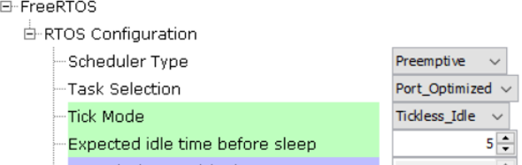
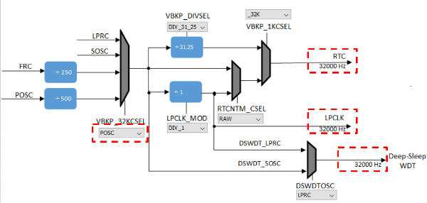

# Low Power BLE Application Design

Low Power BLE Application Design

When designing a wireless Bluetooth Application, BLE stack advertisement/connection intervals are the driving factors determining sleep mode entries and exit. There are 2 low power/sleep modes that are supported by the BLE stack

-   Sleep

-   Deep Sleep


Sleep and Deep Sleep Modes are synonymous to Standby and Backup Modes and this document may use these terminologies interchangeably.

## Sleep/ Standby Low Power Mode {#GUID-BDC8B1B3-C8E9-491F-A0A8-20EB5BF0AC70 .section}

**What determines Application Sleep Duration and How to control it?**

BLE stack allows system to enter low power mode if there is no active data tx/reception or the ble advertisement interval/connection interval. So the system sleep cannot be directly edited as a parameter/ API call.

**Device operation in low power modes?**

During system sleep, clock \(system PLL\) will be disabled and syatem tick will be turned off. FreeRTOS timer needs to be componsated for the time spent in low power mode. RTC timer can continue operating in the low power modes will adjust the FreeRTos timer offset.

So overall system sleep time is determined by the following factors - BLE activity interval, external interrupt \(like GPIO\) or peripheral interrupts.

Peripherals that are allowed to run in standby/sleep low power mode can continue to run in the "Sleep" low power mode

"Deep Sleep/Backup Mode" only allows for certain peripherals like RTC and EIC to continue operating in this low power mode

**How to enable "Sleep/Standby" Low Power Mode ?**

1.  **Reference application examples**

    1.  [BLE Legacy Adv](https://onlinedocs.microchip.com/pr/GUID-A5330D3A-9F51-4A26-B71D-8503A493DF9C-en-US-2/index.html?GUID-820CEA03-90AE-484F-87C9-9CF2CE652702)

        1.  Implements sleep low power mode with periodic ble legacy adv

    2.  [BLE Extended Adv](https://onlinedocs.microchip.com/pr/GUID-A5330D3A-9F51-4A26-B71D-8503A493DF9C-en-US-2/index.html?GUID-9A3C4C97-E09F-4FF9-878C-3873892445F4)

        1.  Implements sleep low power mode with periodic ble extended \(coded PHY\) adv

    3.  [BLE Sensor App](https://onlinedocs.microchip.com/pr/GUID-A5330D3A-9F51-4A26-B71D-8503A493DF9C-en-US-2/index.html?GUID-D3F1BF46-F275-409B-A344-4DB9EAABC5E9)

        1.  Implements sleep low power mode in a ble connection oriented application and data exchage using Microchip Transparent UART Service. This application also has peripherals that are enabled to run in standby/sleep low power mode

    4.  BLE Custom Service Building Block

        1.  Implements sleep low power mode in a ble connection oriented application and data exchage using custom service. This application does not have peripherals continuing to run in standby/sleep low power mode


How to use MPLAB Code Configurator to Generate Sleep Mode?

1.  Sytem Sleep Mode needs to be enabled in BLE stack H3 compoenent configuration, after enabling this dependant components like RTC \(Timer source during sleep\) will be requested to be enabled

    

2.  Upon enabling sleep mode, FreeRTOS related settings will be set automatically

    -   Tick Mode will be set to Tickless\_Idle

    -   Expected idle time before sleep will be set to 5 \(ms\)

        

    -   Tick Hook will be enabled \(For user to add any custom code needed to be executed within each tick interrupt\)

        

    -   RTC peripheral library will be added and configured

    **Note:** RTC counter should not be reset \(RTC\_Timer32CounterSet\(\)\) arbitrarily when the system is running

3.  RTC clock source should be set manually, there are 4 options to choose from

    FRC \(±1% offset\)

    LPRC \( with larger offset, < ±5%\)

    POSC <- Candidate of the clock source \(better clock accuracy\)

    SOSC <- Candidate of the clock source \(better clock accuracy\)

    **Note:** Users must select POSC/SOSC as the RTC clock source as choosing other clock sources will impact BLE connection stability

    

4.  Manually Setting RTC clock source - POSC, open MCC, select "Clock Configuration" and configure as highlighted

    

5.  Manually Setting RTC clock source - SOSC, open MCC, select "Clock Configuration" and configure as highlighted

    

    **Note:** Users can only select one clock source POSC or SOSC, steps are mentioned to choose either

6.  It is recommended to use 48MHz as SYS\_CLOCK for better power savings. This can be configured by setting SPLLPOSTDIV1 to `2` as shown below.

    

7.  Ensure that JTAG Enable is disabled by clearing the JTAGEN bit in CFGCON0 \(Configuration Control Register 0\) as shown below. This code snippet can be added to SYS\_Initialize\(\)

    `CFG_REGS->CFG_CFGCON0CLR = CFG_CFGCON0_JTAGEN_Msk;`

8.  All Unused pins in the application needs to be set in input mode and the pulldown should be enabled for these pins. This can be configured through pin configuration in Harmony3 Configurator as shown below.

    

9.  Generate Code [link](https://onlinedocs.microchip.com/pr/GUID-A5330D3A-9F51-4A26-B71D-8503A493DF9C-en-US-2/index.html?GUID-9C28F407-4879-4174-9963-2CF34161398E) for instructions


Where can i find Sleep related code implementation after code generation step?

|**Implementation**|**Location**|
|------------------|------------|
|BT Sleep Mode|BLE Stack Library|
|System Sleep Mode|Device Support Library|
|Execute BT/System Sleep|app\_idle\_task.c|
|RTC Based Tickless Idle Mode|app\_idle\_task.c|

What is code the user has to implement after code generation for sleep/standby low power mode entry?

FreeRTOS provides Tickless IDLE Mode for power saving, this can be used to stop periodic tick interrupts during idle periods \(periods when there are no application tasks that are able to excute\) For the lost count on time during the IDLE mode, RTC timer is used to make a correcting adjustment to the RTOS tick count value, when it is restarted \(after waking up from sleep\) More information on low power tickless mode is available [here](https://www.freertos.org/low-power-tickless-rtos.html). The Tickless Idle Mode will be executed automatically when the Idle task is the only task able to run, because all the application tasks are either in blocked or suspended state. To prevent the system from entering sleep/standby low mode and waking up immediately, the minimum sleep time\(IDLE time\) is automatically set to 5 ms.

**Note:** maximum sleep time is equal to the maximum period of the RTC 32 bit counter - 134217.8 sec \(around 37 hours\)

1.  In order for the system to enter sleep, system needs to request bluetooth wireless subsystem to sleep. This is accomplished by calling API - BT\_SYS\_EnterSleepMode\(\) for BLE

    

    

2.  The API to call to ensure subsytem is sleeping \(inactive\) or ready for system to enter sleep mode is - BT\_SYS\_AllowSystemSleep

    

3.  If the expected sleep time is greater than 5 ms, system is allowed to enter sleep mode by checking for 2 conditions

    -   Bluetooth subsystem is inactive

    -   eTaskConfirmSleepModeStatus\(\) returns eNoTasksWaitingTimeout, more information [here](https://www.freertos.org/eTaskConfirmSleepModeStatus.html).

    **Tip:** User can also add their own condition to be checked before system goes to sleep, for example, do not enter system sleep if data transmission over UART is active

    ```
    Pseudo code in RTC based Tickless Idle Mode:
    
    ```
    if ((BT_SYS_AllowSystemSleep() || ZB_ReadyToSleep()) && ( eTaskConfirmSleepModeStatus() != eAbortSleep ) && (user_condition))
    {
            //Enter System Sleep Mode
            DEVICE_EnterSleepMode ();        //RTC Based Tickless Idle Mode       
    }
    ```
    ```


-   When both the conditions as mentioned in point 3 are met, we enter RTC based Tickless Idle mode \(Stop the system tick, use of RTC timer to set the sleep time, disable interrupts\)

    System will enter sleep mode after setting the RTC based Tickless Idle Mode by calling API - Device\_EnterSleepMode\(\) and then wait for Interrupt \(WFI\) instruction is executed

    


How does the system exit from deep sleep mode?

1.  Sytem when in sleep/standby mode can be waken up by RTC timeout, BLE or GPIO interrupt

2.  Sleep mode exit is initiated by calling API - DEVICE\_ExitSleepMode\(\)

3.  Upon exiting the sleep mode, interrupts need to be reenabled to allow the inteerupt service routine to be executed

4.  Interrupts are disabled as the sys tick needs to be compensated \(Tickless IDLE mode\)

    


HW and FW state during System wake up and Sleep Mode


**Parent topic:**[How-to: Low Power Design](https://onlinedocs.microchip.com/pr/GUID-A5330D3A-9F51-4A26-B71D-8503A493DF9C-en-US-2/index.html?GUID-F9A40E74-7127-4C2C-B480-2746007AAEAE)

