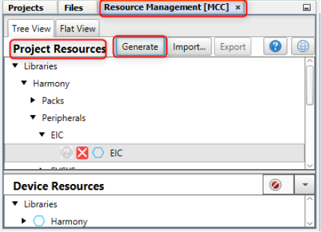
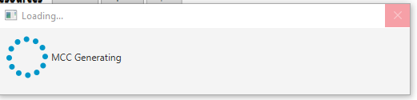

# MPLAB Code Configurator\(MCC\) Code Generation

1.  Generate code

1.  Select Generate

## Merge Strategy {#MERGE-STRATEGY .section}

Understanding [MCC Merge Window](https://microchipdeveloper.com/mcc:merge)

**Tip:** if a user wants to maintain the modifications made for their application code development, they should select "Close" the merge window

**Parent topic:**[Support Documentation](https://onlinedocs.microchip.com/pr/GUID-A5330D3A-9F51-4A26-B71D-8503A493DF9C-en-US-2/index.html?GUID-5FC6D5A2-B8C3-4AD8-AC31-0AABE237A2F7)

