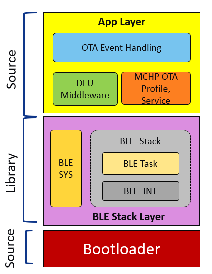

# BLE OTA DFU Firmware Architecture

The below figure shows the BLE OTA DFU Firmware Architecture of PIC32CXBZ2/WBZ451 device.

-   [MCHP OTA Profile and Service Middleware:](https://onlinedocs.microchip.com/pr/GUID-C5EAF60E-9124-427C-A0F1-F2DBE662EA92-en-US-1/index.html?GUID-21DF9FC9-288A-4527-B524-21DC72997BCF)

    -   Defines and handles the MCHP defined BLE GATT Server and Profile for getting the upgradable image over BLE link.

    -   Implements OTA state management and error handling.

    -   Implements defragmentation and decryption of received new image.

-   [DFU Middleware:](https://onlinedocs.microchip.com/pr/GUID-C5EAF60E-9124-427C-A0F1-F2DBE662EA92-en-US-1/index.html?GUID-17C45D3A-4EF4-4A95-A26B-537316951787)

    -   DFU APIs for writing the OTA image into Embedded Flash.

    -   This module provides Device Firmware Update \(DFU\) capabilities common across the different supported transport mediums like UART, BLE

-   [OTA Event Handling:](https://onlinedocs.microchip.com/pr/GUID-A5330D3A-9F51-4A26-B71D-8503A493DF9C-en-US-1/index.html?GUID-CDA62122-6D5D-4CDC-B1B7-3EB02C26552C)

    -   OTA events from "MCHP OTA Profile and Service" middleware is sent to application for DFU permission.

-   OTA DFU Encryption Key management:

    -   Trigger new Flash Image authentication by calling Bootloader API.

    -   Timeout handling in case of failure/error while receiving the image.

-   [Bootloader:](https://onlinedocs.microchip.com/pr/GUID-2085FE66-A762-4CC0-B054-7F98E8AF999A-en-US-2/index.html?GUID-A04B5B1F-202B-4944-B18F-13E4857CC3CD)

    -   Bootloader is responsible for authentication and activation of new firmware, booting into the application, optionally entering into Serial DFU mode to get new image over serial interface. Please be noted that Bootloader code is running from Boot Flash in PIC32CXBZ2/WBZ451 family of devices. So, it is not immutable.

**Parent topic:**[Device Firmware Upgrade Over BLE](https://onlinedocs.microchip.com/pr/GUID-A5330D3A-9F51-4A26-B71D-8503A493DF9C-en-US-1/index.html?GUID-908446A4-F490-4063-9096-66C4831F9BE4)

