# BLE OTA DFU Demo

The below BLE OTA demo steps are common for any application implementing OTA functionality.

BLE sensor application is the sample project which implements OTA functioanlity as explained in  the above steps. The current image \(ble\_sensor.X.production.signed.unified\_gpiobased.hex  or ble\_sensor.X.production.signed.unified\_timerbased.hex\) with OTA capability and new  upgrdable .bin \(ble\_sensor\_1.0.0.1\_enc\_ota.bin\) is also available in  \\ble\\advanced\_applications\\ble\_sensor\\precompiled\_hex for your reference.

-   **Hardware Required:**

|Tool|Qty|
|  WBZ451 Curiosity Board|1|
|Micro USB cable|1|
|Android/iOS Mobile|1|

-   **Smartphone App:** Microchip Bluetooth Data \(MBD\) iOS/Android app available in stores

-   **Demo steps:**

    1.  To perform the OTAU, the upgradable firmware bin file created in "[Upgradable image .bin file generation](https://onlinedocs.microchip.com/pr/GUID-A5330D3A-9F51-4A26-B71D-8503A493DF9C-en-US-1/index.html?GUID-6816EA2C-EDCC-48EC-9D99-BF8EAF56C5A1)" to be stored into MBD app. Send the upgrdable bin file to your mail. Follow the below screenshots to store the image received on mail into MBD app.

        -   **iOS Mobile:**
        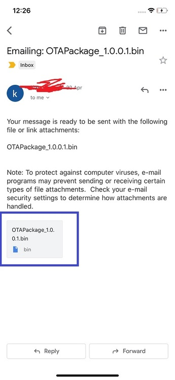

        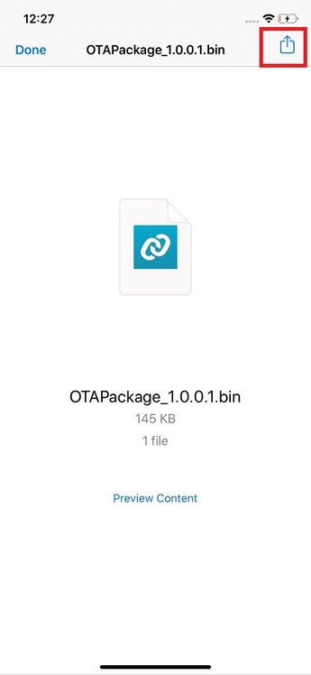

        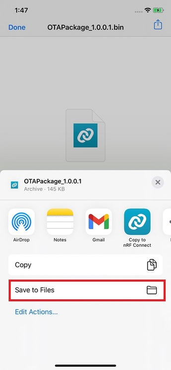

        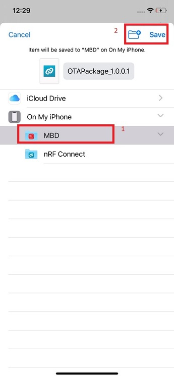

        -   **Android Mobile:**

            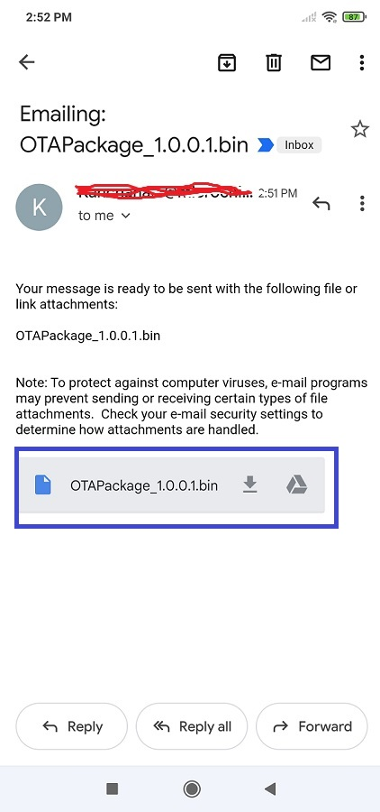

        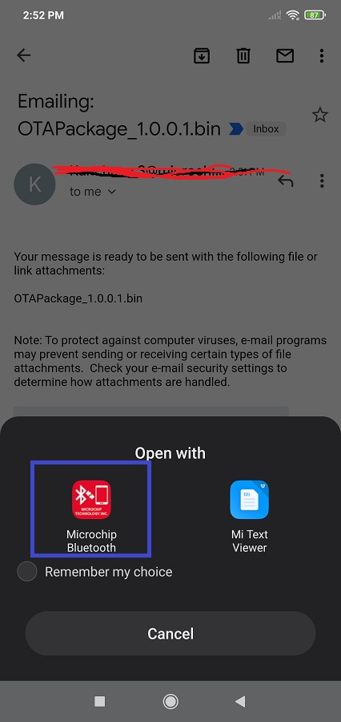

        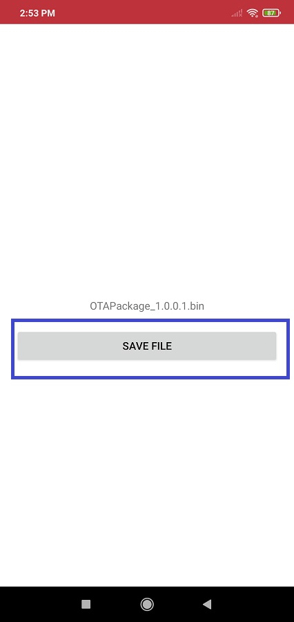

    2.  Turn on mobile Bluetooth and select **“OTA DFU"** tab of Microchip Bluetooth Data App on the mobile device.

        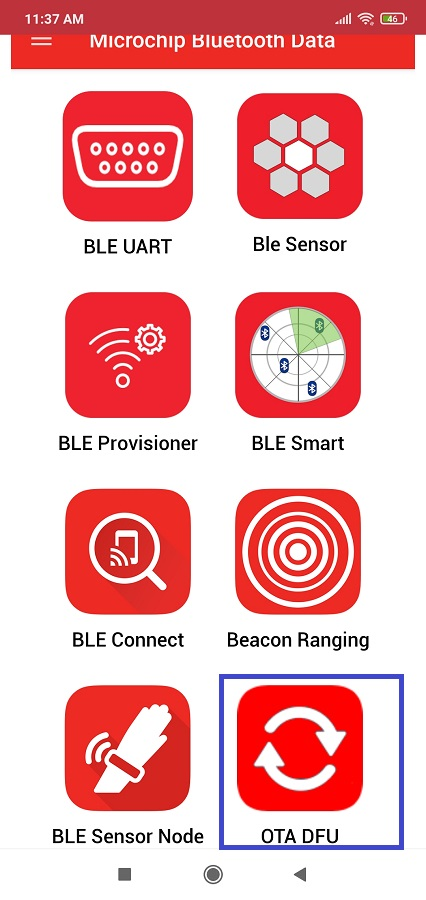

    3.  Power On the OTA capable target device \( PIC32CXBZ2/WBZ451 \) which was programmed in "[Programming the Application using MPLABX IDE](https://onlinedocs.microchip.com/pr/GUID-A5330D3A-9F51-4A26-B71D-8503A493DF9C-en-US-1/index.html?GUID-436FCDB1-1B96-4B4C-802C-0C61967DA657)". Device will be advertising. Click on "SCAN" button in mobile app and the device be visible in scanned list.

        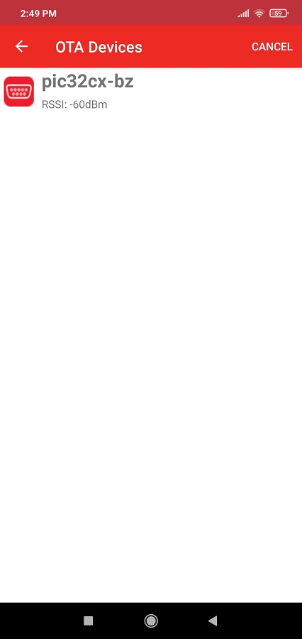

    4.  Click on intended device from the scanned list. Mobile app will now get connected with OTA Target device. "Connected" message will appear for a short while.

        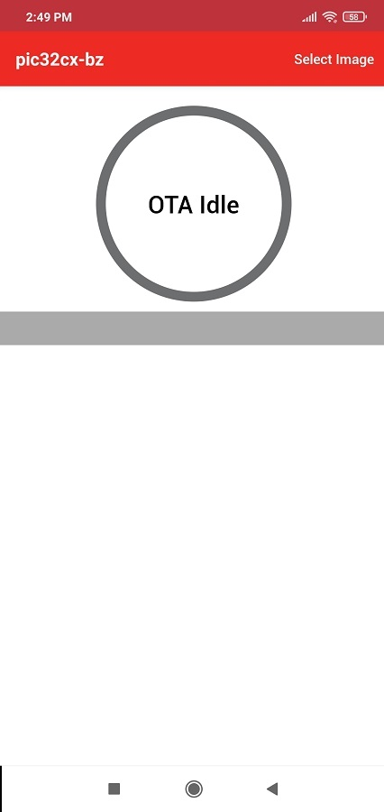

    5.  Click the ‘Select Image’ option to choose the available firmware file.

        

    6.  The OTAU firmware image file copied in the step 1 will be visible on screen. Click on that image.

        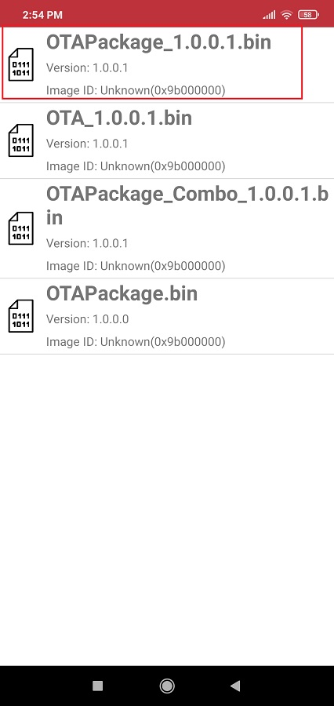

    7.  After confirming the FW version press OK button.

        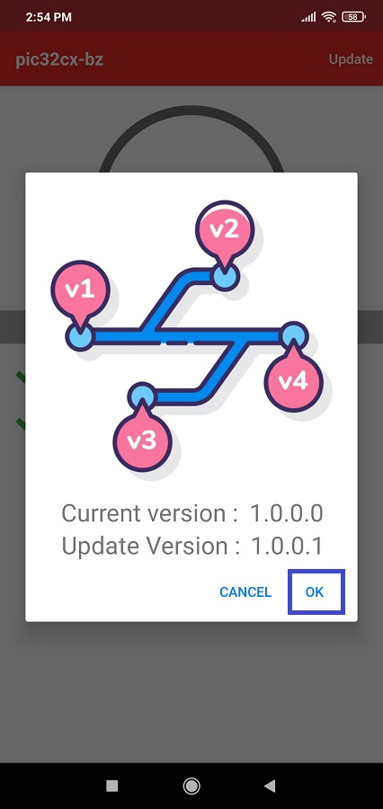

    8.  Firmware update will be initiated and the progress will be shown in mobile app. The process would take few seconds.

        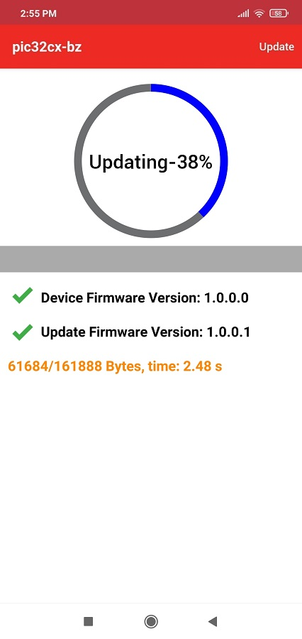

    9.  Once the complete image is transferred, "OTA Update successfully" status will be shown in mobile app. Click on "OK" and then device will perform authentication of the image. If validation is successful, then system reboot automatically.

        

        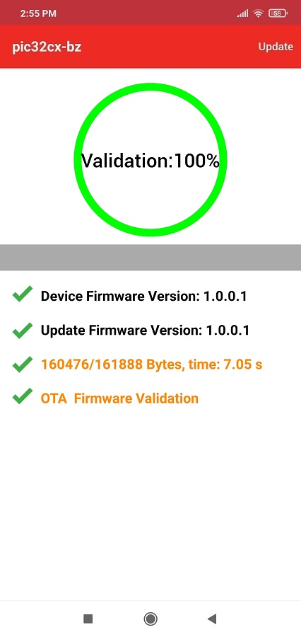

    10. On bootup, device does the authentication of new image in Slot1 and then copies the new image to Slot0. Now the new image will be running from Slot0.
    11. To verify whether the running image on the target is newly upgraded image, follow steps 2 to 7 and check the current version.

**Parent topic:**[Device Firmware Upgrade Over BLE](https://onlinedocs.microchip.com/pr/GUID-A5330D3A-9F51-4A26-B71D-8503A493DF9C-en-US-1/index.html?GUID-908446A4-F490-4063-9096-66C4831F9BE4)

