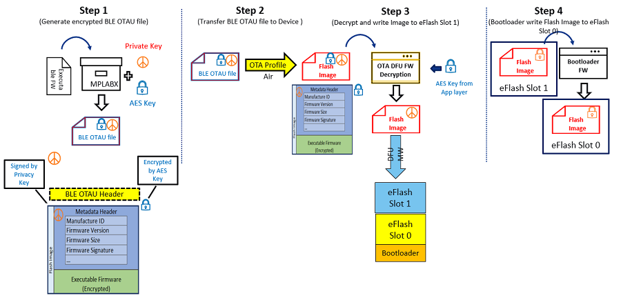

# BLE OTA DFU Image Distribution Procedure

**Step 1:** Encrypted and Signed BLE OTAU bin File generation using signature and OTA configurator from MPLABX Tools device properties. Place the OTAU file in OTAU manager

**Step 2:** Transfer the OTAU Flash image over BLE OTA profile/service to OTAU Target

**Step 3:** Image is decrypted using AES Key in Target and stored in Embedded Flash Slot1

**Step 4:** Once the complete image is received, the device is reset. Bootloader will copy new image from Slot1 to Slot0 after image authentication is done.

**Parent topic:**[Device Firmware Upgrade Over BLE](https://onlinedocs.microchip.com/pr/GUID-A5330D3A-9F51-4A26-B71D-8503A493DF9C-en-US-1/index.html?GUID-908446A4-F490-4063-9096-66C4831F9BE4)

