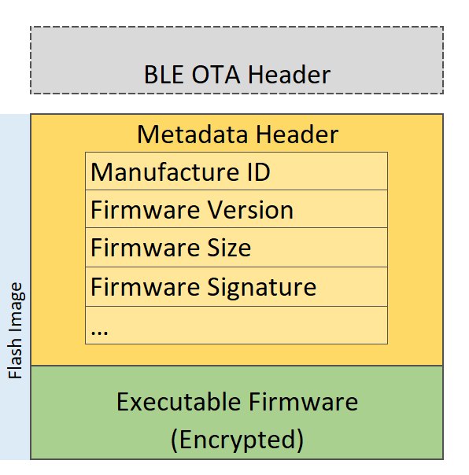
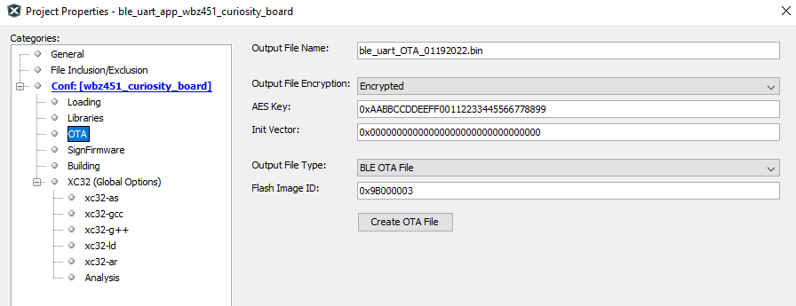
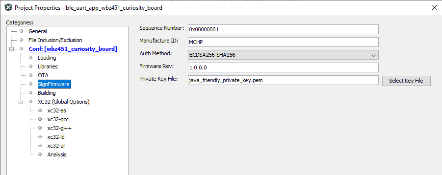

# BLE OTA DFU Image File Definition

**\#BLE OTA DFU Image File Definition**

BLE OTA DFU File contains the OTAU header and Upgradable Flash Image as shown in below figure. This file is loaded into OTAU Manager \(Smart phone/ GATT client\) to send to OTAU Target over BLE link.

• **Flash Image:** Meta-data Header + Executable Firmware. This is Full image content which is programmed in the device Flash Slot1.

• **Meta-data Header:** Flash Image will have a metadata header, metadata payload and metadata footer that will give the Bootloader firmware information about where the firmware image is located, security decryption information, signature, sequence number etc. Digital signatures ensure the authenticity of the image and integrity of the data in the image. A digital signature also ensures that the data within the image has not been modified \(preserving integrity\) and is intact as it was generated at the source. Refer to meta data header format from [stack document](https://onlinedocs.microchip.com/pr/GUID-2085FE66-A762-4CC0-B054-7F98E8AF999A-en-US-1/index.html?GUID-A04B5B1F-202B-4944-B18F-13E4857CC3CD).

• **OTAU File Encryption:** The executable firmware can be encrypted \(This is configurable\). Encrypting the image ensures the confidentiality of the data. This makes that no unauthorized parties are able to peek at the contents of the image. Only the end-device should be able to decrypt the image. AES128-CBC method of encryption is used. Only the firmware image is encrypted and OTAU Header is not encrypted.

• **BLE OTAU Header:** This holds the OTAU File information for BLE OTA DFU Client \(Ex: mobile App\) to perform OTA DFU procedures. This header is not being sent over the air to OTAU Target.

◦ Total Header length: 16 bytes

◦ BLE OTAU Header Version \(HEADER\_VER\): 1 byte

-   0x01: PIC32CXBZ2/WBZ451

-   Others: RFU.

◦ Flash Image is encrypted or not \(FLASH\_IMG\_ENC\): 1 byte

-   0x00: Firmware Image is not encrypted.

-   0x01: Firmware Image is encrypted by AES-CBC method.

-   Others: RFU.

◦ Checksum : 2 bytes

-   Checksum value of full OTAU file.

◦ Flash Image ID \(FLASH\_IMG\_ID\): 4 byte

-   Identity number of Flash Image.

◦ Flash Image Revision/version \(FLASH\_IMG\_REV\): 4 byte

◦ OTAU File Type \(FILE\_TYPE\): 1 Byte

-   0x01: BLE OTAU File

-   0x02: BLE+Zigbee Combo OTAU File

-   Others: RFU

◦ Reserved: 3 byte

OTA file is .bin file which can be generated from MPLABX Tools environment as shown below. The detail steps for image generation is explained later.

**• BLE OTA Header and Encryption Key Configuration:**

**• Meta-data Header Configuration:**

**Parent topic:**[Device Firmware Upgrade Over BLE](https://onlinedocs.microchip.com/pr/GUID-A5330D3A-9F51-4A26-B71D-8503A493DF9C-en-US-1/index.html?GUID-908446A4-F490-4063-9096-66C4831F9BE4)

