# Bootloader

## Introduction {#GUID-4600C314-6BE7-4ABC-90C1-CFB163261393 .section}

A bootloader is a small application that can be used to upgrade firmware on a target device without the need for an external programmer or debugger. For PIC32CXBZ2 standalone bootloader, it provides below functionalities:

-   Device Firmware Upgrade over Serial\(UART\) interface, this is also called DFU over Serial.

-   Provide functionality support for wireless Over The Air Update, which is also called OTAU.

-   Provide various approaches to verify and authenticate firmware if enabled.

-   Display Console message if enabled

## PIC32CXBZ2 Standalone Bootloader Component {#GUID-881DEB27-9C11-4617-9B56-8B4E7D0E4829 .section}

PIC32CXBZ2 bootloader is a standalone Harmony component used to configure bootloader code for PIC32CXBZ2 device. Click [here](https://onlinedocs.microchip.com/pr/GUID-2085FE66-A762-4CC0-B054-7F98E8AF999A-en-US-2/index.html?GUID-A04B5B1F-202B-4944-B18F-13E4857CC3CD) to know about PIC32CXBZ2 standalone bootloader component, user can find more information as listed below:

-   Memory layout of PIC32CXBZ2 device

-   Boot memory information

-   Image metadata definition

-   Working of Bootloader

-   Flow diagram of Bootloader

-   Bootloader configuration options

-   Bootloader and DFU API usage

## Bootloader Example Code {#GUID-8BB1D890-221C-46E7-A103-BC77B130A573 .section}

PIC32CX-BZ2/WB45 bootloader provided two methods to enter DFU mode, one is GPIO Trigger, another is Timber Based Trigger. Later section will have more detailed information about them.

For bootloader using GPIO Trigger method, user can find example code in *wireless\_apps\_pic32cxbz2\_wbz45\\apps\\bootloader\\bootloader*, and precompiled hex file at *wireless\_apps\_pic32cxbz2\_wbz45\\apps\\bootloader\\bootloader\\precompiled\_hex\\bootloader.X.production.hex*

For bootloader using Timer Based Trigger method, user can find a precompiled hex file at *wireless\_apps\_pic32cxbz2\_wbz45\\apps\\bootloader\\bootloader\\precompiled\_hex\\bootloader\_timer.X.production.hex*. Since Timer Based Trigger bootloader creation is very similar to GPIO Trigger, there is no example code provided for it.

## Creating Bootloader From Scratch Using MCC {#GUID-8A406025-673D-4A19-9E25-F3D42627031A .section}

This section explains the steps required by a user to configure and generate a PIC32CXBZ2 standalone bootloader from scratching using MCC. User can find the bootloader example code\(GPIO Trigger\) generated using MCC in the path **wireless\_apps\_pic32cxbz2\_wbz45\\apps\\bootloader\\bootloader**

Generated Bootloader example has the following configurations:

-   Enabled UART DFU

-   Enabled console to display messages

-   Enabled GPIO Trigger

-   Hardware requried is **WBZ451 Curiosity Board,** DFU mode is triggered by pressing SW2\(GPIO PB4\) on the board

-   Automatically reboot firmware after DFU is finished

**WBZ451 Curiosity Board** is the hardware required to run this bootloader example, the board top view is shown in figure-1.

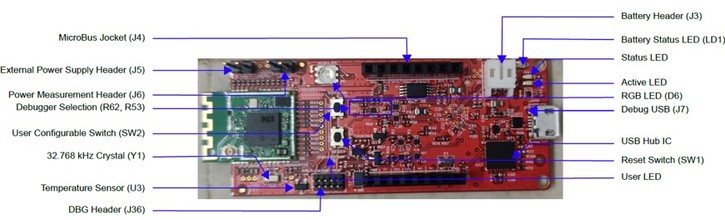

Followings are steps to create the bootloader example\(GPIO Trigger\) from scratch.

**Tip:** New users of MPLAB Code Configurator are recommended to go through the [overview](https://onlinedocs.microchip.com/pr/GUID-1F7007B8-9A46-4D03-AEED-650357BA760D-en-US-6/index.html?GUID-B5D058F5-1D0B-4720-8649-ACE5C0EEE2C0).

1. Create a new MCC Harmony Project -- [link](https://onlinedocs.microchip.com/pr/GUID-A5330D3A-9F51-4A26-B71D-8503A493DF9C-en-US-1/index.html?GUID-B86E8493-D00D-46EF-8624-D412342147F0) for instructions, selecting **WBZ451** as Target Device.

2. After MCC is launched, in Device Resource window, expand **Harmony – Wireless – Driver**, select **Bootloader** and add the component. Accept all the dialog messages by clicking **Yes** on message prompt. This will resolve dependencies among components and add connection in the graph.

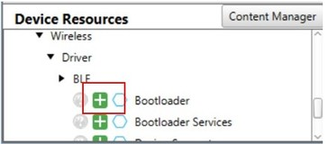

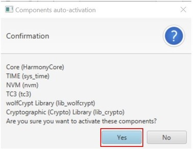

3. In the project graph window, select **Bootloader** component to show its Configuration Options. In the Configuration Options, enable **Bootloader UART DFU**, verify it is **GPIO Trigger** mode and port PB4 is selected as GPIO trigger port. PB4 is chosen as it is connected to SW2 on WBZ451 Curiosity board. Then enable Console and leave **ECC Public Key** and **Supported Authentication Methods** to default.

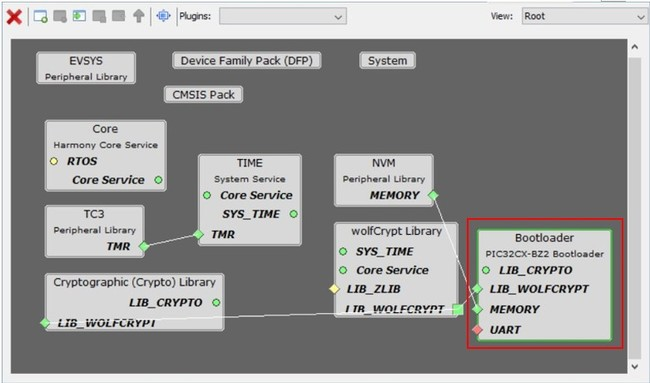

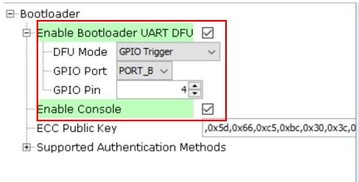

**GPIO Trigger** is the option to trigger DFU mode, where user needs to hold the GPIO button during reset to put the bootloader into DFU mode. Use **GPIO Port** and **GPIO Pin** option to change the port and pin based on user hardware.

**Tip**: Other than GPIO Trigger, another trigger option **Timer Based Trigger** is also provided, where bootloader will be in DFU mode for amount of time before jumping to the user application. User can change the **DFU Wait Time in Milliseconds** to change the amount of time. By selecting Timer Based Trigger, a 32bit timer component TC0 is asked to be activated, click **YES** to accept adding TC0 and accept its connection. Following figures show Timer Based Trigger options and message prompt of adding TC0.

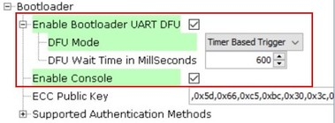

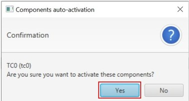

**Tip**: For Supported Authentication Methods, 3 methods are provided: **None**, **SHA256**, and **ECDSA256**. Authentication methods with **ECC Public Key** are used to configure firmware authentication methods, including verifying firmware completion status and authenticating firmware vendor. For more details about these configurations, user can refer to [here](https://onlinedocs.microchip.com/pr/GUID-2085FE66-A762-4CC0-B054-7F98E8AF999A-en-US-2/index.html?GUID-4552A2E4-E35C-4FD0-9C01-0EE86D4F6163).

4. In the project graph window, selecting the Bootloader component, right click the dependency of UART, select SERCOM0 in the Satisfiers list. Then SERCOM0 component will be added into project graph.

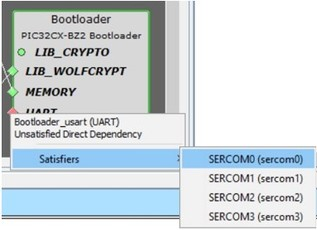

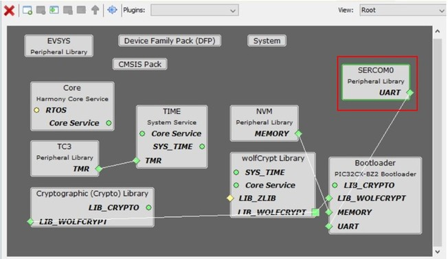

5. Select SERCOM0 component to open its Configuration Options, change **Receive Pinout** and **Transmit Pinout** according to WBZ451 Curiosity board. Leave other settings to default.

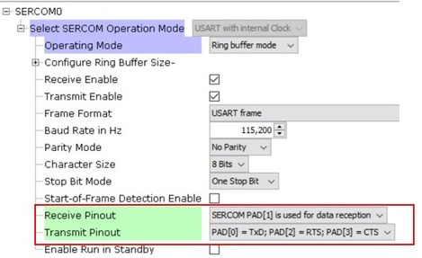

6. Expand tree of Peripherals, select and add RCON component. Verify RCON options, just leaving it as default is okay.

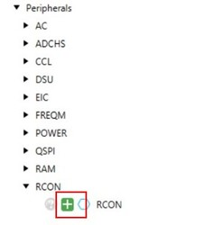

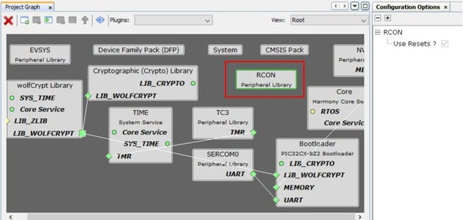

**Tip**: RCON provides software reset function, adding RCON component is for enabling automatical firmware reboot after DFU completion.

7. Then press **Generate** button to generate the code.

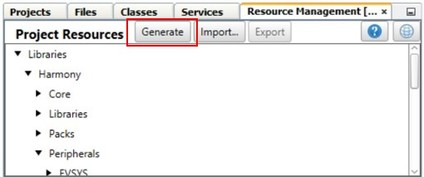

8. To make the Bootloader code be fit into 24KB boot memory of PIC32CXBZ2, manually find and replace **ecc.c** and **crypt\_ecc\_pukcl.c** with files provided in **wireless\_pic32cxbz\_wbz\\utilities\\pic32cx-bz\\tempBtl**

9. To enable firmware auto reboot after DFU completion, it need host end to send a new command to bootloader. This new command is device Reset command defined to 0x12. To add this command definition, open file progexec.h, add code as below:

**\#define DEVICE\_RESET\_CMD 0x12**

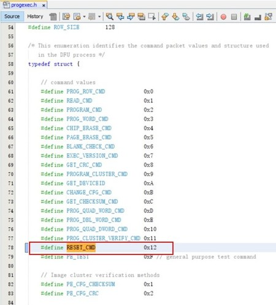

Then in file progexec.c, function **program\_exec\_main\(\)**, add code to handle device Reset command, call **RCON\_SoftwareReset\(\)** to start software reset. Code added is shown in below figure.

**Tip**: firmware auto reboot also needs host end modification to send 0x12 command to reset device after DFU completion, so far only PC GUI tool\(MicrochipUtilityTool.exe\) is modified and supported it, Python scripts as another way have not been modified to support it.

10. On the IDE Tools bar, click **Clean and Build Main Project** to build the code, *bootloader.X.production.hex* file will be generated. User can also find precompiled hex files under folder *wireless\_apps\_pic32cxbz2\_wbz45\\apps\\bootloader\\bootloader\\precompiled\_hex*.

While generated bootloader hex file should be added to user aplication as Loadable File, they shouldn't be used alone. Followings are talking about a few simple steps need to be handled at user application side.

## Configure User Application to Use Bootloader {#GUID-D83B387C-C1ED-437A-9B48-F6196A8B6C8F .section}

To use Bootloader with a user application, there are a few steps to be configured at user application project. These steps are common to any user application that wants to have Bootloader capability, these steps include:

-   Add **Bootloader Services** component onto user application project

-   Add Bootloader as **Loadable File/Project** to create unified image

-   Program unified image to device.

**Add Bootloader Services Component**

Open any user application project with MPLAB X IDE, click on **MCC** icon on Tools bar to launch MPLAB Code Configurator to open project graph.

In Device Resource window, expand **Harmony – Wireless – Driver**, select **Bootloader Services** component and add it. If user doesn’t want to verify or authenticate the firmware to be upgraded, no need check the mark for **Use Firmware Signature Verification API in Bootloader**. Bootloader Services component setting is following.

\(Following project graph is just an example, user may have different graph depending on their application.\)

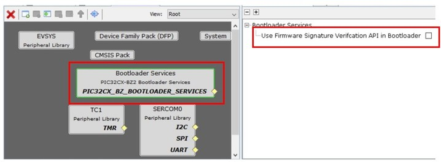

**Tip:** for DFU via UART, it is not necessary to enable firmware signature and verification, although user can do so if needs. While for OTAU, user must enable firmware signature and verification, by clicking on check box to **Use Firmware Signature Verification API in Bootloader**.

Once **Bootloader Services** component is added and configured, press **Generate** button to generate the user application code. In the generated new code, some code about bootloader service is added, as well as project’s linker script file is also automatically changed to reflect bootloader functionality.

**Add Bootloader as Lodable File/Project to Create Unified Image**

Once the new code is generated, user need to add Bootloader as a loadable project/loadable hex file in the updated project. This enables MPLAB X IDE to merge both user application and bootloader and make an unified firmware by creating an unified image file.

To add Bootloader as loadable file, expand application project’s tree, right click **Loadables**, select **Add Loadable File**, then browse and add the bootloader hex file.

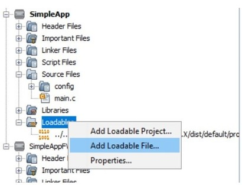

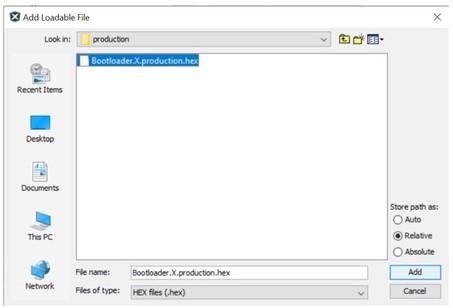

To add bootloader as loadable project, expand application project’s tree, right click **Loadables**, select **Add Loadable Project**, then browse and add the bootloader project.

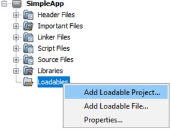

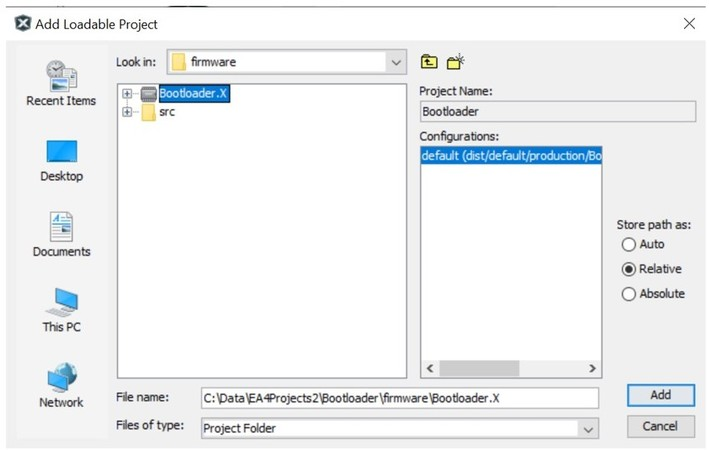

After Loadable File or Project is added, then on the IDE Tools bar, click **Clean and Build Main Project** icon to rebuild the project.

After code is built, a few files is generated under path f*irmware\\ble\_sensor.X\\dist\\default\\production*. The file named as **signed.unified.hex** is the unified image merged with both user application and bootloader. By programing this unified image, user application will have bootloader capability. The file named as **signed.bin** file is the target binary image file that bootloader use for DFU. If user has any modifications on user application firmware, user can build and generate this binary file, then use bootloader to upgrade device to new image.

**Program Unified Image**

As mentioned above, user need to program device with unified image to make user application to have bootloader capability, to do this, on the IDE Tools bar, click **Make and Program Device Main Project** icon to program device, the unified image will be programmed into device.

Now the device with user application will have bootloader functionality, referring the guidance in [Device Firmware Upgrade Over Serial](https://onlinedocs.microchip.com/pr/GUID-A5330D3A-9F51-4A26-B71D-8503A493DF9C-en-US-1/index.html?GUID-003E64BA-98A3-40EA-8417-ED7F09C14761), user can run Device Firmware Upgrade by using the bootloader.

**Parent topic:**[How-to: Firmware and OTA Updates](https://onlinedocs.microchip.com/pr/GUID-A5330D3A-9F51-4A26-B71D-8503A493DF9C-en-US-1/index.html?GUID-D7A53CEA-74B4-4CAA-A5D4-F69980188D1B)

