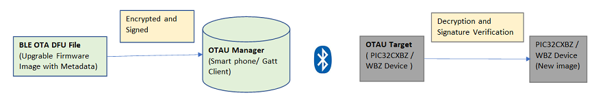

# Device Firmware Upgrade Over BLE

**Introduction**

One of the highly important features of wirelessly-connected devices is the capability of Over-The-Air device firmware update \(OTA DFU\). The increasing demand by end-users for this functionality is

-   To address issues and security vulnerabilities.

-   To ship products to market faster and have the option of delaying lower priority features and being able to roll them out to devices in the field.

PIC32CXBZ2/WBZ451 family of devices support Over-The-Air upgrade through BLE.

Microchip defined OTA profile and service enables firmware upgrade over the BLE link using Generic Attribute Profile \(GATT\). The BLE OTA protocol defines the communication between the OTAU target and OTAU manager. The OTAU manager can be a mobile device \(iOS/Android™\) or any BLE device that implements the OTA GATT client protocol that transfers the upgrade firmware to the OTAU target. The OTAU target implements the OTA GATT server protocol to receive the new firmware image.

**Secure BLE OTA DFU Process**

With the increasing popularity of OTA DFU capability in IoT devices, devices are getting exposed to vulnerabilities and security threats. So, it is important to make sure that the device’s OTA DFU process is secure and reliable. One of the way of sending upgradable image reliably and securely is to sign and encrypt the image.

Here are the basics of how an over-the-air device firmware update \(OTA DFU\) process works over BLE link:

• BLE OTA DFU file \(Firmware Image encrypted, signed\) is uploaded to the OTAU Manager. OTAU Manager can be Smart phone or any BLE device that supports OTA Client

• OTAU Target \( PIC32CXBZ2/WBZ451 device\) queries the OTAU Manager and fetches new firmware image.

• The image will be decrypted, validated and applied.

-   **[BLE OTA DFU Firmware Architecture](https://onlinedocs.microchip.com/pr/GUID-A5330D3A-9F51-4A26-B71D-8503A493DF9C-en-US-1/index.html?GUID-159581BB-D157-4A79-A4B0-7C9A9692449A)**  

-   **[Memory Management](https://onlinedocs.microchip.com/pr/GUID-A5330D3A-9F51-4A26-B71D-8503A493DF9C-en-US-1/index.html?GUID-F2D3E8B2-1470-4065-82A4-A313FCBAC126)**  

-   **[Microchip defined BLE OTA DFU Profile](https://onlinedocs.microchip.com/pr/GUID-A5330D3A-9F51-4A26-B71D-8503A493DF9C-en-US-1/index.html?GUID-DF914131-7CEA-4CF1-8F13-C5872AAB7DC6)**  

-   **[BLE OTA DFU Image File Definition](https://onlinedocs.microchip.com/pr/GUID-A5330D3A-9F51-4A26-B71D-8503A493DF9C-en-US-1/index.html?GUID-894A155C-558E-45FD-AA0C-1546AE00DE53)**  

-   **[BLE OTA DFU Image Distribution Procedure](https://onlinedocs.microchip.com/pr/GUID-A5330D3A-9F51-4A26-B71D-8503A493DF9C-en-US-1/index.html?GUID-03033848-F789-4EF6-845B-0C7594868889)**  

-   **[BLE OTA DFU Implementation](https://onlinedocs.microchip.com/pr/GUID-A5330D3A-9F51-4A26-B71D-8503A493DF9C-en-US-1/index.html?GUID-1DBEFA54-6B29-4BB3-8C75-9FD48DB81F3F)**  

-   **[BLE OTA DFU Demo](https://onlinedocs.microchip.com/pr/GUID-A5330D3A-9F51-4A26-B71D-8503A493DF9C-en-US-1/index.html?GUID-5B01388B-241F-4BCF-9204-BE758BC2F97F)**  

**Parent topic:**[How-to: Firmware and OTA Updates](https://onlinedocs.microchip.com/pr/GUID-A5330D3A-9F51-4A26-B71D-8503A493DF9C-en-US-1/index.html?GUID-D7A53CEA-74B4-4CAA-A5D4-F69980188D1B)

