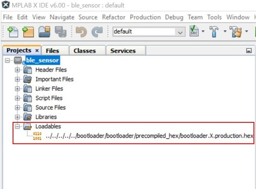
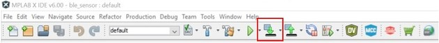
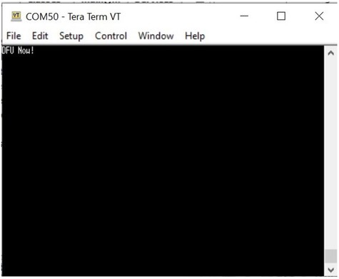
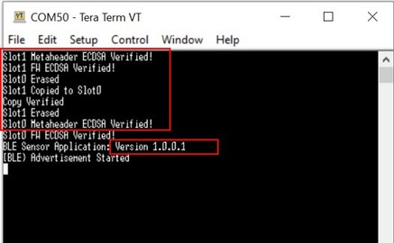

# Device Firmware Upgrade Over Serial

Device Firmware Upgrade\(DFU\) over serial is the functionality in Bootloader that user uses it to load new image received over serial interface and write into the flash. PC GUI tool\(MicrochipUtilityTool.exe\) and Python Script are two methods used for DFU over serial. Followings are user guide and demostrantion steps using these two methods to do DFU over serial, the demonstration is to upgrade *ble\_sensor* user application with a new image.

## DFU over Serial Using MicrochipUtility Tool {#GUID-A1369926-0B48-4E78-92AB-B7F6A46DE89C .section}

MicrochipUtility is a GUI tool, it suppors OTAU over serial, Zigbee OTAU. The utility tool is provided in Microchip website [link](https://ww1.microchip.com/downloads/aemDocuments/documents/WSG/ProductDocuments/SoftwareTools/MicrochipUtilityTool_v1_1.zip). For its user guide and demonstration using this tool to do serial DFU, click [Serial Bootloader Demo](https://onlinedocs.microchip.com/pr/GUID-A5330D3A-9F51-4A26-B71D-8503A493DF9C-en-US-1/index.html?GUID-E24160FD-C371-4A9C-99F3-CB7C84DFD5C6).

## DFU over Serial Using Python Script {#GUID-0E99ACA1-DC71-48D2-B157-5FDFDD92D72D .section}

***Pre-requisite:***

-   **ble\_sensor** project as current user application\(version 1.0.0.0\) *wireless\_apps\_pic32cxbz2\_wbz45\\apps\\ble\\advanced\_applications\\ble\_sensor\\firmware*

-   Precompiled **ble\_sensor** new image\(binary file\): *wireless\_apps\_pic32cxbz2\_wbz45\\apps\\ble\\advanced\_applications\\ble\_sensor\\precompiled\_hex\\ble\_sensor.X.production.signed\_uart\_1.0.0.1.bin*

-   **Bootloader**:

    -   Precompiled hex file for GPIO Trigger mode DFU: *wireless\_apps\_pic32cxbz2\_wbz45\\apps\\bootloader\\bootloader\\precompiled\_hex\\bootloader.X.production.hex*

    -   Precompiled hex file for Timer Based Trigger DFU: *wireless\_apps\_pic32cxbz2\_wbz45\\apps\\bootloader\\bootloader\\precompiled\_hex\\bootloader\_timer.X.production.hex*

-   Python Script Files:

    -   For GPIO Trigger mode DFU: **flash\_load\_2ndSlot.py, progctrl.py** \(*wireless\_pic32cxbz\_wbz\\utilities\\pic32cx-bz\\dfuPythonScripts\\*\)

    -   For Timer Based Trigger DFU: **flash\_load\_2ndSlot\_timer.py, progctrlOptimized.py** \(*wireless\_pic32cxbz\_wbz\\utilities\\pic32cx-bz\\dfuPythonScripts\\*\)

-   Hardware: **WBZ451 Curiosity Board**

***How to Run Python Script:***

For GPIO Trigger DFU, execute python script by below command:

**python flash\_load\_2ndSlot.py -i image.bin**

For Timer Based Trigger DFU, execute python script by below command:

**python flash\_load\_2ndSlot\_timer.py -i image.bin**

**image.bin** is the binary file of new user image, this binary file is generated from user application by MPLAB X IDE. It could be other file name from user’s own application, it may have path name before the file.

***DFU over Serial Demonstration:***

Following are steps to operate DFU over seiral, programing a new user image by using Bootloader.

-   **Preparation: Create and Program Unified image**

Before DFU operation, make sure the unified image containing bootloader and current user application are created and programmed. To do this, open **ble\_sensor** project with MPLAB X IDE. If user click **Lodables**, will see the bootloader precompiled hex file is already added into the project.

**Tip**: For Timer Based Trigger DFU, user need to remove this hex file that is for GPIO Trigger DFU, and add another timer based bootloader hex\(*bootloader\_timer.X.production.hex*\) as **Loadable File***.*

Then on the IDE Tools bar, click **Clean and Build Main Project** icon to build the project. Since the project has a loadable hex file added, code building will create a unified image hex file *ble\_sensor.X.production.signed.unified.hex*

**Tip**: Another binary file named *ble\_sensor.X.production.signed.bin* is created at the same time. This binary file will be the targe image file used by bootloader for DFU. However, in this demonstration, we will use another precomipled binary file as target image, since that image contains different firmware version to tell user DFU is successful.

Once code building is finished, on the IDE Tools bar, click **Make and Program Device Main Project** icon to program device, the unified image will be programmed into WBZ451 Curiosity board.

Now the board is ready, followings we will use DFU over serial to upgrade it to a new image *ble\_sensor.X.production.signed\_uart\_1.0.0.1.bin*

For creating unified image, user can refer to [Bootloader](https://onlinedocs.microchip.com/pr/GUID-A5330D3A-9F51-4A26-B71D-8503A493DF9C-en-US-1/index.html?GUID-399616BF-E65E-43B3-9831-4B19472A5EF0) - section Configure User Application to use Bootloader - Add Bootloader as Lodable File/Project to Create Unified Image to know more details.

-   **Enter into DFU Mode**

For the provided bootloader example, DFU mode is triggered by SW2 Button on WBZ451 Curiosity board. So press and hold SW2 Button first, then short press Reset button\(SW1\) to restart the firmware, the firmware will enter DFU mode. Opening **Tera Term** on PC, and configure it as **115200/8bit/none Parity/1 Stop bit**, will see the message output as “DFU Now!”.

This message means the board is under DFU mode.

-   **Run Python Script to do DFU**

Close **Tera Term** and open Windows **Command Prompt**, go to the directory where python script files and binary image file are located and execute python script as below:

**python flash\_load\_2ndSlot.py -i ble\_sensor.X.production.signed\_uart\_1.0.0.1.bin**

To run above python script, user may need to copy those python script files and binary image file into a same folder. However, python script also support file with aboslute path name or relative path name.

")

**Tip**: For Timer Based Trigger DFU, it uses different python script files, execute python script as below:

**python flash\_load\_2ndSlot\_timer.py -i ble\_sensor.X.production.signed\_uart\_1.0.0.1.bin**

For Timer Based Trigger DFU, it will wait to capture DFU mode window of the bootloader, so for operating Timer Based Trigger DFU, need execute python script first, then reset the board and wait for a while. If python script has captured DFU window, it will start DFU process. Otherwise, user will need another reset the board until DFU is started. Referring to figure below, after python script is executed, it keep waiting and reminding user to reset the board until DFU progress starts to be shown.

")

The % progress will tell the DFU progress. Once it is finished as 100%, the new image is copied to slot1 of internal flash memory.

-   **Reset Board to Start New Firmware**

Python script has not supported firmware automatical reboot after DFU completion, so need manually reset the board to start new firmware.

Once DFU progress achieves 100% complete, close Windows **Command Prompt** and open **Tera Term** to see the message output. On the board, press the Reset button\(SW1\) to restart, the bootloader will then copy new firmware from flash memory slot1 to slot0. After that, bootloader will jump and start new user image in slot0. On Tera Term, user will see messages as shown below, original firmware version is 1.0.0.0, now firmware version is 1.0.0.1, the DFU is successful.

**Tip**: For Timer Based Trigger DFU, it doesn't need manual reset the board to start new image. Timer Based Trigger bootloader will automatically copy new user image and jump to start it.

**Tip**: Depending on if user has enabled **Use Firmware Signature Verification API in Bootloader** in **Bootloader Services** component or not, the bootloader code may or may not verify metaheader and firmware using specified method. If bootloader has verified metaheader and firmware, their verification result will be displayed in Tera Term.

**Parent topic:**[How-to: Firmware and OTA Updates](https://onlinedocs.microchip.com/pr/GUID-A5330D3A-9F51-4A26-B71D-8503A493DF9C-en-US-1/index.html?GUID-D7A53CEA-74B4-4CAA-A5D4-F69980188D1B)

