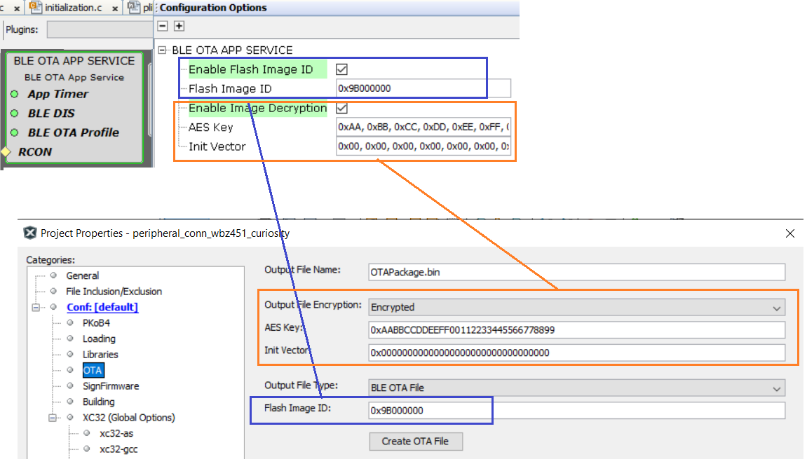
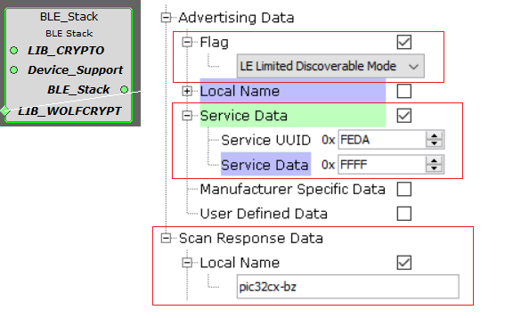
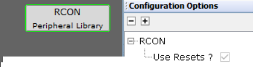
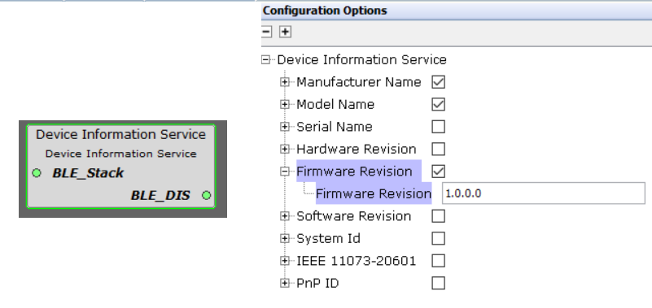

# MCC Component and Code Generation

## **Pre-requisite** {#GUID-488BE45A-325E-418A-95F6-922D38103699 .section}

1.  Open any BLE application based on MCC \(Example project/ Custom created project\)

2.  Launch MPLABx Code Configurator \(MCC\)

**Pull-in MCC Components**

The below steps explains the components/configurations needed for OTA functionality alone.

Click on "+" symbol "BLE OTA APP SERVICE" component from "Device Resources" of MCC to project graph. When the component is added, the dependent components also getting added automatically. Accept Dependencies or satisfiers, select "Yes" inorder to add the dependent components.

1.  Configure "BLE OTA APP SERVICE" component as below based on the need

    1.  Enable Flash Image ID - This option checks for Image ID. If this option is enabled the upgradable image should have the same ID of current image, only then OTA upgrade procedure will happen. Use the same value as in BLE OTA DFU bin file generation configuration as shown below.
    2.  Enable Image Decryption - If the upgradable image is secured \(encrypted using AES128 CBC\), this configuration has to be enabled to do decryption of the received image. The AES Key should match with the Key in BLE OTA DFU bin file generation configuration as shown below.
     

    

     

2.  When the Image decryption option is enabled in the above step, the dependent crypto components will get added \(if not already present in project graph\). Accept Dependencies or satisfiers, select "Yes" in order to add the dependent components.

    

    1.  Verify the below configurations:

        1.  wolfCrypto Library component - AES-CBC mode is enabled.

            

        2.  System component - AES Hardware engine clock is enabled.

            

## **Verify Configurations** {#GUID-69B03FD4-E699-4FC7-95E2-8668F09E84FB .section}

All the required configurations are automatically done when the "BLE OTA APP SERVICE" component is added. Verify if the Project Graph window has all the expected MCC configurations

1.  **BLE OTA profile and OTA Service Components** - Enable Server Role. This  module generates the code needed for MCHP defined BLE OTA profile and  service.

     

    

     

    

     

2.  **BLE\_Stack component - DFU Module enable** - This module generates the code needed for device firmware upgrade middleware for writing the OTA image into Embedded Flash.

     

    

     

3.  **BLE\_Stack component** - Advertising and Scan data payload is configured for manufacturer specific service UUID and local name. BLE OTA Microchip Data \(MBD\) mobile app expects service UUID as "0xFEDA" to filter the devices.

    

4.  **FreeRTOS stack size -** The minimum stack size required by OTA feature is 3584 bytes. For example if the original stack size needed for user application is 1024 bytes, then set the total stack size as 1024 + 3584 = 4608 bytes.

     

    

     

5.  **Bootloader Services component** - This component generates the supporting linker file and MPLABX script needed for [Upgradable image .bin file generation](https://onlinedocs.microchip.com/pr/GUID-A5330D3A-9F51-4A26-B71D-8503A493DF9C-en-US-1/index.html?GUID-6816EA2C-EDCC-48EC-9D99-BF8EAF56C5A1). Also, the crypto API's in bootloader section is called to verify the authenticity \(signature verification\) of the received image before performing device reset.

     

    

     

    

     

6.  **App Timer Service component** - The BLE OTA procedure requires error handling and initializing the state in case of failure in receiving the image. There are 2 software timers based on FreeRTOS systick is used. APP\_TIMER\_OTA\_TIMEOUT for error handling. APP\_TIMER\_OTA\_REBOOT for resetting the device after successful image reception.

     

    

     

7.  **RCON component** - As mentioned above APP\_TIMER\_OTA\_REBOOT timer is used for resetting the device after successful image reception. Device reset is performed using SW reset in RCON module.

    

8.  **DIS BLE Service** - Device Info Service is BT SIG defined service. This service can be used to hold the firmware version. When upgrading the Image, OTAU manager gets the current running image version. OTA server in device can use firmware version from DIS and send to OTAU manager. Using the FW from DIS is just optional.

    

    If DIS is not needed for customer application, DIS component can be removed and the below code for sending firmware version should be modified.

    

## **Generate Code** {#GUID-DE5D19D8-B219-4571-951F-3F7614EF9797 .section}

Generate Code by Clicking on "[Generate](https://onlinedocs.microchip.com/pr/GUID-A5330D3A-9F51-4A26-B71D-8503A493DF9C-en-US-1/index.html?GUID-9C28F407-4879-4174-9963-2CF34161398E)" button

## **Files and Routines Automatically generated by MCC** {#GUID-9AA8F313-5753-483D-9E47-367D9FADD90E .section}

After generating the code from MCC tool by clicking Generate button, below is the project folder structure.

**Parent topic:**[BLE OTA DFU Implementation](https://onlinedocs.microchip.com/pr/GUID-A5330D3A-9F51-4A26-B71D-8503A493DF9C-en-US-1/index.html?GUID-1DBEFA54-6B29-4BB3-8C75-9FD48DB81F3F)

