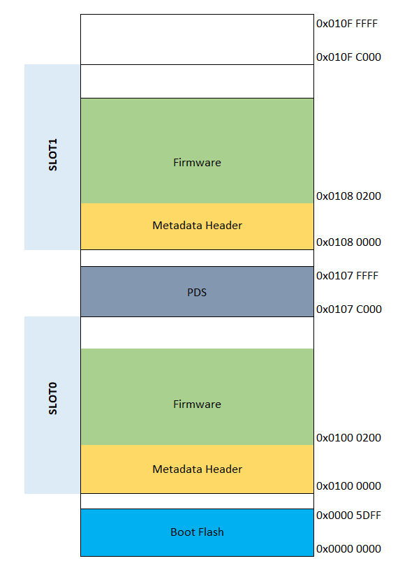

# Memory Management

PIC32CXBZ2/WBZ451 family of devices has enough Embedded Flash memory to hold the new upgradable OTA image until new image is authenticated. The image is received in blocks over BLE link. If the image is encrypted, will be decrypted and stored in Embedded Flash Slot1. Once the complete image is received, image is validated for signature. Then the device reset will trigger the bootloader in Boot Flash region to load the image from Slot1 to Slot0. Now the new firmware starts executing.

Here is the memory split for PIC32CXBZ2/WBZ451 embedded Flash for OTA DFU:

The above memory split is handled in linker script as shown below:

\#ifndef PDS\_LENGTH

\#define PDS\_LENGTH 0x4000

\#endif

\#define ROM\_BASE\_ADDR 0x01000000

\#define METADATA\_HEADER\_SIZE 0x200

\#define SLOT0\_BASE\_ADDR ROM\_BASE\_ADDR

\#define SLOT1\_BASE\_ADDR 0x01080000

\#ifndef ROM\_ORIGIN1

\#define ROM\_ORIGIN1 SLOT0\_BASE\_ADDR + METADATA\_HEADER\_SIZE

\#endif

\#ifndef ROM\_LENGTH1

\#define ROM\_LENGTH1 \(SLOT1\_BASE\_ADDR - SLOT0\_BASE\_ADDR - PDS\_LENGTH - METADATA\_HEADER\_SIZE\)

\#elif \(ROM\_LENGTH1 \> 0x100000\)

\#error ROM\_LENGTH1 is greater than the max size of 0x100000-0x200

\#endif

\#ifndef PDS\_ORIGIN

\#define PDS\_ORIGIN \(ROM\_ORIGIN1 + ROM\_LENGTH1\)

\#endif

\#ifndef ROM\_ORIGIN2

\# define ROM\_ORIGIN2 SLOT1\_BASE\_ADDR

\#endif

\#ifndef ROM\_LENGTH2

\#define ROM\_LENGTH2 0x0080000

\#elif \(ROM\_LENGTH2 \> 0x100000\)

\#error ROM\_LENGTH2 is greater than the max size of 0x100000

\#endif

\#ifndef BOOT\_ROM\_ORIGIN

\# define BOOT\_ROM\_ORIGIN 0x0

\#endif

\#ifndef BOOT\_ROM\_LENGTH

\# define BOOT\_ROM\_LENGTH 0x5e00

\#elif \(BOOT\_ROM\_LENGTH \> 0x5e00\)

\# error BOOT\_ROM\_LENGTH is greater than the max size of 0x5e00

\#endif

**Parent topic:**[Device Firmware Upgrade Over BLE](https://onlinedocs.microchip.com/pr/GUID-A5330D3A-9F51-4A26-B71D-8503A493DF9C-en-US-1/index.html?GUID-908446A4-F490-4063-9096-66C4831F9BE4)

