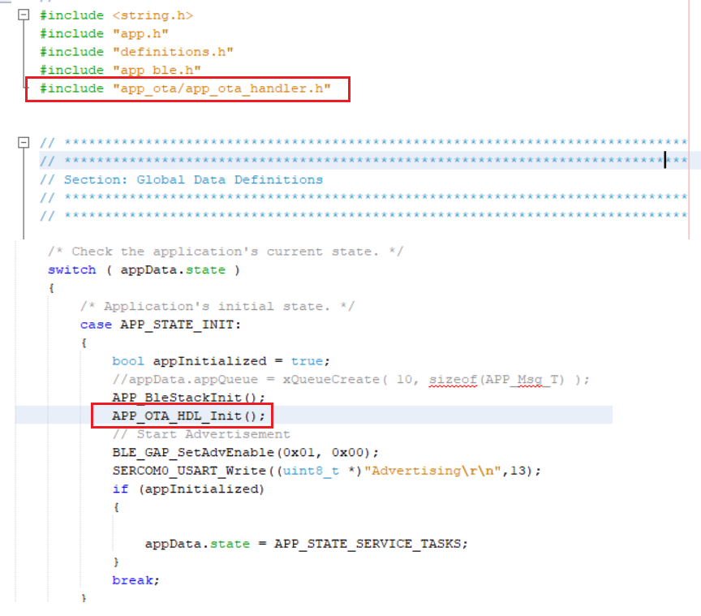
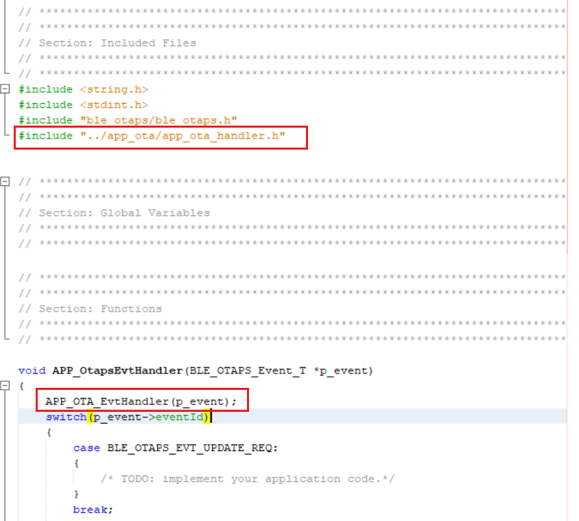
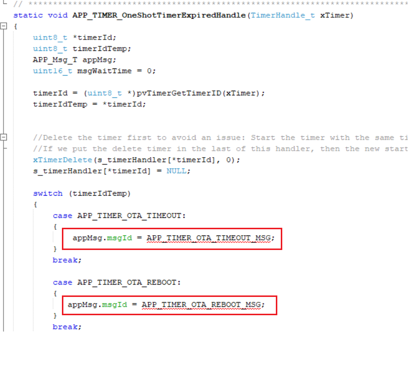
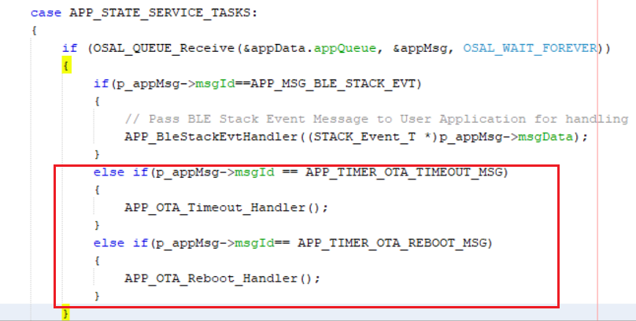
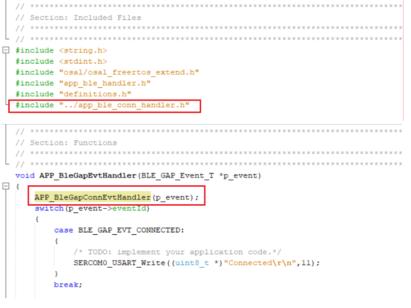
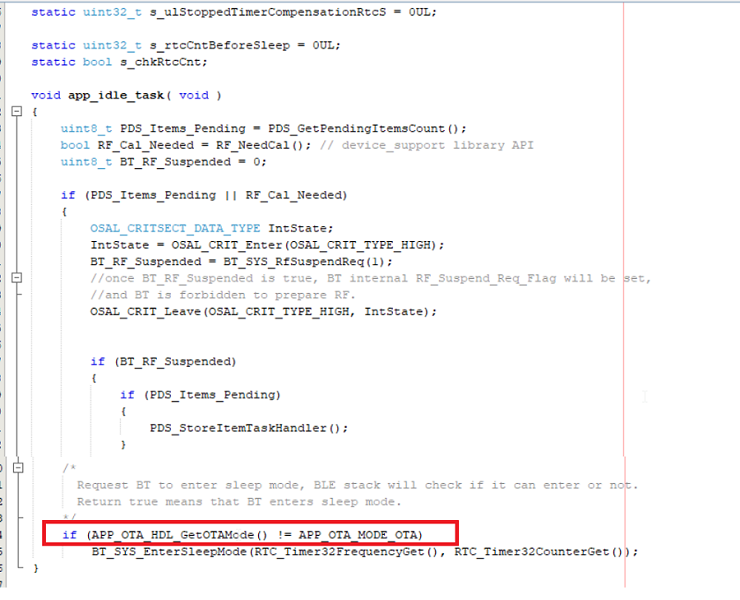

# OTA Application Development

1.  Compile MCC auto generated project

    -   Compile the MCC auto generated project as below.
    

    

    -   Addressing the mandatory error \(if not already done\): User action required in app\_user\_edits.c. Follow the steps mentioned in the note and do the necessary changes. Then comment the **\#error** message as below.

    

2.  Call BLE OTA Init function in "app.c" and add the include file.

    ``` {#CODEBLOCK_QCS_X5D_25B}
    *APP\_OTA\_HDL\_Init\(\);*
    ```

    ``` {#CODEBLOCK_KVW_Z5D_25B}
    *\#include "app\_ota/app\_ota\_handler.h"*
    ```

    

3.  Call BLE OTA event handler function in "app\_ble/app\_otaps\_handler.c".

    ``` {#CODEBLOCK_LRT_NYD_25B}
    *APP\_OTA\_EvtHandler\(p\_event\);*
    ```

    ``` {#CODEBLOCK_CSB_4YD_25B}
    *\#include "../app\_ota/app\_ota\_handler.h"*
    ```

    

4.  Uncomment timer message ID's in "app\_timer/app\_timer.c" needed for OTA error handling and reboot timer. When the timer is fired, the related message is posted in freeRTOS application task queue.

    

5.  Define the timer message ID's in APP\_MsgId\_T structure in "app.h".

    ``` {#CODEBLOCK_STR_TYD_25B}
    *APP\_TIMER\_OTA\_TIMEOUT\_MSG,*
    ```

    ``` {#CODEBLOCK_DPG_5YD_25B}
    *APP\_TIMER\_OTA\_REBOOT\_MSG,*
    ```

    

6.  Call OTA timer handlers in APP\_Tasks\(\) in "app.c".

    ``` {#CODEBLOCK_PBG_KZD_25B}
    *else if\(p\_appMsg-\>msgId == APP\_TIMER\_OTA\_TIMEOUT\_MSG\)*
    ```

    ``` {#CODEBLOCK_MKL_KZD_25B}
    *\{*
    ```

    ``` {#CODEBLOCK_PKS_KZD_25B}
    *APP\_OTA\_Timeout\_Handler\(\);*
    ```

    ``` {#CODEBLOCK_Z2Z_KZD_25B}
    *\}*
    ```

    ``` {#CODEBLOCK_OVH_LZD_25B}
    *else if\(p\_appMsg-\>msgId== APP\_TIMER\_OTA\_REBOOT\_MSG\)*
    ```

    ``` {#CODEBLOCK_U3Q_LZD_25B}
    *\{*
    ```

    ``` {#CODEBLOCK_YCX_LZD_25B}
    *APP\_OTA\_Reboot\_Handler\(\);*
    ```

    ``` {#CODEBLOCK_KXD_MZD_25B}
    *\}*
    ```

    

7.  Call DIS service Init function in "app.c" and add the include file.

    ``` {#CODEBLOCK_ZQH_RZD_25B}
    *BLE\_DIS\_Add\(\);*
    ```

    ``` {#CODEBLOCK_ZVM_RZD_25B}
    *\#include "ble\_dis/ble\_dis.h"*
    ```

    

8.  Call BLE gap connected/disconnected event handler in "app\_ble/app\_ble\_handler.c" . app\_ble\_conn\_handler.c handles the events and also restarts the Advertising when disconnected.

    ``` {#CODEBLOCK_FDF_TZD_25B}
    *APP\_BleGapConnEvtHandler\(p\_event\);*
    ```

    ``` {#CODEBLOCK_AHM_TZD_25B}
    *\#include "../app\_ble\_conn\_handler.h"*
    ```

    

9.  If the "Standby Sleep mode" [low power functionality](https://onlinedocs.microchip.com/pr/GUID-A5330D3A-9F51-4A26-B71D-8503A493DF9C-en-US-1/index.html?GUID-101C8B73-AD8E-4845-831A-DC498B147435) is enabled in the application, during the OTA upgrade procedues, it is required to disable the device entering into sleep mode. Add the below check in app\_idle\_task\(\) when the BT\_SYS\_EnterSleepMode\(\) is called.

    ``` {#CODEBLOCK_XNX_5ZD_25B}
    *if \(APP\_OTA\_HDL\_GetOTAMode\(\) != APP\_OTA\_MODE\_OTA\)
    BT\_SYS\_EnterSleepMode\(RTC\_Timer32FrequencyGet\(\), RTC\_Timer32CounterGet\(\)\); *
    ```

    

10. Compile the project for no errors.

    


API Documentation Reference:

-   [OTA Profile Middleware API's](https://onlinedocs.microchip.com/pr/GUID-C5EAF60E-9124-427C-A0F1-F2DBE662EA92-en-US-1/index.html?GUID-3344373C-B7F8-4284-91B3-8BA707CF96D0)

-   [OTA Application level API's](https://onlinedocs.microchip.com/pr/GUID-A5330D3A-9F51-4A26-B71D-8503A493DF9C-en-US-1/index.html?GUID-CDA62122-6D5D-4CDC-B1B7-3EB02C26552C)


**Parent topic:**[BLE OTA DFU Implementation](https://onlinedocs.microchip.com/pr/GUID-A5330D3A-9F51-4A26-B71D-8503A493DF9C-en-US-1/index.html?GUID-1DBEFA54-6B29-4BB3-8C75-9FD48DB81F3F)

