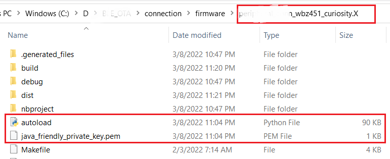
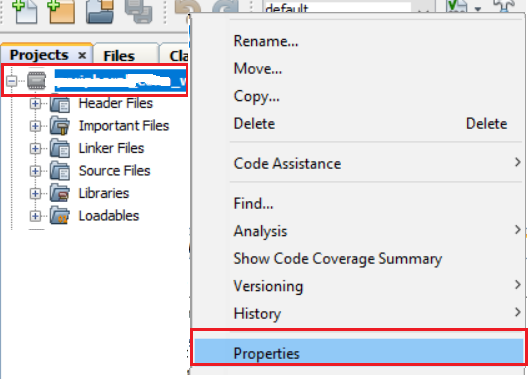
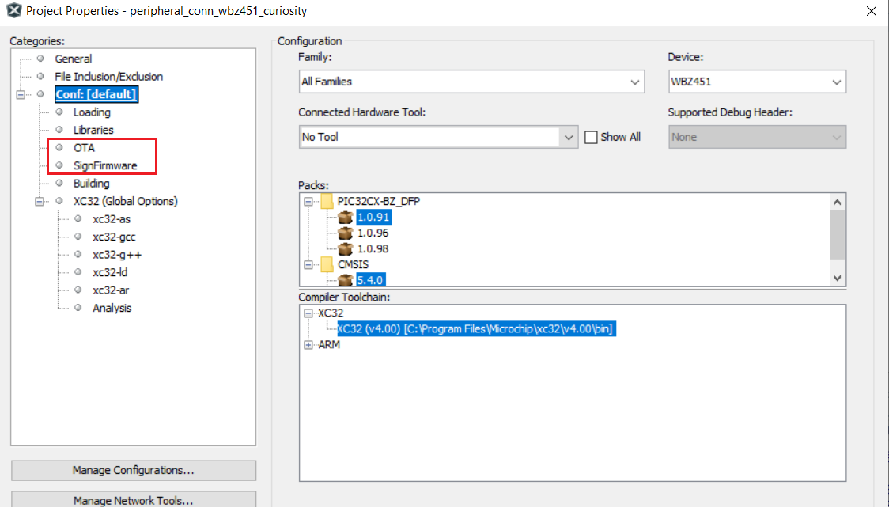
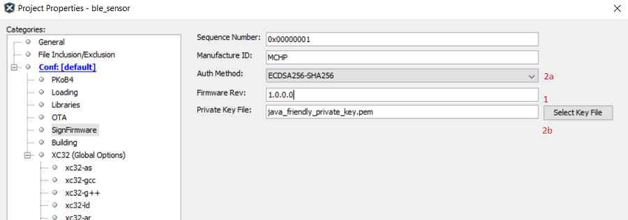
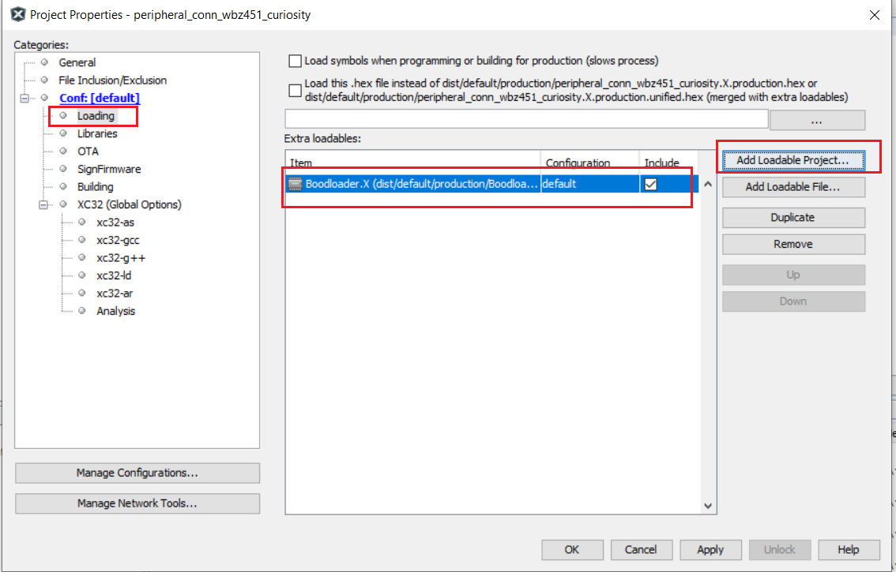

# Project Properties Configuration for Current/Running Firmware

By following the previous steps, the BLE OTA capability is added into application project. Referring to [Memory management](https://onlinedocs.microchip.com/pr/GUID-A5330D3A-9F51-4A26-B71D-8503A493DF9C-en-US-1/index.html?GUID-F2D3E8B2-1470-4065-82A4-A313FCBAC126), this belongs to "Firmware" in Slot0 section. Metatdata header and "Bootloader" has to be added into this project to make as working project with OTA capability to receive new upgradable image over BLE link.

MPLABX Tools environment allows to configure and append the Metadata header into application image. The needed script and sample private key .pem files are added into project folder \(.X\) when the OTA code was generated from MCC.

**Attention:**

**Note: Before proceeding to below steps, close the OTA application project and reopen the project. This step is mandatory for "SignFirmware" and "OTA" bin generation MPLABX script to be loaded into project environment.**

1.  Right click on the project -\> Properties.

    

    

2.  **SignFirmware** - Adds Metadata header into application image. Refer to [Meta-data Header Configuration](https://onlinedocs.microchip.com/pr/GUID-A5330D3A-9F51-4A26-B71D-8503A493DF9C-en-US-1/index.html?GUID-894A155C-558E-45FD-AA0C-1546AE00DE53) for more details on header format. There are configurable parameters like Firmware Rev \(version\), authentication method and manufacturer ID. Configure as per requirement.

    

    -   Step1: "Firmware Rev" - Firmware version of current running firmware.  This should be same as version in [DIS service](https://onlinedocs.microchip.com/pr/GUID-A5330D3A-9F51-4A26-B71D-8503A493DF9C-en-US-1/index.html?GUID-2624FC46-FF08-4D14-9FA0-25B260F81754).

    -   Step2:"Auth Method" - There are 3 Supported authenticated methods
        -   **Signature validation** \(ECDSA256-SHA256\) – most secure, and  data integrity check. Signature is encrypted using ECDSA private  key. 256-bit ECDSA Public key to be programmed in device to do  signature decryption. [openssl](https://wiki.openssl.org/index.php/Command_Line_Elliptic_Curve_Operations) \(example commands:  https://techdocs.akamai.com/iot-token-access-control/docs/generate-jwt-ecdsa-keys\)  is one of the open tools to generate ECDSA public/private key  pair. [Sample private key](#GUID-70714605-ACB2-451F-87F0-66F97057949F) is available in project folder .X. Public  key is input in Bootloader project.

        -   Hash validation \(SHA-256\) – less security, and data integrity  check.

        -   No validation \(None\) – no security, no integrity check.

    **Warning:**

    Make sure to keep "Sequence number" as non-zero value and not 0xFFFFFFFF.

3.  Bootloader - Standalone Bootloader project is available in \\bootloader folder of application GIT  repo. The bootloader code stays in Boot Flash section. The bootloader project  can be added as loadable project into OTA project. When the OTA project is  build, unified image with Bootloader+Metadata Header+Firmware will be generated.  Add the loadable project/loadable file \(bootloader.hex\) into OTA project as  shown below.

    

4.  After doing the above steps, click on "Apply", then "OK" to take the changes into effect.

**Parent topic:**[BLE OTA DFU Implementation](https://onlinedocs.microchip.com/pr/GUID-A5330D3A-9F51-4A26-B71D-8503A493DF9C-en-US-1/index.html?GUID-1DBEFA54-6B29-4BB3-8C75-9FD48DB81F3F)

