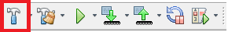
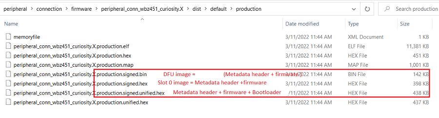

# Unified Image Generation

1.  Compile the project for no errors.

    

2.  MPLABX generated hex image will be available in project production folder dist\\default\\production. There are 3 new images created as an outcome of "SignFirmware" MPLABX script. These images are the valid images which has the metadata header appended.

    1.  signed.unified.hex - This is signed unified image along with bootloader. This is the current image to be programmed on the device.

    2.  signed.hex - This image is signed image without bootloader. This does not  work if bootloader is not present on the device.

    3.  signed.bin - This is upgradable image which can be sent over serial DFU.  Follow the steps mentioned in [DFU over serial](https://onlinedocs.microchip.com/pr/GUID-A5330D3A-9F51-4A26-B71D-8503A493DF9C-en-US-1/index.html?GUID-003E64BA-98A3-40EA-8417-ED7F09C14761) if want to upgrade the device using serial  interface.

        

**Parent topic:**[BLE OTA DFU Implementation](https://onlinedocs.microchip.com/pr/GUID-A5330D3A-9F51-4A26-B71D-8503A493DF9C-en-US-1/index.html?GUID-1DBEFA54-6B29-4BB3-8C75-9FD48DB81F3F)

