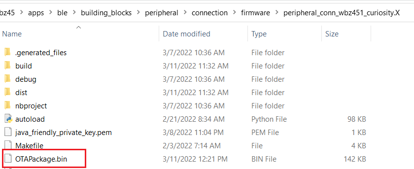

# Upgradable image .bin file generation

Referring to [Project Properties Configuration for Current image](https://onlinedocs.microchip.com/pr/GUID-A5330D3A-9F51-4A26-B71D-8503A493DF9C-en-US-1/index.html?GUID-70714605-ACB2-451F-87F0-66F97057949F), "SignFirmware" and "OTA" bin generation MPLABX script is added into OTA project. "OTA" window in project properties is used for OTA DFU image generation.

1.  After making the new upgrdabe application keep the new upgradable image version  number not same as current running image version. The version number has to be  taken care in [DIS Service](https://onlinedocs.microchip.com/pr/GUID-A5330D3A-9F51-4A26-B71D-8503A493DF9C-en-US-1/index.html?GUID-2624FC46-FF08-4D14-9FA0-25B260F81754) in new firmware as well as "Firmware Rev" in  "SignFirmware" window. For example, new image Firmware Rev is chosen as 1.0.0.1  and same in DIS Firmware version in the project.

    1.  Follow step 1 in [Project Properties Configuration for Current image](https://onlinedocs.microchip.com/pr/GUID-A5330D3A-9F51-4A26-B71D-8503A493DF9C-en-US-1/index.html?GUID-70714605-ACB2-451F-87F0-66F97057949F) to open "SignFirmware" properties window.
    2.  Change the "Firmware Rev" and then click on "Apply".

        

    3.  Compile the project.

2.  Follow step 1 in [Project Properties Configuration for Current image](https://onlinedocs.microchip.com/pr/GUID-A5330D3A-9F51-4A26-B71D-8503A493DF9C-en-US-1/index.html?GUID-70714605-ACB2-451F-87F0-66F97057949F) to open "OTA" properties window.
    1.  "OTA" window has few configurations.

         

        

         

        -   Output File Name - Name of the image.

        -   Output File Encryption - Image is encrypted or plain image.

        -   Output File Type - Choose "BLE OTA File" type for BLE based  OTAU.

        -   Flash Image ID - Refer to [Enable Flash Image ID](https://onlinedocs.microchip.com/pr/GUID-A5330D3A-9F51-4A26-B71D-8503A493DF9C-en-US-1/index.html?GUID-2624FC46-FF08-4D14-9FA0-25B260F81754) for details.

    2.  After the configurations, click on "Create OTA File". The Upgradable .bin image with selected "Output File Name" will be created in .X folder. This is the image stored in OTAU Manager to send to OTAU Target.

        

**Parent topic:**[BLE OTA DFU Implementation](https://onlinedocs.microchip.com/pr/GUID-A5330D3A-9F51-4A26-B71D-8503A493DF9C-en-US-1/index.html?GUID-1DBEFA54-6B29-4BB3-8C75-9FD48DB81F3F)

