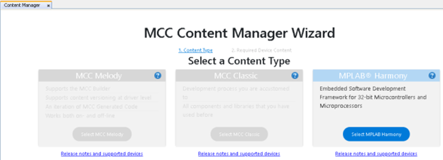
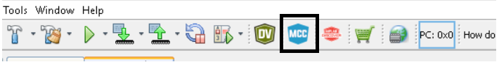
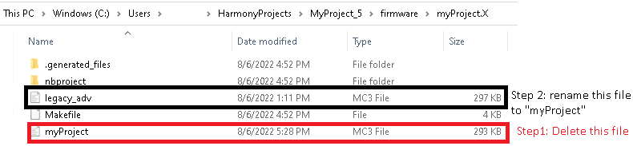
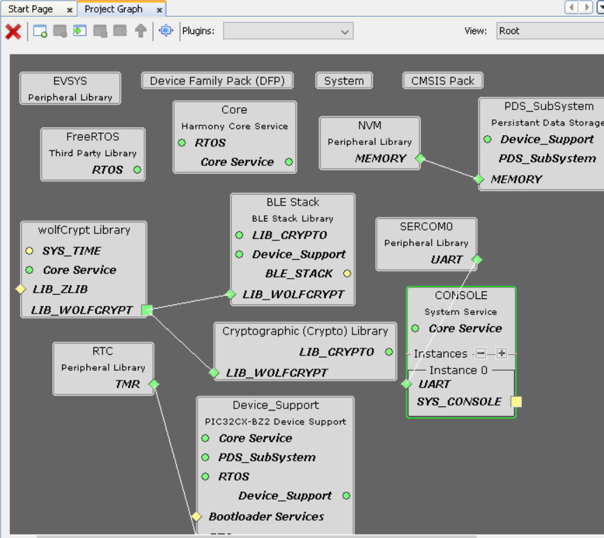

# Import existing App Example Configuration

Users who want to implement a similar application based on the existing application examples provided by Microchip can choose to import the configuration so that they srart from a known good configuration.

1.  Create a [new MPLAB MCC Harmony Project](https://onlinedocs.microchip.com/pr/GUID-A5330D3A-9F51-4A26-B71D-8503A493DF9C-en-US-1/index.html?GUID-F8FE2886-8A2C-4FC0-9956-C094CE44D162)

2.  Select the MPLAB Harmony option

    

3.  Select Finish

    

4.  Select Harmony Framework

    

5.  Default project graph will be loaded. Close the MPLAB Code Configurator by clicking on the MCC option in IDE

    

    

6.  User should now overwrite the .mc3 file created for the new MPLAB MCC Harmony Project \(in step 1\) with the .mc3 file of the application example of their choice provided by Microchip. For example we will now overwrite the .mc3 file \(created with the new MPLAB MCC Harmony Project\)with .mc3 file created for [legacy advertisement application](https://onlinedocs.microchip.com/pr/GUID-A5330D3A-9F51-4A26-B71D-8503A493DF9C-en-US-1/index.html?GUID-820CEA03-90AE-484F-87C9-9CF2CE652702)

    

7.  Reopen MCC to see if project graph has imported the components and the respective configuration for these components as expected

    

    
