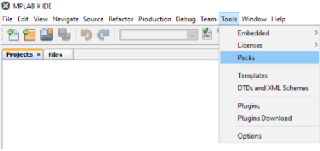
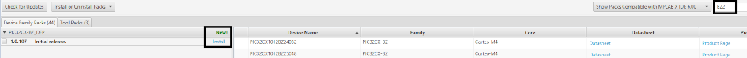

# Install Device Family Part Pack

PIC32CXBZ Device Support is handled by Device Family Part Pack installation

## Installing PIC32CXBZ2 DFP {#GUID-36A5AF9B-EAFF-42A7-8979-0774358384C8 .section}

1.  Open the MPLAB X IDE and Select Tools \> Packs

    

2.  Search for "BZ2" in the search box available and select "install"

    

[Intrroduction to DFP](https://microchipdeveloper.com/xcc:introduction-to-dfps) gives background information on usage of Device Family Part Pack in application development

**Parent topic:**[Getting Started with Software Development](https://onlinedocs.microchip.com/pr/GUID-A5330D3A-9F51-4A26-B71D-8503A493DF9C-en-US-1/index.html?GUID-2AD37FE2-1915-4E34-9A05-79E3810726D7)

