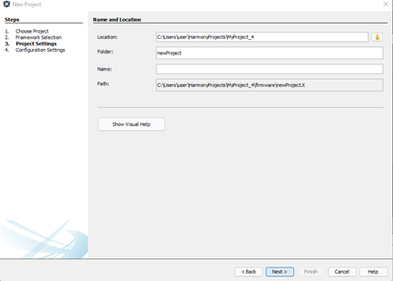
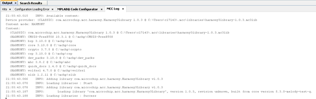
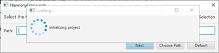

# Install Harmony 3 Dependencies

**This section will describe in detail how to install the correct versions of the required Harmony 3component dependencies. The following table summarizes the components and versions that will be installed**

|Harmony components to be cloned with MCC Content Manager|Version|
|csp|3.13.0|
|core|3.11.0|
|mhc|3.8.3|
|dev\_packs|3.13.0|
|bsp|3.13.0|
|CMSIS-FreeRTOS|10.3.1|
|crypto|3.7.4|
|wolfssl|4.7.0|
|PIC32CX-BZ\_DFP|1.0.107|
|wireless\_ble|1.0.0|
|wireless\_system\_pic32cxbz\_wbz|1.0.0|
|wireless\_apps\_pic32cxbz2\_wbz45|1.0.0|
|wireless\_pic32cxbz\_wbz|1.0.0|

## Clone the Harmony repositories using MCC Content Manager Wizard {#GUID-5E0F1FBF-073A-4D6D-B601-5B86194844FE .section}

1.  Create a new “MCC Harmony” project \(In order to clone the Harmony repositories user needs to create an empty project and clone the required repositories\)

    1.  Select "New Project"

        

    2.  Select "32-bit MCC Harmony Project"

        

    3.  Framework Selection

        

    4.  Project Settings

        

    5.  Configuration Settings

        

2.  Open “MPLAB Code Configurator” after creation of project. MCC Content Manager window will appear in IDE

    

3.  Select “MPLAB Harmony” from the content manager window

    

    Select "Optional Content" as shown below

    

4.  Ensure all components are selected as displayed in the image below. Ignore version selection for now it will be taken care of at a later stage

    

5.  Select “Finish” The downloading of selected components from harmony repositories will take some minutes.If all the selected components are cloned successfully, MCC logs in IDE will display this information.

    

    **Attention:**

    -   **If in the process a failure to download a particular component appears, try redownloading again only the component that failed to download. For example, if user received a prompt from MCC saying “dev\_packs” was not download**
    -   close the MCC reopen MCC again and start from step 3 in this section, with the “dev\_packs” as the only missing component for downloading and select “Finish”
    

6.  Select/Confirm the Harmony Framework Path

    

    **Note:** Framework Path selection window appears beneath the Initializing Project pop-up, users should Choose Path as “C:\\mchp”

    

    Project Graph Window will appear after choosing the framework path and successful initialization of project

    

7.  Change to content[versions](#GUID-AF986E94-2ACB-4D83-B1AD-C07C778186AE) recommended for use during development in the table using the content manager from Device Resources and select “Apply”. This step is important and should be followed by user as every wireless stack and app example release is tested with certain version of dependant component.

    

After successfully checking out the right version of content/components, users can [start developing application examples](https://onlinedocs.microchip.com/pr/GUID-A5330D3A-9F51-4A26-B71D-8503A493DF9C-en-US-1/index.html?GUID-FAC65B28-B78E-48AF-BCFE-2D63DC274CDB).

**Parent topic:**[Getting Started with Software Development](https://onlinedocs.microchip.com/pr/GUID-A5330D3A-9F51-4A26-B71D-8503A493DF9C-en-US-1/index.html?GUID-2AD37FE2-1915-4E34-9A05-79E3810726D7)

