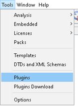
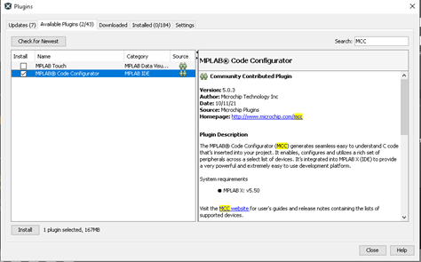
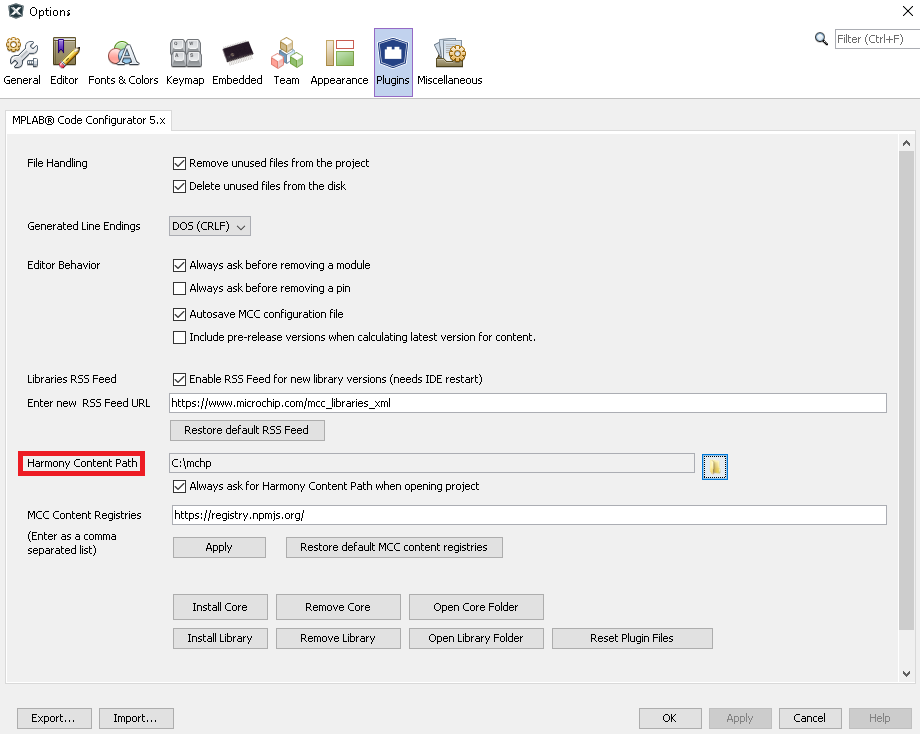

# Install MCC Plugin

Installing MPLAB Code Configurator Plugin

## Install MCC Plugin in the IDE {#GUID-BAA5752A-6C3B-47D2-81D7-69DBCA6F1482 .section}

1.  Install MCC Plugin

    

    

2.  Configure the plugin options

    

**Parent topic:**[Getting Started with Software Development](https://onlinedocs.microchip.com/pr/GUID-A5330D3A-9F51-4A26-B71D-8503A493DF9C-en-US-1/index.html?GUID-2AD37FE2-1915-4E34-9A05-79E3810726D7)

