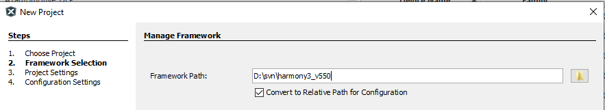

# Creating a new MCC Harmony Project

1.  Create a **new 32-bit MPLAB MCC Harmony** Project

1.  Select the **Framework Path** \(Framework path must match SDK setup  document\)and select **Next**

1.  Select Project Folder and select Next

1.  Select the device and click Finish

or

1.  MPLABx Code Configurator will be launched automatically.

1.  Select **"Next"**

1.  Select **"MPLAB Harmony"**

1.  Select **"Finish"**

1.  Project Graph window of the Configurator may have predefined components

1.  Project and Device resources

**Parent topic:**[Getting Started with Software Development](https://onlinedocs.microchip.com/pr/GUID-A5330D3A-9F51-4A26-B71D-8503A493DF9C-en-US-1/index.html?GUID-2AD37FE2-1915-4E34-9A05-79E3810726D7)

